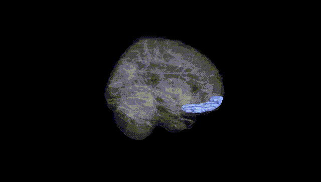
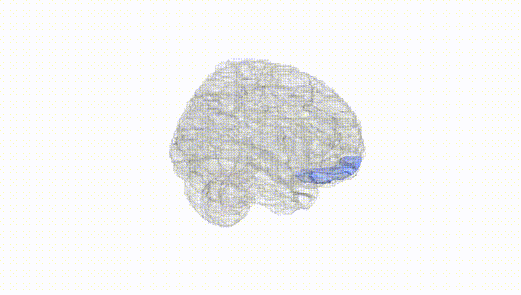
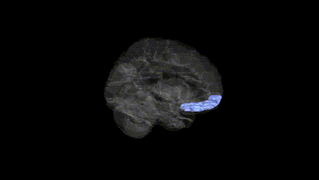
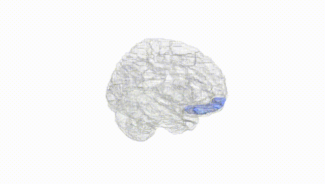
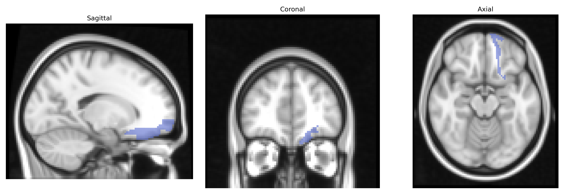
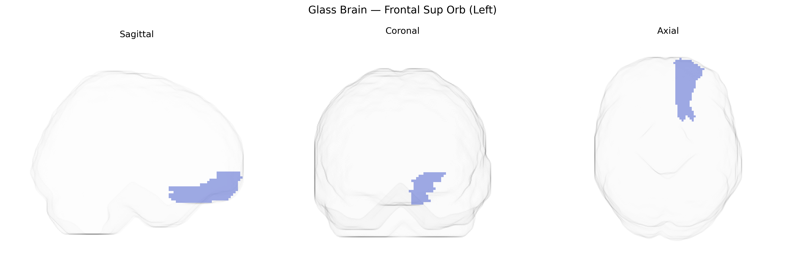

# Frontal Sup Orb (Left)
 
## Overview
 
The left Frontal Sup Orb (Left) region in the AAL atlas corresponds to the left superior frontal gyrus, orbital part, located on the ventral surface of the frontal lobe within the orbitofrontal cortex. This area lies anterior to the precentral gyrus and superior to the medial orbital and rectus gyri, forming part of the prefrontal cortex involved in higher-order cognitive and affective functions. Cytoarchitectonically, it encompasses portions of Brodmann areas classically associated with decision-making, valuation, reward processing, emotional regulation, and social cognition. Through extensive connections with limbic structures (including the amygdala and hippocampus), the thalamus, and other prefrontal territories, the superior frontal orbital cortex contributes to the integration of sensory, emotional, and motivational information, influencing goal-directed behavior and adaptive responses to changing environmental contingencies. [Superior frontal gyrus](https://en.wikipedia.org/wiki/Superior_frontal_gyrus)
 
The left superior frontal gyrus (Frontal Sup Orb L in the AAL atlas), a core node of the dorsomedial and orbitofrontal prefrontal circuitry, has been repeatedly implicated in imaging genetics and GWAS of brain structure and function, with variants in genes such as BDNF, COMT, and DRD2 influencing its cortical thickness, activation, and connectivity in tasks involving working memory, cognitive control, and emotion regulation. Large-scale ENIGMA and UK Biobank neuroimaging GWAS have identified polygenic influences on superior frontal cortical thickness and surface area, implicating synaptic, neurodevelopmental, and myelination-related pathways, and demonstrating substantial genetic correlation between left superior frontal morphology and general cognitive ability, educational attainment, and intracranial volume. Disorder-focused genetic studies link reduced or altered left superior frontal structure and function to risk alleles for major depressive disorder, schizophrenia, bipolar disorder, ADHD, and autism spectrum disorder, often mediated by genes affecting glutamatergic and dopaminergic signaling and neurodevelopmental processes; for example, schizophrenia polygenic risk scores correlate with superior frontal gyral thinning, while depression- and anxiety-associated loci show effects on orbitofrontal/superior frontal activation to emotional stimuli. Additionally, GWAS of personality, impulsivity, and risk-taking have reported that polygenic scores for these traits partly predict variation in superior frontal/orbitofrontal metrics, underscoring this region’s role as a genetically influenced hub linking higher-order cognition, affective control, and vulnerability to psychiatric and behavioral phenotypes.
 
*Overview generated by GPT-4o (2026).*
 
---
 
**Region ID:** 2111  
**Hemisphere:** left  
**Atlas:** AAL 
 
---
 
## Frontal Sup Orb (Left) – Black Background (Full Brain)
 

 
**Full Quality Version:** <a href="full_black.mp4" download>Download MP4</a>
 
---
 
## Frontal Sup Orb (Left) – White Background (Full Brain)
 

 
**Full Quality Version:** <a href="full_white.mp4" download>Download MP4</a>
 
---

## Frontal Sup Orb (Left) – Black Background (Hemisphere)
 

 
**Full Quality Version:** <a href="hemi_black.mp4" download>Download MP4</a>
 
---
 
## Frontal Sup Orb (Left) – White Background (Hemisphere)
 

 
**Full Quality Version:** <a href="hemi_white.mp4" download>Download MP4</a>
 
---

## Triplanar View – T1 Background
 

 
---
 
## Triplanar View – Ghost Brain
 


