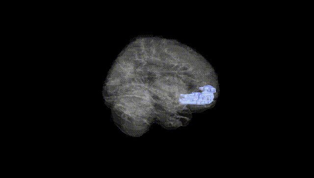
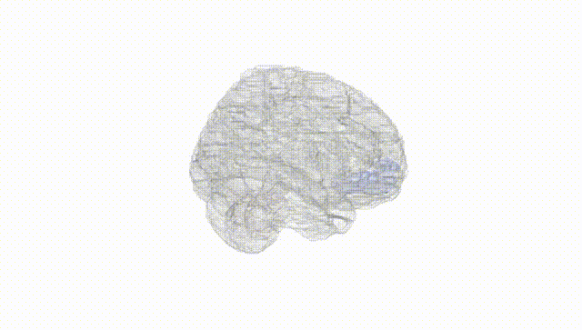
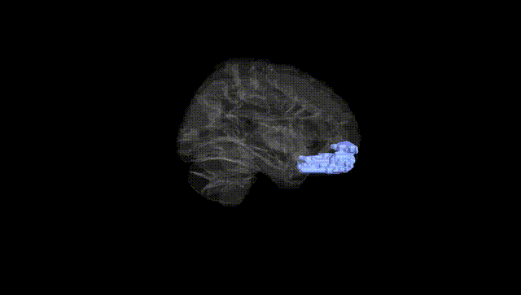
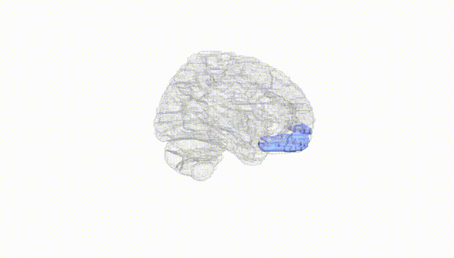
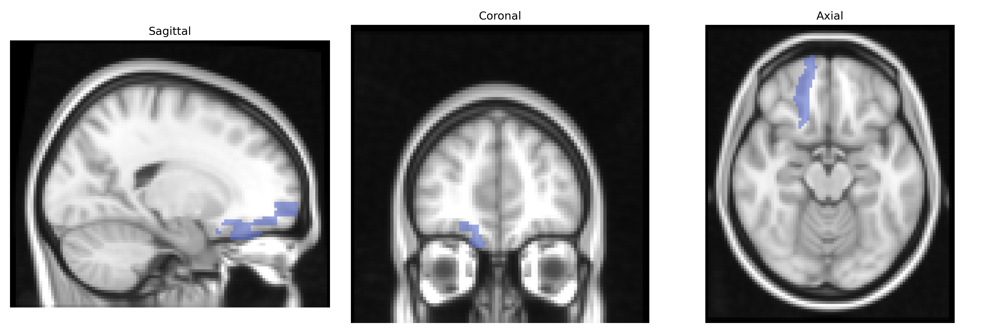
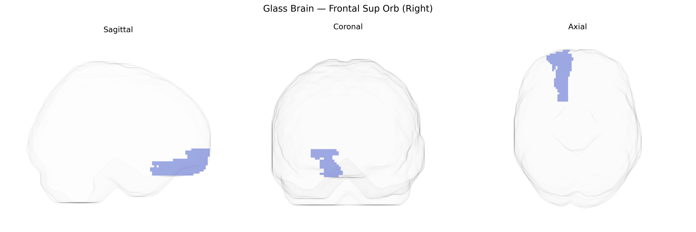

# Frontal Sup Orb (Right)
 
## Overview
 
The right Frontal Sup Orb (Right) region in the AAL atlas corresponds to the right orbitofrontal portion of the superior frontal gyrus, part of the prefrontal cortex located on the ventral surface of the frontal lobe above the orbits of the eyes. This area is involved in higher-order cognitive and affective processes, including reward evaluation, decision-making, emotional regulation, and social behavior, integrating sensory and limbic inputs to guide adaptive choices. It has extensive connections with limbic structures (such as the amygdala), other prefrontal regions, and sensory association cortices, supporting its role in valuation, expectation, and behavioral flexibility. There is no direct Wikipedia article for “right Frontal Sup Orb (Right)” as defined in the AAL atlas; a related structure is the orbitofrontal cortex: [Orbitofrontal cortex](https://en.wikipedia.org/wiki/Orbitofrontal_cortex).
 
The right superior frontal gyrus (Frontal Sup Orb R in the AAL atlas), part of orbitofrontal and dorsomedial prefrontal circuitry, has been implicated in multiple genetic and GWAS findings primarily via imaging genetics studies rather than direct region-specific association scans. Variants in genes related to synaptic function, neurodevelopment, and neurotransmission—such as CACNA1C, BDNF, GRIN2B, and COMT—have been associated with structural and functional alterations in superior frontal and orbitofrontal regions in cohorts studying schizophrenia, bipolar disorder, major depressive disorder, and anxiety, often manifesting as differences in cortical thickness, gray matter volume, or resting-state connectivity that include or overlap the right frontal superior areas. Large-scale ENIGMA and UK Biobank imaging–genetics efforts have identified polygenic effects on frontal cortical morphology, including this region, linking higher schizophrenia and depression polygenic risk scores to reduced frontal thickness and altered connectivity, while polygenic risk for educational attainment and cognitive performance correlates with larger frontal volumes and enhanced functional coupling. Additionally, orbitofrontal/superior frontal circuits containing this region have been genetically connected to traits such as impulsivity, risk-taking, substance use, and obsessive-compulsive symptomatology, where risk alleles in dopaminergic and glutamatergic pathways show convergent effects on orbitofrontal–striatal networks. Although few GWAS report the right Frontal Sup Orb as a uniquely specified locus, converging evidence from gene-based, polygenic, and imaging–genetic studies indicates that common variation influencing cortical development, synaptic plasticity, and psychiatric risk exerts measurable effects on this region’s structure and function.
 
*Overview generated by GPT-4o (2026).*
 
---
 
**Region ID:** 2112  
**Hemisphere:** right  
**Atlas:** AAL 
 
---
 
## Frontal Sup Orb (Right) – Black Background (Full Brain)
 

 
**Full Quality Version:** <a href="full_black.mp4" download>Download MP4</a>
 
---
 
## Frontal Sup Orb (Right) – White Background (Full Brain)
 

 
**Full Quality Version:** <a href="full_white.mp4" download>Download MP4</a>
 
---

## Frontal Sup Orb (Right) – Black Background (Hemisphere)
 

 
**Full Quality Version:** <a href="hemi_black.mp4" download>Download MP4</a>
 
---
 
## Frontal Sup Orb (Right) – White Background (Hemisphere)
 

 
**Full Quality Version:** <a href="hemi_white.mp4" download>Download MP4</a>
 
---

## Triplanar View – T1 Background
 

 
---
 
## Triplanar View – Ghost Brain
 


