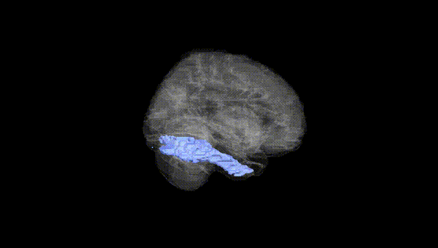
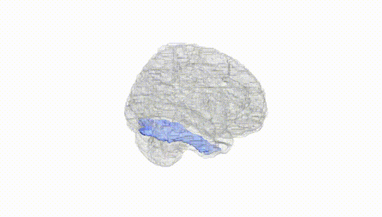
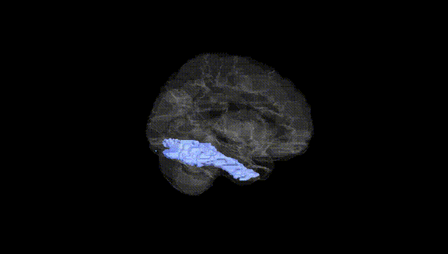
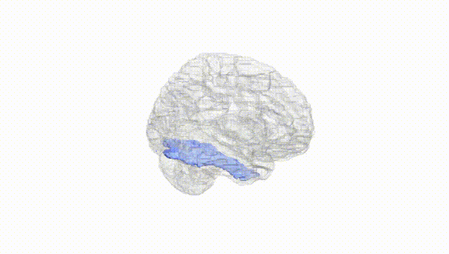
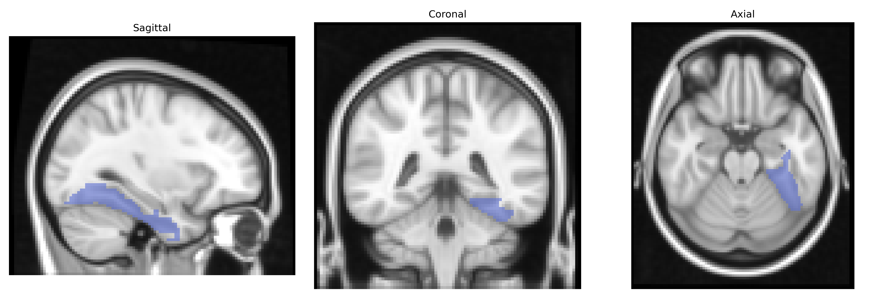
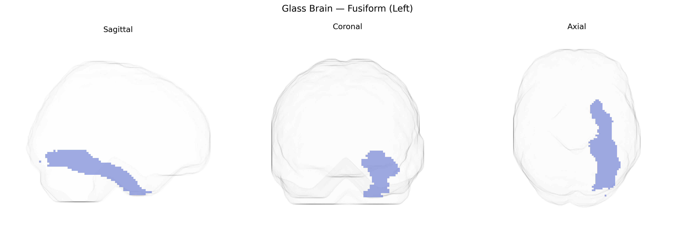

# Fusiform (Left)
 
## Overview
 
The left Fusiform gyrus, as defined in the AAL atlas, is a ventral temporal lobe structure located on the basal surface of the cerebral hemisphere, extending from the occipital lobe anteriorly into the temporal lobe between the inferior temporal gyrus laterally and the parahippocampal gyrus medially. It is cytoarchitectonically heterogeneous and participates in high-level visual processing, including object recognition, face perception, and reading, with the left hemisphere particularly implicated in visual word form processing and orthographic-phonological mapping. The region has extensive reciprocal connections with early visual cortices, inferior temporal areas, parietal regions, and language-related frontal areas, integrating visual input with semantic and linguistic networks, and is involved in functions such as category-specific recognition and expertise-related visual discrimination.  

[Fusiform gyrus](https://en.wikipedia.org/wiki/Fusiform_gyrus)
 
The left fusiform gyrus (AAL fusiform left) shows genetic associations primarily through GWAS and imaging–genetics studies linking its structure and function to language, reading, face processing, and neuropsychiatric traits. Variants in DCDC2, KIAA0319, ROBO1, and DYX1C1, identified in dyslexia and reading-disorder GWAS, have been associated with altered left fusiform/visual word form area morphology and activation, supporting a genetic contribution to reading-related specialization. Common variants in CNTNAP2, FOXP2, and related language-network genes have been linked to fusiform activation patterns during language tasks, while autism spectrum disorder risk loci (e.g., in genes such as NRXN1, SHANK3, and synaptic/neuronal-development pathways) are associated with atypical fusiform structure and reduced face-selective activation, consistent with fusiform involvement in social-perception deficits. Large-scale ENIGMA and UK Biobank imaging–GWAS analyses have identified polygenic influences on fusiform cortical thickness and surface area, implicating widespread neurodevelopmental and synaptic genes and showing genetic correlations with cognitive performance, educational attainment, and psychiatric conditions including schizophrenia, bipolar disorder, and major depression. Additionally, Alzheimer’s disease and frontotemporal dementia risk variants (e.g., APOE ε4 and MAPT haplotypes) have been associated with fusiform atrophy patterns, aligning with the region’s vulnerability in posterior cortical and semantic variants of dementia.
 
*Overview generated by GPT-4o (2026).*
 
---
 
**Region ID:** 5401  
**Hemisphere:** left  
**Atlas:** AAL 
 
---
 
## Fusiform (Left) – Black Background (Full Brain)
 

 
**Full Quality Version:** <a href="full_black.mp4" download>Download MP4</a>
 
---
 
## Fusiform (Left) – White Background (Full Brain)
 

 
**Full Quality Version:** <a href="full_white.mp4" download>Download MP4</a>
 
---

## Fusiform (Left) – Black Background (Hemisphere)
 

 
**Full Quality Version:** <a href="hemi_black.mp4" download>Download MP4</a>
 
---
 
## Fusiform (Left) – White Background (Hemisphere)
 

 
**Full Quality Version:** <a href="hemi_white.mp4" download>Download MP4</a>
 
---

## Triplanar View – T1 Background
 

 
---
 
## Triplanar View – Ghost Brain
 


