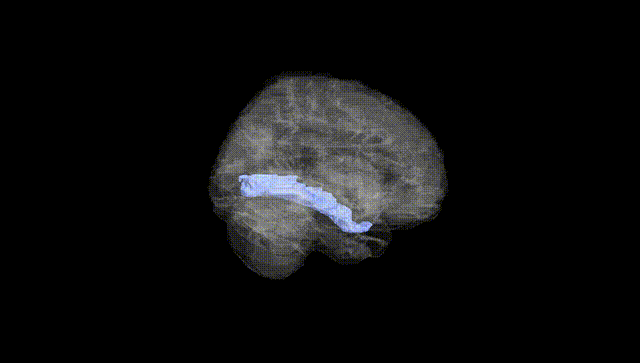
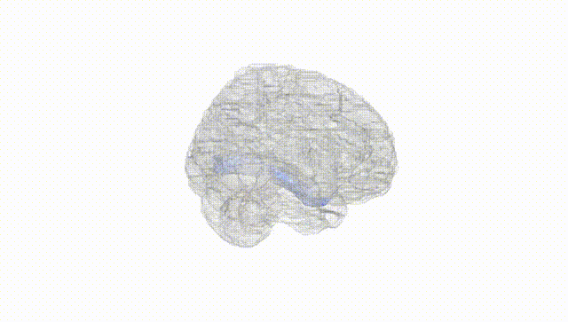
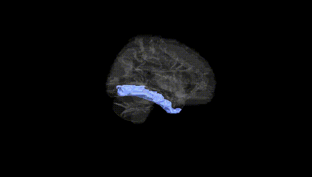
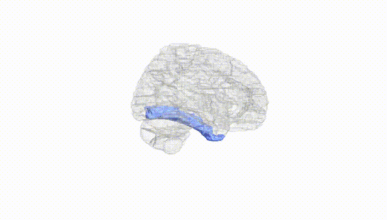
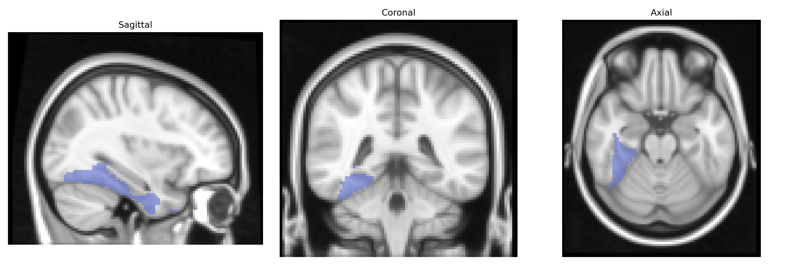
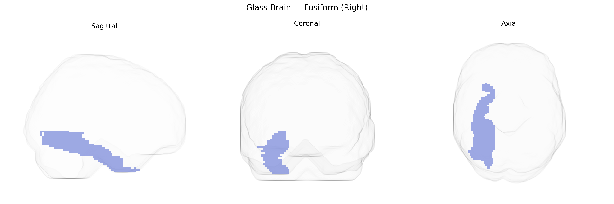

# Fusiform (Right)
 
## Overview
 
The right fusiform gyrus, as defined in the AAL atlas, is a ventral temporal lobe structure located on the basal surface of the cerebral hemisphere, extending from the occipital pole anteriorly toward the temporal pole between the inferior temporal gyrus laterally and the parahippocampal gyrus medially. It is composed primarily of association cortex involved in high-level visual processing, including object recognition, face perception, and reading, and contains specialized subregions such as the fusiform face area that show category-selective responses. Cytoarchitectonically, it corresponds largely to Brodmann areas 37 and parts of 20, and is supplied by branches of the posterior cerebral and, anteriorly, the middle cerebral arteries. Functionally, the right fusiform gyrus is particularly implicated in holistic and configural aspects of visual perception and is frequently engaged in tasks requiring recognition of complex visual stimuli, with lesions associated with deficits such as prosopagnosia and other category-specific agnosias.  

[Fusiform gyrus](https://en.wikipedia.org/wiki/Fusiform_gyrus)
 
The right fusiform gyrus, as defined in the AAL atlas, has been implicated in several genetic and GWAS-based findings, particularly in relation to face processing, social cognition, and neuropsychiatric risk. Twin and imaging-genetics studies indicate substantial heritability of fusiform structure and activation, with variants in genes such as CNTNAP2, DISC1, and neuregulin-related pathways contributing to altered fusiform morphology or function in autism spectrum disorder and schizophrenia. GWAS of brain morphology have identified common variants near genes involved in synaptic development and neuronal migration (e.g., MAPT region, microtubule and axon-guidance genes) associated with fusiform cortical thickness and surface area, though many signals are shared across temporal and occipitotemporal regions rather than strictly localized to right fusiform. Functional imaging-genetics work has linked risk alleles for autism, prosopagnosia, and social anxiety traits to reduced right fusiform activation during face recognition tasks, and large-scale consortia like ENIGMA have reported polygenic influences on ventral temporal cortex volume that overlap with ADHD, depression, and schizophrenia risk loci. Overall, genetic associations suggest that common and rare variants affecting synaptic plasticity, neurodevelopmental signaling, and social-behavioral traits contribute to individual differences in right fusiform structure and face-selective function, although most GWAS signals remain nonspecific to this single AAL-defined region.
 
*Overview generated by GPT-4o (2026).*
 
---
 
**Region ID:** 5402  
**Hemisphere:** right  
**Atlas:** AAL 
 
---
 
## Fusiform (Right) – Black Background (Full Brain)
 

 
**Full Quality Version:** <a href="full_black.mp4" download>Download MP4</a>
 
---
 
## Fusiform (Right) – White Background (Full Brain)
 

 
**Full Quality Version:** <a href="full_white.mp4" download>Download MP4</a>
 
---

## Fusiform (Right) – Black Background (Hemisphere)
 

 
**Full Quality Version:** <a href="hemi_black.mp4" download>Download MP4</a>
 
---
 
## Fusiform (Right) – White Background (Hemisphere)
 

 
**Full Quality Version:** <a href="hemi_white.mp4" download>Download MP4</a>
 
---

## Triplanar View – T1 Background
 

 
---
 
## Triplanar View – Ghost Brain
 


