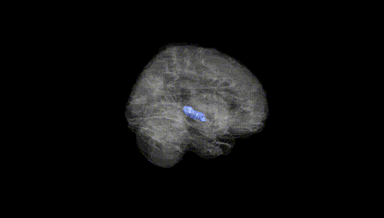
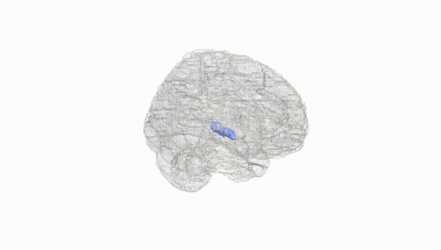
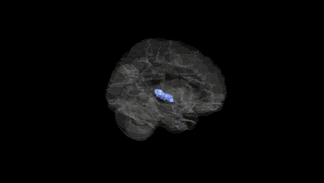
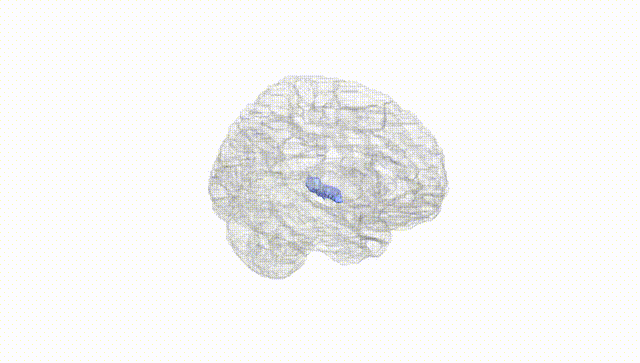
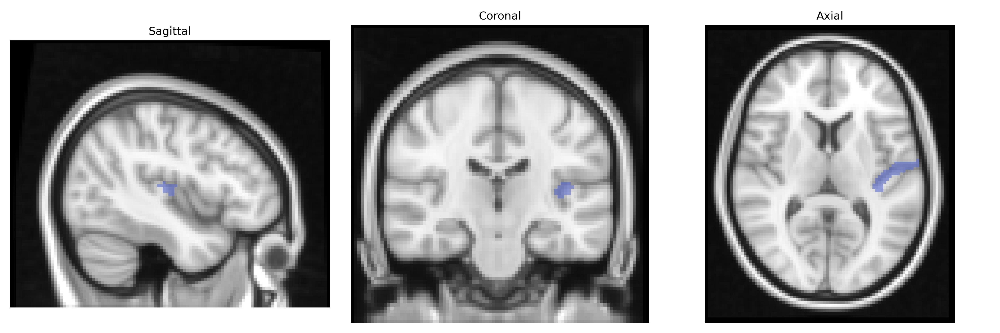
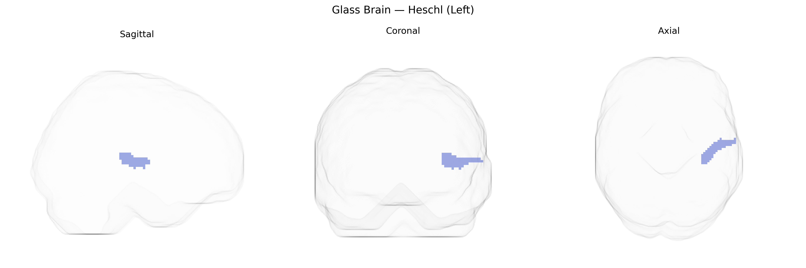

# Heschl (Left)
 
## Overview
 
The left Heschl gyrus, corresponding to the primary auditory cortex (A1), is a transverse temporal gyrus located on the superior surface of the temporal lobe within the Sylvian fissure. It is the initial cortical recipient of auditory input from the medial geniculate nucleus of the thalamus via the auditory radiations and is organized tonotopically, with neurons selectively responsive to specific sound frequencies. This region is critically involved in early-stage processing of acoustic features such as sound intensity, frequency, temporal patterns, and spatial localization, and plays an essential role in the neural encoding of speech and other complex sounds. The left hemisphere Heschl gyrus is often associated with language-dominant auditory functions, contributing to phonemic and speech sound analysis that supports higher-order linguistic processing in adjacent temporal and frontal cortical areas. Related article: [Heschl's gyrus](https://en.wikipedia.org/wiki/Heschl%27s_gyrus).
 
The left Heschl gyrus (primary auditory cortex) from the AAL atlas has been implicated in several imaging genetics and GWAS studies, although specific locus-level associations remain limited and often reflect broader temporal or auditory cortex signals. Large-scale brain MRI GWAS consortia such as ENIGMA and UK Biobank–based studies have identified heritable variation in Heschl gyrus volume, surface area, and cortical thickness, with polygenic influences overlapping general brain structure genes (e.g., variants near genes involved in neurodevelopment, synaptic function, and axon guidance), though typically reported at the lobe or temporal region level rather than as Heschl-specific loci. Candidate and GWAS-based imaging genetics work has linked structural and functional variation in the left Heschl gyrus to language-related traits (such as phonological processing and reading ability/dyslexia), musical aptitude and pitch perception, and auditory hallucinations in schizophrenia, with some shared genetic architecture between auditory cortex measures and psychiatric disorders including schizophrenia and autism spectrum disorder. Additional associations have been noted between temporal auditory cortex measures and neurodevelopmental and cognitive traits (e.g., educational attainment, IQ), as well as tinnitus and hearing-related phenotypes, but precise gene-level or variant-level effects specifically restricted to the left Heschl region remain incompletely resolved and are generally embedded within broader genetic influences on temporal lobe and global cortical morphology.
 
*Overview generated by GPT-4o (2026).*
 
---
 
**Region ID:** 8101  
**Hemisphere:** left  
**Atlas:** AAL 
 
---
 
## Heschl (Left) – Black Background (Full Brain)
 

 
**Full Quality Version:** <a href="full_black.mp4" download>Download MP4</a>
 
---
 
## Heschl (Left) – White Background (Full Brain)
 

 
**Full Quality Version:** <a href="full_white.mp4" download>Download MP4</a>
 
---

## Heschl (Left) – Black Background (Hemisphere)
 

 
**Full Quality Version:** <a href="hemi_black.mp4" download>Download MP4</a>
 
---
 
## Heschl (Left) – White Background (Hemisphere)
 

 
**Full Quality Version:** <a href="hemi_white.mp4" download>Download MP4</a>
 
---

## Triplanar View – T1 Background
 

 
---
 
## Triplanar View – Ghost Brain
 


