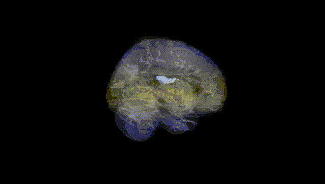
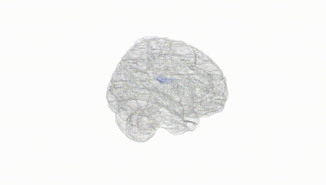
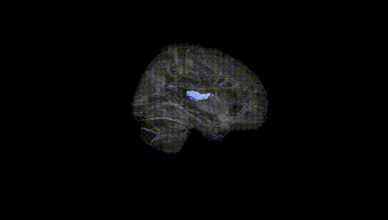
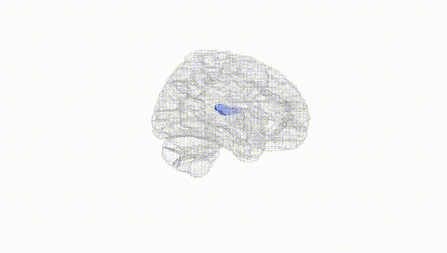
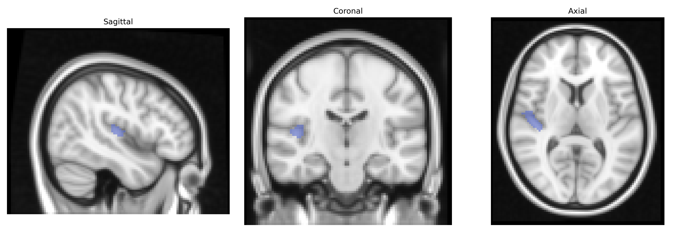
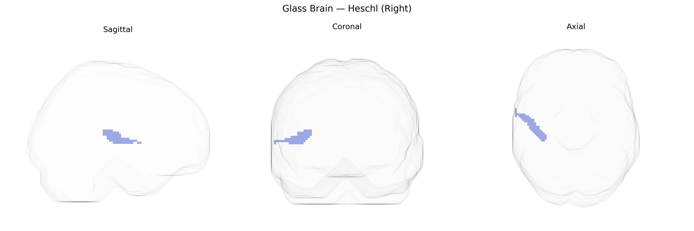

# Heschl (Right)
 
## Overview
 
The right Heschl gyrus, corresponding to the primary auditory cortex (A1) in the AAL atlas, is located in the superior temporal lobe buried within the lateral (Sylvian) fissure, forming part of the transverse temporal gyri. It receives highly organized, tonotopically mapped input from the medial geniculate nucleus of the thalamus and is crucial for the early cortical processing of acoustic features such as frequency, intensity, and temporal structure of sounds. Neurons in this region are specialized for detailed analysis of auditory stimuli, contributing to sound localization, pitch perception, and the initial stages of speech and music processing, with the right hemisphere often showing relative specialization for spectral and melodic aspects of sounds. Cytoarchitectonically, Heschl’s gyrus corresponds largely to Brodmann area 41 (and parts of 42), characterized by a prominent granular layer IV typical of primary sensory cortices. [Heschl's gyrus](https://en.wikipedia.org/wiki/Heschl%27s_gyrus)
 
The right Heschl gyrus (primary auditory cortex) as defined in the AAL atlas has been implicated in several genetic and GWAS-based associations, primarily through imaging genetics studies that link common variants to auditory cortex structure and function rather than to this parcel alone. Variants in genes involved in neuronal development, synaptic plasticity, and myelination (e.g., CNTNAP2, FOXP2, KIAA0319, DCDC2, GRIN2B, BDNF) have been associated with cortical thickness, surface area, or activation in superior temporal and Heschl regions in the context of language, speech perception, and reading, including developmental dyslexia and specific language impairment. GWAS of brain imaging phenotypes (such as those from ENIGMA and UK Biobank) have reported heritable variation in auditory cortex volume and surface area and identified loci near genes related to neurodevelopment and axon guidance (e.g., MIR137, LRRC4C, and other glutamatergic and neurodevelopmental genes), although results are typically reported for broader temporal lobe or auditory regions rather than the right Heschl gyrus in isolation. Genetic associations between right Heschl morphology or activation and neuropsychiatric conditions such as schizophrenia, autism spectrum disorder, and tinnitus have been reported in candidate-gene and small-scale imaging genetics studies, often implicating glutamatergic, GABAergic, and synaptic genes (e.g., NRG1/ERBB4 pathway, GABAA receptor subunits), but these findings remain less consistent and require larger, replication-focused GWAS specifically targeting this region to be considered robust.
 
*Overview generated by GPT-4o (2026).*
 
---
 
**Region ID:** 8102  
**Hemisphere:** right  
**Atlas:** AAL 
 
---
 
## Heschl (Right) – Black Background (Full Brain)
 

 
**Full Quality Version:** <a href="full_black.mp4" download>Download MP4</a>
 
---
 
## Heschl (Right) – White Background (Full Brain)
 

 
**Full Quality Version:** <a href="full_white.mp4" download>Download MP4</a>
 
---

## Heschl (Right) – Black Background (Hemisphere)
 

 
**Full Quality Version:** <a href="hemi_black.mp4" download>Download MP4</a>
 
---
 
## Heschl (Right) – White Background (Hemisphere)
 

 
**Full Quality Version:** <a href="hemi_white.mp4" download>Download MP4</a>
 
---

## Triplanar View – T1 Background
 

 
---
 
## Triplanar View – Ghost Brain
 


