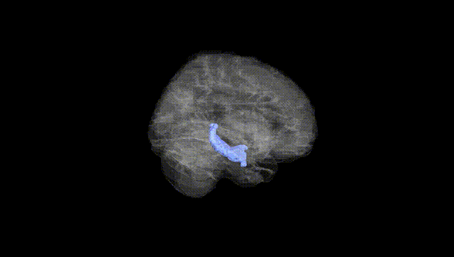
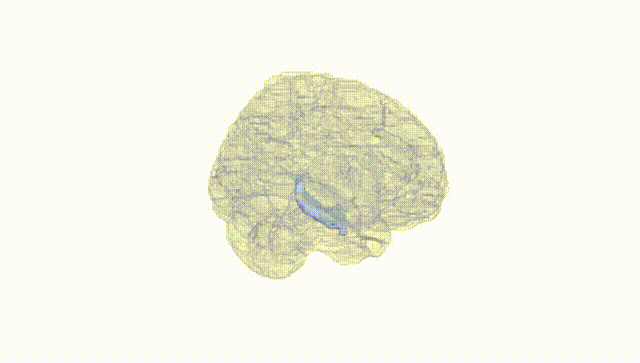
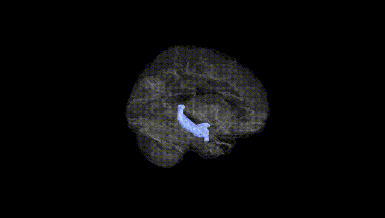
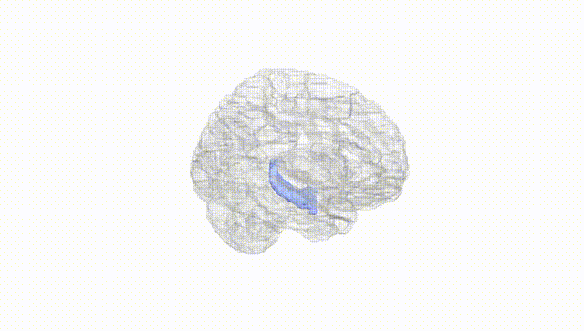
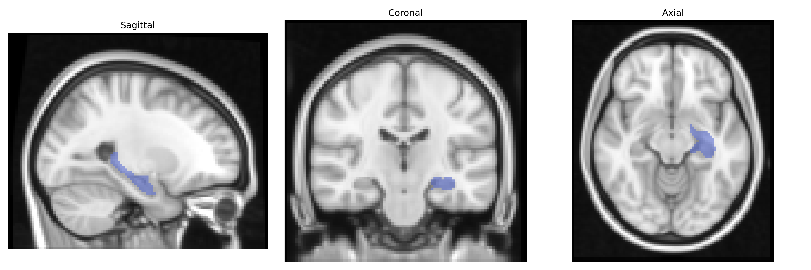
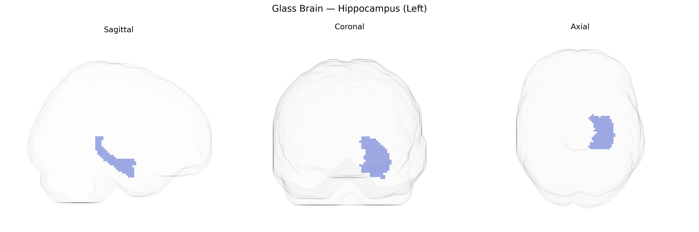

# Hippocampus (Left)
 
## Overview
 
The left hippocampus is a paired medial temporal lobe structure critically involved in declarative memory formation, spatial navigation, and contextual processing, with a notable role in verbal memory and language-related encoding in the dominant (typically left) hemisphere. It is composed of distinct subfields (CA1–CA4, dentate gyrus, and subiculum) organized in a trisynaptic circuit that supports synaptic plasticity and long-term potentiation, providing a cellular basis for learning and memory. The left hippocampus receives multimodal input via the entorhinal cortex and projects to widespread cortical and subcortical targets, including the prefrontal cortex and limbic structures, integrating cognitive, emotional, and mnemonic functions. It is highly vulnerable to hypoxia, neurodegenerative processes (notably in Alzheimer’s disease), and mesial temporal sclerosis, and serves as an important anatomical and functional node in the limbic network. [Hippocampus](https://en.wikipedia.org/wiki/Hippocampus)
 
Genetic associations with left hippocampal volume and function, as defined in AAL-based neuroimaging studies, have been identified primarily through large-scale GWAS and imaging genetics work. Common variants in genes involved in synaptic plasticity, neurodevelopment, and neurodegeneration—including BDNF (notably Val66Met), APOE (particularly ε4), MAPT, CLU, and CR1—have been repeatedly linked to hippocampal structure and memory performance, with APOE ε4 and Alzheimer’s disease risk alleles specifically associated with reduced left hippocampal volume and accelerated atrophy. GWAS of hippocampal subfields and total hippocampal volume (e.g., ENIGMA and UK Biobank cohorts) have highlighted loci in or near genes related to neuronal growth and repair (such as DPP4, ASTN2, WIF1, and SEMA3A), many of which show hemispheric or subfield-specific effects that include the left hippocampus. Polygenic risk scores for Alzheimer’s disease, schizophrenia, major depressive disorder, and bipolar disorder have been associated with smaller hippocampal volume or altered activation patterns, and some studies suggest stronger or earlier left-sided effects in mood and psychotic disorders. Additionally, common variants influencing general cognitive ability, educational attainment, and neuroticism overlap with loci affecting hippocampal morphology, supporting a shared genetic architecture between left hippocampal structure and complex cognitive and affective traits.
 
*Overview generated by GPT-4o (2026).*
 
---
 
**Region ID:** 4101  
**Hemisphere:** left  
**Atlas:** AAL 
 
---
 
## Hippocampus (Left) – Black Background (Full Brain)
 

 
**Full Quality Version:** <a href="full_black.mp4" download>Download MP4</a>
 
---
 
## Hippocampus (Left) – White Background (Full Brain)
 

 
**Full Quality Version:** <a href="full_white.mp4" download>Download MP4</a>
 
---

## Hippocampus (Left) – Black Background (Hemisphere)
 

 
**Full Quality Version:** <a href="hemi_black.mp4" download>Download MP4</a>
 
---
 
## Hippocampus (Left) – White Background (Hemisphere)
 

 
**Full Quality Version:** <a href="hemi_white.mp4" download>Download MP4</a>
 
---

## Triplanar View – T1 Background
 

 
---
 
## Triplanar View – Ghost Brain
 


