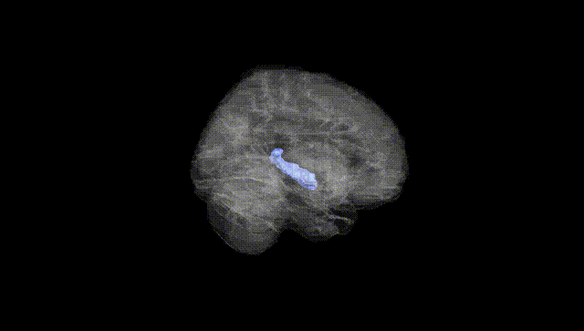
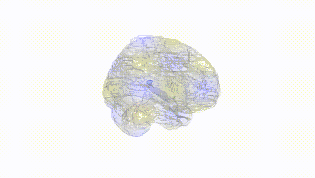
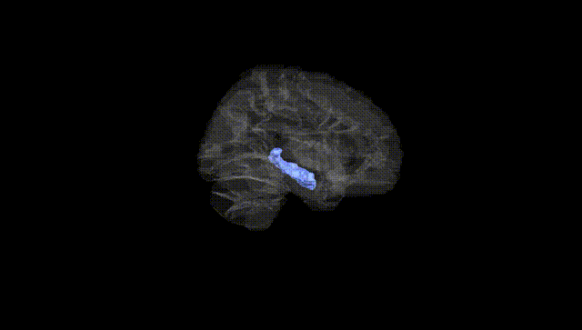
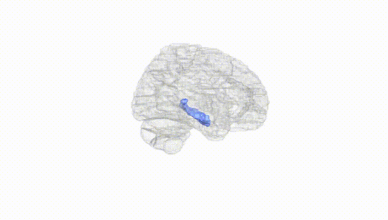
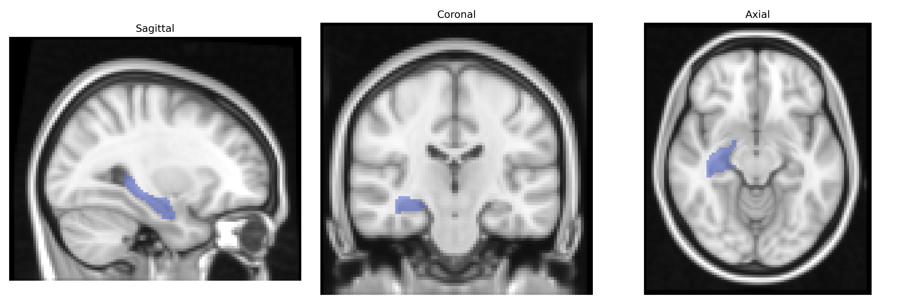
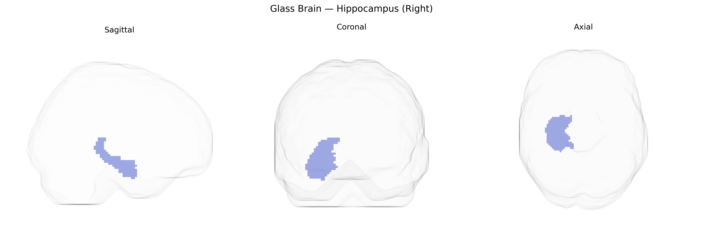

# Hippocampus (Right)
 
## Overview
 
The right hippocampus is a medial temporal lobe structure crucial for episodic memory formation, spatial navigation, and contextual processing, often described as part of the limbic system. It consists of distinct subfields (CA1–CA4, dentate gyrus, and subiculum) arranged in a curved, laminated architecture that supports synaptic plasticity and long-term potentiation, key mechanisms for memory encoding and consolidation. The right hippocampus is frequently associated with visuospatial memory and navigation, complementing the left hippocampus, which is more strongly linked to verbal and linguistic memory processes. It receives multimodal inputs from the entorhinal cortex and projects to widespread cortical and subcortical regions, including the prefrontal cortex and amygdala, integrating sensory, emotional, and contextual information. Structural or functional alterations in the right hippocampus are implicated in conditions such as temporal lobe epilepsy, Alzheimer’s disease, depression, and post-traumatic stress disorder. [Hippocampus](https://en.wikipedia.org/wiki/Hippocampus)
 
The right hippocampus, as defined in the AAL atlas, shows robust heritability and has been implicated by numerous GWAS in relation to both regional volume and a range of neuropsychiatric and cognitive traits; common variants in and near genes such as APOE, MAPT, SORL1, MS4A6A, TOMM40, BIN1, and CLU, as well as loci in pathways related to synaptic function, neurodevelopment, and lipid metabolism, have been associated with right hippocampal volume or shape, particularly in large imaging-genetics consortia (e.g., ENIGMA, UK Biobank). Reduced right hippocampal volume has been genetically linked to Alzheimer’s disease risk, with APOE ε4 carriers often showing more pronounced atrophy, and polygenic risk scores for Alzheimer’s, schizophrenia, and major depression correlating with smaller right hippocampal volume or altered asymmetry. GWAS have also connected variation in right hippocampal structure with traits such as general cognitive ability, memory performance, educational attainment, and risk for epilepsy and bipolar disorder, highlighting shared genetic architectures between right hippocampal morphology and psychiatric or neurodegenerative phenotypes. Overall, the right hippocampus emerges as a genetically influenced structure whose variation reflects overlapping polygenic contributions from disease-related and cognition-related loci rather than a single disorder-specific genetic signature.
 
*Overview generated by GPT-4o (2026).*
 
---
 
**Region ID:** 4102  
**Hemisphere:** right  
**Atlas:** AAL 
 
---
 
## Hippocampus (Right) – Black Background (Full Brain)
 

 
**Full Quality Version:** <a href="full_black.mp4" download>Download MP4</a>
 
---
 
## Hippocampus (Right) – White Background (Full Brain)
 

 
**Full Quality Version:** <a href="full_white.mp4" download>Download MP4</a>
 
---

## Hippocampus (Right) – Black Background (Hemisphere)
 

 
**Full Quality Version:** <a href="hemi_black.mp4" download>Download MP4</a>
 
---
 
## Hippocampus (Right) – White Background (Hemisphere)
 

 
**Full Quality Version:** <a href="hemi_white.mp4" download>Download MP4</a>
 
---

## Triplanar View – T1 Background
 

 
---
 
## Triplanar View – Ghost Brain
 


