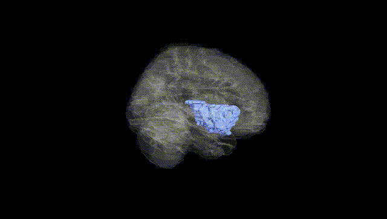
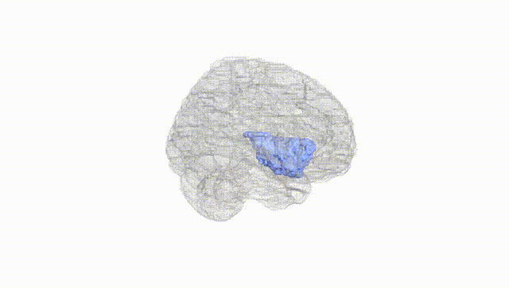
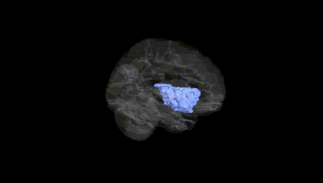
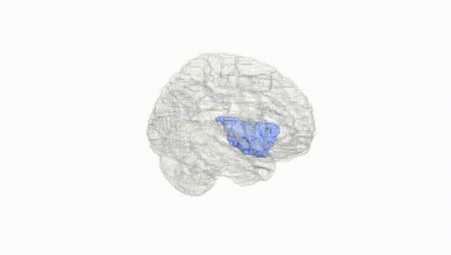
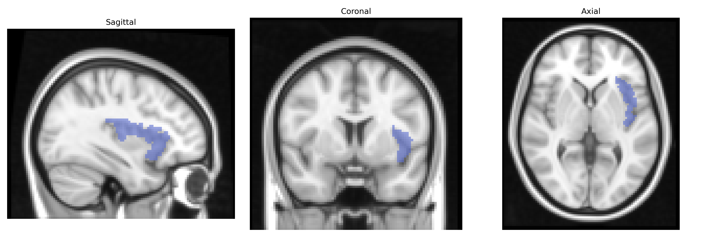
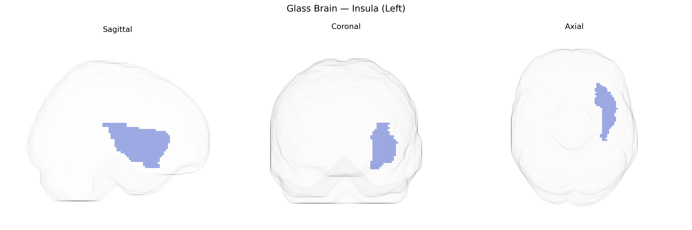

# Insula (Left)
 
## Overview
 
The left insula, as defined in the AAL atlas, is a cortical region buried deep within the lateral sulcus and covered by the frontal, parietal, and temporal opercula. It is structurally divided into anterior and posterior portions with distinct cytoarchitectonic and functional characteristics. The anterior insula is heavily interconnected with limbic and prefrontal regions and is involved in interoceptive awareness, emotional processing, salience detection, and aspects of cognitive control, while the posterior insula is more closely associated with somatosensory, pain, and visceral processing, integrating sensory inputs related to the internal state of the body. The left insula, in particular, shows lateralized contributions to language, affective processing, and speech motor control in many individuals, consistent with left-hemisphere specialization. It receives multimodal inputs from thalamic nuclei and projects to prefrontal, limbic, and sensory association cortices, supporting its role as a hub for integrating internal bodily states with higher-order cognitive and affective functions. [Insular cortex](https://en.wikipedia.org/wiki/Insular_cortex)
 
The left insular cortex, as defined in the AAL atlas, has been implicated in multiple imaging-genetics and GWAS studies, largely through its structural and functional variation. Common variants in genes such as BDNF (e.g., Val66Met), CACNA1C, and COMT have been associated with insular volume or activity, particularly in circuits related to emotion regulation, interoception, and salience processing. Large neuroimaging GWAS from consortia like ENIGMA and UK Biobank have identified polygenic influences on insular cortical thickness and surface area, with loci near genes involved in neurodevelopment, synaptic function, and axon guidance (for example, variants near genes such as TESC, PAX6, and DPYSL5 in some cortical-structure GWAS), although findings are typically distributed and highly polygenic rather than region-specific. Genetically informed studies in psychiatric disorders—especially major depressive disorder, schizophrenia, bipolar disorder, and anxiety—have repeatedly reported insular abnormalities (reduced or altered insular volume and connectivity), with some of these differences statistically mediating the effects of polygenic risk scores for these disorders on clinical symptoms. In addiction-related and pain-related GWAS and imaging-genetic work, the left insula has been linked to genes influencing dopaminergic and opioid signaling and to polygenic risk for substance use and chronic pain, consistent with its role in craving, risk evaluation, and interoceptive pain awareness. Further, GWAS of traits such as neuroticism, emotional reactivity, and cardiovascular autonomic measures have shown associations with insula morphology or function, suggesting that common genetic variation influencing affective and autonomic processes frequently converges on this region, though no single gene or variant can be considered uniquely specific to the left insula.
 
*Overview generated by GPT-4o (2026).*
 
---
 
**Region ID:** 3001  
**Hemisphere:** left  
**Atlas:** AAL 
 
---
 
## Insula (Left) – Black Background (Full Brain)
 

 
**Full Quality Version:** <a href="full_black.mp4" download>Download MP4</a>
 
---
 
## Insula (Left) – White Background (Full Brain)
 

 
**Full Quality Version:** <a href="full_white.mp4" download>Download MP4</a>
 
---

## Insula (Left) – Black Background (Hemisphere)
 

 
**Full Quality Version:** <a href="hemi_black.mp4" download>Download MP4</a>
 
---
 
## Insula (Left) – White Background (Hemisphere)
 

 
**Full Quality Version:** <a href="hemi_white.mp4" download>Download MP4</a>
 
---

## Triplanar View – T1 Background
 

 
---
 
## Triplanar View – Ghost Brain
 


