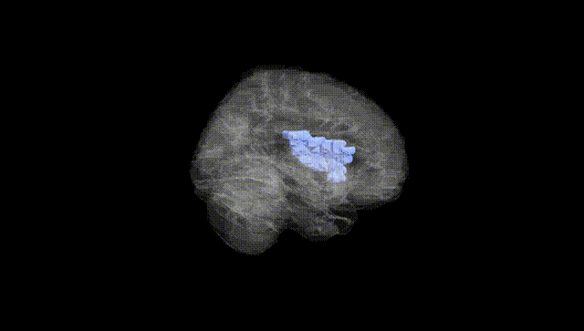
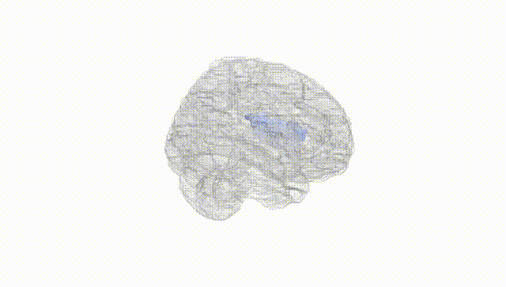
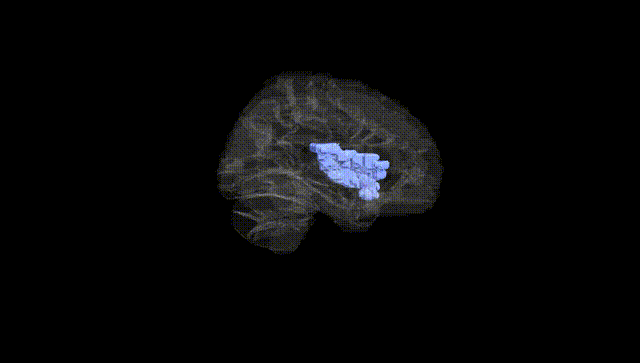
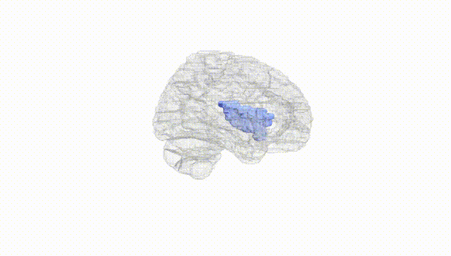
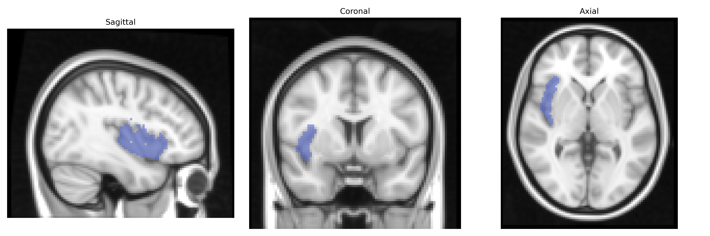
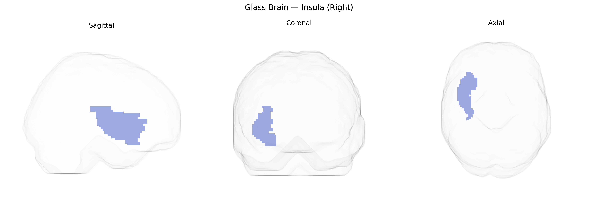

# Insula (Right)
 
## Overview
 
The right insula (Right) in the AAL atlas corresponds to the right insular cortex, a deeply situated cortical region buried within the lateral sulcus and covered by parts of the frontal, parietal, and temporal opercula. It is cytoarchitectonically heterogeneous, with posterior portions more granular and linked to sensorimotor integration (including visceral, somatosensory, and pain processing) and anterior portions more agranular and associated with higher-order functions such as interoceptive awareness, emotional processing, risk evaluation, and autonomic regulation. The right insula is a key node in the salience network, contributing to the detection of behaviorally relevant stimuli and mediation between default-mode and executive networks, and shows lateralized involvement in affective and sympathetic autonomic processes. Developmentally and functionally, it integrates limbic, sensory, and cognitive signals, supporting complex functions such as subjective feeling states, gustatory perception, and aspects of self-awareness. [Insular cortex](https://en.wikipedia.org/wiki/Insular_cortex)
 
Genetic associations involving the right insula in the AAL atlas largely emerge from neuroimaging GWAS that link common variants to insular structure and function, as well as from disorder-focused studies implicating insula-related circuits. Large-scale brain morphology GWAS (e.g., ENIGMA and UK Biobank) have identified multiple loci affecting insular cortical thickness and surface area, including variants near genes involved in neurodevelopment and synaptic function (such as MEF2C, TESC, and other loci regulating cortical patterning), although these findings often do not distinguish left from right insula in detail. Insula-related activation patterns in pain perception and interoception have been connected to genetic variation in dopaminergic and opioid system genes (e.g., COMT, OPRM1) and serotonin-related genes that modulate affective and sensory processing, with fMRI genetics showing genotype-dependent differences in insular reactivity to pain, disgust, and emotional stimuli. Psychiatric and neurological GWAS occasionally highlight the insula as a key node in circuits affected by risk variants: schizophrenia, major depression, bipolar disorder, autism spectrum disorder, and anxiety disorders show structural and functional insular alterations that co-localize with polygenic risk burdens, and some imaging–genetics work has reported that higher polygenic risk scores for these conditions predict reduced insular volume or altered connectivity, including lateralized effects in the right insula in certain studies of depression and anxiety. In addiction and substance use disorders, variants in genes such as CHRNA5–CHRNA3–CHRNB4 (nicotinic receptors) and dopaminergic pathway genes have been associated with altered insular activity and connectivity during craving and cue reactivity tasks. Overall, the right insula emerges in genetic studies as a convergence point for neurodevelopmental, emotional, interoceptive, and addiction-related genetic influences, though most findings reflect bilateral or general insular effects rather than strictly right-lateralized, AAL-defined regional specificity.
 
*Overview generated by GPT-4o (2026).*
 
---
 
**Region ID:** 3002  
**Hemisphere:** right  
**Atlas:** AAL 
 
---
 
## Insula (Right) – Black Background (Full Brain)
 

 
**Full Quality Version:** <a href="full_black.mp4" download>Download MP4</a>
 
---
 
## Insula (Right) – White Background (Full Brain)
 

 
**Full Quality Version:** <a href="full_white.mp4" download>Download MP4</a>
 
---

## Insula (Right) – Black Background (Hemisphere)
 

 
**Full Quality Version:** <a href="hemi_black.mp4" download>Download MP4</a>
 
---
 
## Insula (Right) – White Background (Hemisphere)
 

 
**Full Quality Version:** <a href="hemi_white.mp4" download>Download MP4</a>
 
---

## Triplanar View – T1 Background
 

 
---
 
## Triplanar View – Ghost Brain
 


