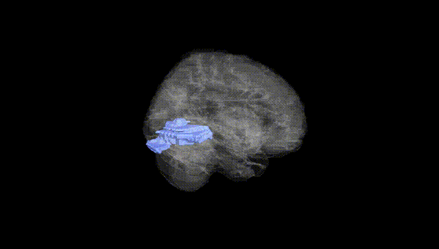
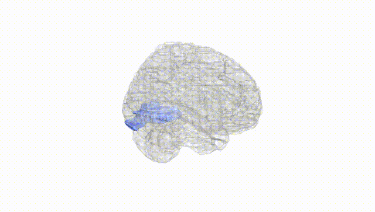
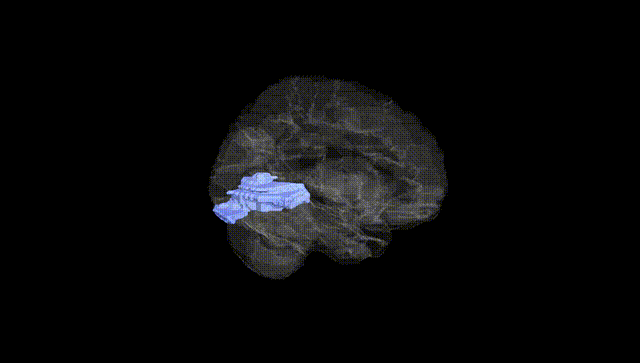
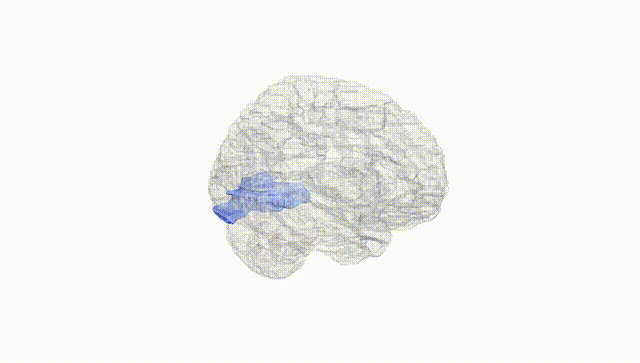
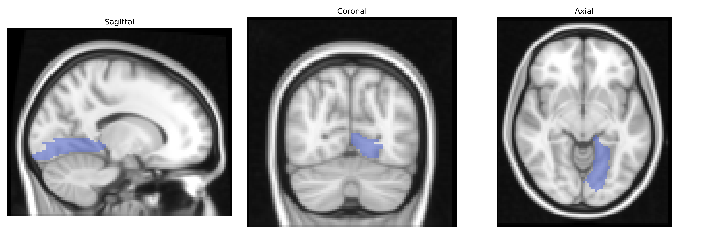
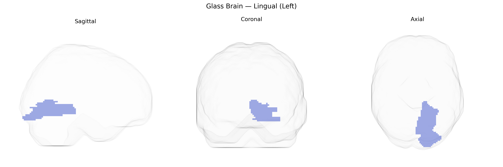

# Lingual (Left)
 
## Overview
 
The left lingual gyrus, as defined in the AAL atlas, is a medial occipital lobe structure located ventral to the calcarine sulcus and extending into the posterior part of the temporal lobe. It contains portions of Brodmann areas 17, 18, and 19, and is heavily involved in early and intermediate stages of visual processing, particularly related to complex pattern, letter, and word-form recognition, as well as aspects of visuospatial integration. This region receives input from primary visual cortex and contributes to higher-order visual functions that support reading, object identification, and integration of visual features into coherent percepts. Lateralization to the left hemisphere is associated with specialized roles in visual word processing and interaction with language-related cortices in the temporal and parietal lobes. [Lingual gyrus](https://en.wikipedia.org/wiki/Lingual_gyrus)
 
The left lingual gyrus, as defined in the AAL atlas, has been implicated in several genetic and imaging-genetics studies, with associations spanning visual processing, psychiatric and neurological conditions, and cognitive traits. GWAS of brain structure and function (e.g., ENIGMA, UK Biobank) have identified common variants influencing cortical thickness, surface area, and activation in lingual regions, including loci near or within genes such as HMGA2 (general brain size and surface area), MAPT (temporal–occipital measures), and multiple synaptic and neurodevelopmental genes contributing to occipital and ventral visual cortex morphology; however, these are typically region‑group or vertex‑wise associations rather than uniquely specific to the left lingual gyrus. Imaging-genetics studies in schizophrenia, major depressive disorder, and bipolar disorder have reported disorder‑risk variants (for example in ZNF804A, DISC1, and other synaptic/neurodevelopmental genes) that modulate lingual gyrus volume or task‑related activation, often in the context of visual or emotional processing tasks. In autism spectrum disorder and ADHD, common and rare variants affecting synaptic plasticity and cortical patterning have been linked to altered occipital/lingual activation during face and visual attention tasks. Variants associated with reading and language-related traits (e.g., in DCDC2, KIAA0319, and other dyslexia-susceptibility genes) have shown associations with functional differences in left occipito‑temporal areas that encompass the lingual gyrus, consistent with its role in orthographic and visual word processing. Additionally, genetic influences on visual perception, migraine, and occipital lobe epilepsy have been inferred from altered structure or perfusion in lingual regions, although specific left‑lingual–restricted GWAS hits remain rare and most findings reflect polygenic effects shared across broader occipital and ventral visual cortices.
 
*Overview generated by GPT-4o (2026).*
 
---
 
**Region ID:** 5021  
**Hemisphere:** left  
**Atlas:** AAL 
 
---
 
## Lingual (Left) – Black Background (Full Brain)
 

 
**Full Quality Version:** <a href="full_black.mp4" download>Download MP4</a>
 
---
 
## Lingual (Left) – White Background (Full Brain)
 

 
**Full Quality Version:** <a href="full_white.mp4" download>Download MP4</a>
 
---

## Lingual (Left) – Black Background (Hemisphere)
 

 
**Full Quality Version:** <a href="hemi_black.mp4" download>Download MP4</a>
 
---
 
## Lingual (Left) – White Background (Hemisphere)
 

 
**Full Quality Version:** <a href="hemi_white.mp4" download>Download MP4</a>
 
---

## Triplanar View – T1 Background
 

 
---
 
## Triplanar View – Ghost Brain
 


