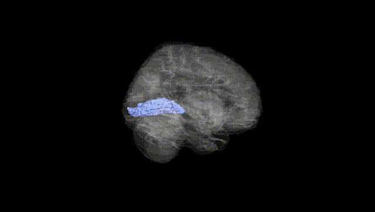
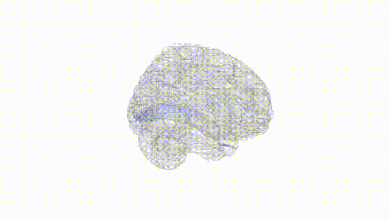
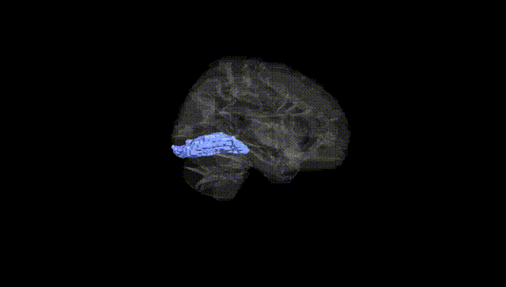
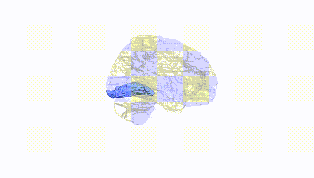
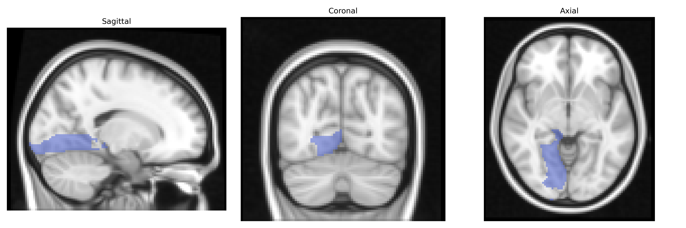
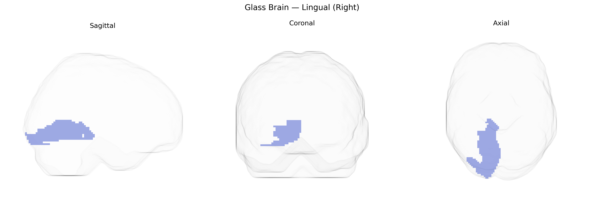

# Lingual (Right)
 
## Overview
 
The right lingual gyrus is a medial occipital lobe structure involved primarily in visual processing, including analysis of complex visual patterns, letter and word forms, and aspects of visual memory. It receives input from the primary visual cortex and participates in higher-order visual association functions, contributing to recognition of shapes, scenes, and written language, as well as integration of visual information with other sensory and cognitive domains. Functionally, it is implicated in visual imagery, reading, and certain aspects of visuospatial attention, and shows activation in tasks requiring detailed visual discrimination and encoding of visual stimuli into memory. [Lingual gyrus](https://en.wikipedia.org/wiki/Lingual_gyrus)
 
The right lingual gyrus, as defined in the AAL atlas, has been implicated in several genetic and imaging-genetics studies, particularly through GWAS of cortical thickness, surface area, and functional activation. Variants in genes related to synaptic function, neurodevelopment, and myelination (e.g., BDNF, CNTNAP2, GRIN2B, and APOE) have been associated with structural or functional measures in occipital and lingual cortices, often in the context of visual processing and memory. Imaging-genetics work has linked APOE ε4 and other Alzheimer’s disease–risk variants to altered occipital and lingual gray matter volume and connectivity, and polygenic risk scores for schizophrenia, bipolar disorder, and major depression have been associated with structural differences in visual association regions including the lingual gyrus. GWAS of traits such as reading ability, dyslexia, and visual word recognition report associations between genetic variants in neuronal migration and axon guidance pathways and activation patterns in left and right lingual regions during reading and visual tasks. Additionally, autism spectrum disorder and attention-deficit/hyperactivity disorder genetic risk has been tied to atypical activation and connectivity in the lingual gyrus in imaging-genetics cohorts, while migraine and visual aura studies point to associations between ion channel and vascular-related variants and altered lingual cortex excitability. Although many studies examine bilateral or occipital-lobe effects rather than isolating the right lingual region, converging evidence indicates that genetic influences on visual processing, reading, neurodevelopmental and neurodegenerative disorders, and cortical morphology frequently involve this AAL-defined area.
 
*Overview generated by GPT-4o (2026).*
 
---
 
**Region ID:** 5022  
**Hemisphere:** right  
**Atlas:** AAL 
 
---
 
## Lingual (Right) – Black Background (Full Brain)
 

 
**Full Quality Version:** <a href="full_black.mp4" download>Download MP4</a>
 
---
 
## Lingual (Right) – White Background (Full Brain)
 

 
**Full Quality Version:** <a href="full_white.mp4" download>Download MP4</a>
 
---

## Lingual (Right) – Black Background (Hemisphere)
 

 
**Full Quality Version:** <a href="hemi_black.mp4" download>Download MP4</a>
 
---
 
## Lingual (Right) – White Background (Hemisphere)
 

 
**Full Quality Version:** <a href="hemi_white.mp4" download>Download MP4</a>
 
---

## Triplanar View – T1 Background
 

 
---
 
## Triplanar View – Ghost Brain
 


