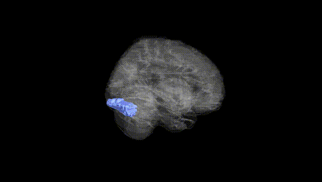
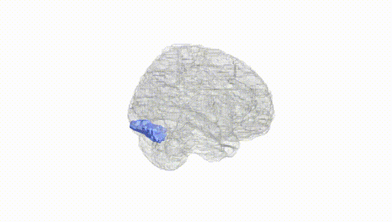
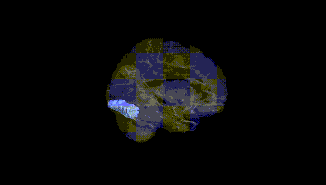
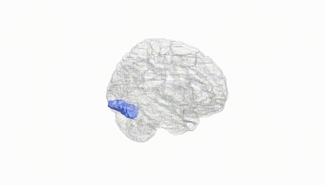
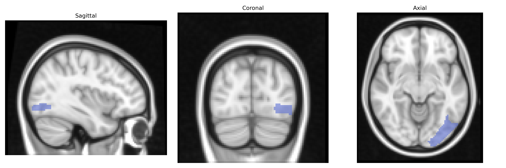
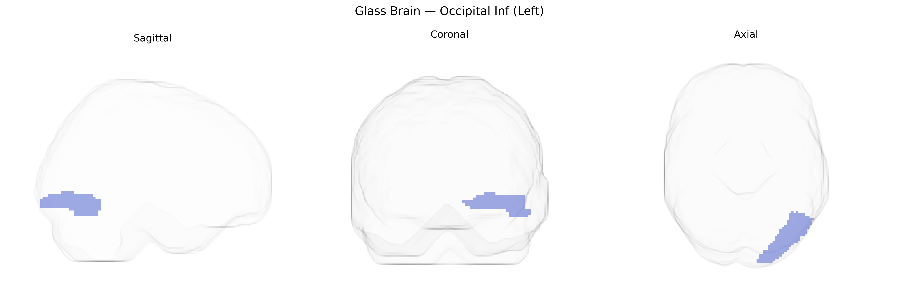

# Occipital Inf (Left)
 
## Overview
 
The left Inferior Occipital gyrus (Occipital_Inf_L) in the AAL atlas is a ventral occipital cortical region involved primarily in early and intermediate stages of visual processing, including analysis of form, contour, and complex object features. It lies on the inferolateral surface of the occipital lobe, bordering other occipital and temporo-occipital regions, and receives strong input from primary and secondary visual areas. Functionally, this region contributes to the ventral “what” visual pathway, supporting object recognition and contributing to category-specific visual processing in conjunction with adjacent fusiform and lateral occipital areas. Lesions or dysfunction in the inferior occipital cortex can impair detailed visual perception and object identification, and it often serves as a seed or region of interest in neuroimaging studies examining visual perception, face and object processing, and occipito-temporal network connectivity. There is no direct Wikipedia article for this exact AAL label; a closely related structure is the [Occipital lobe](https://en.wikipedia.org/wiki/Occipital_lobe).
 
The left inferior occipital gyrus (Occipital_Inf_L in the AAL atlas), a core component of the ventral visual stream implicated in object and word-form processing, has been indirectly linked to several genetic influences through imaging genetics and GWAS of brain structure and function rather than region-specific candidate-gene studies. Large-scale brain MRI GWAS (e.g., ENIGMA and UK Biobank–based studies) have identified multiple loci affecting occipital and visual cortical surface area and thickness—including variants near genes involved in neurodevelopment, synaptic signaling, and axon guidance (such as MEF2C, MAPT, KIAA0586, and loci enriched for glutamatergic and GABAergic pathways)—although these are typically reported at the lobe or visual-cortex level rather than specifically isolating the inferior occipital gyrus. Functional imaging genetics has connected polymorphisms in genes like BDNF (e.g., Val66Met), dopamine- and serotonin-related genes, and dyslexia-associated loci (such as DCDC2 and KIAA0319) with altered activation in ventral occipito-temporal regions encompassing or overlapping the left inferior occipital area during reading, face, or object recognition tasks. Genetic liability for neurodevelopmental and psychiatric disorders—including dyslexia, autism spectrum disorder, and schizophrenia—has been associated with atypical structure or activation in ventral occipital regions, including the left inferior occipital gyrus and adjacent fusiform cortex, and polygenic risk scores for these conditions correlate with occipital and visual-network measures in some cohorts, though spatial specificity is often coarse. Moreover, GWAS of visual perceptual traits (e.g., visual acuity, contrast sensitivity, and face recognition ability) and reading-related skills suggest polygenic influences that map onto networks involving this region, but to date no robust, widely replicated GWAS signals are uniquely and specifically assigned to the AAL-defined Occipital_Inf_L, and most genetic associations remain at the level of broader visual and ventral temporal occipital circuitry rather than a single AAL parcel.
 
*Overview generated by GPT-4o (2026).*
 
---
 
**Region ID:** 5301  
**Hemisphere:** left  
**Atlas:** AAL 
 
---
 
## Occipital Inf (Left) – Black Background (Full Brain)
 

 
**Full Quality Version:** <a href="full_black.mp4" download>Download MP4</a>
 
---
 
## Occipital Inf (Left) – White Background (Full Brain)
 

 
**Full Quality Version:** <a href="full_white.mp4" download>Download MP4</a>
 
---

## Occipital Inf (Left) – Black Background (Hemisphere)
 

 
**Full Quality Version:** <a href="hemi_black.mp4" download>Download MP4</a>
 
---
 
## Occipital Inf (Left) – White Background (Hemisphere)
 

 
**Full Quality Version:** <a href="hemi_white.mp4" download>Download MP4</a>
 
---

## Triplanar View – T1 Background
 

 
---
 
## Triplanar View – Ghost Brain
 


