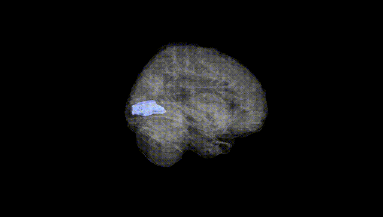
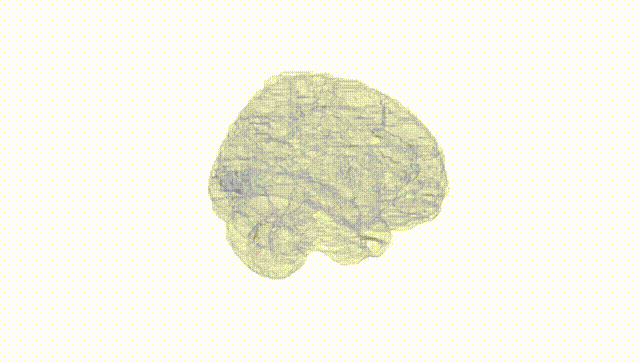
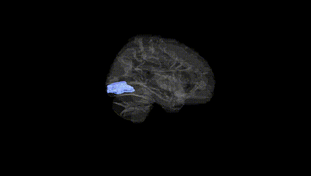
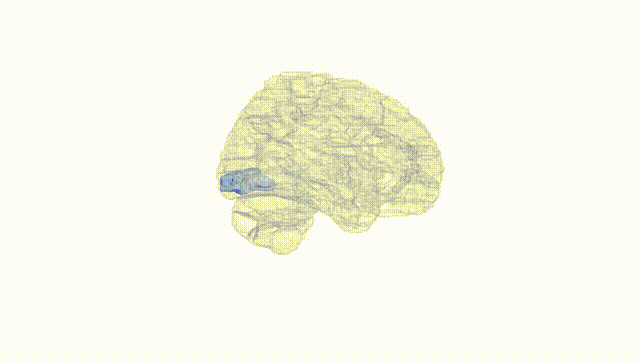
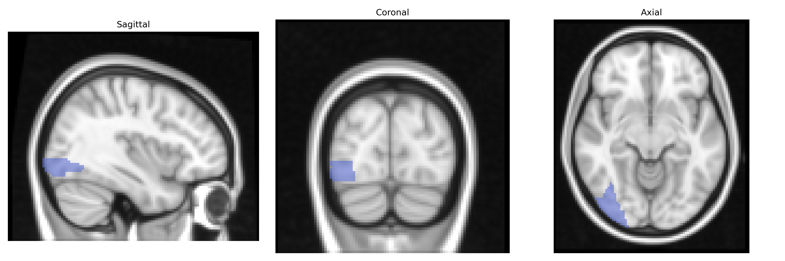
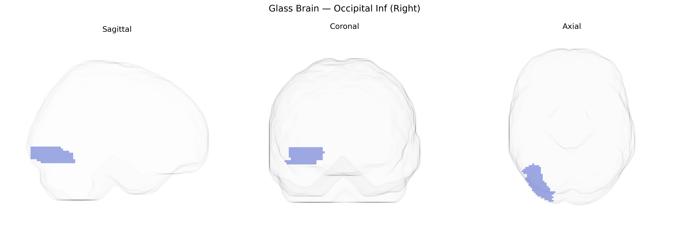

# Occipital Inf (Right)
 
## Overview
 
The right Inferior Occipital Gyrus (Occipital Inf Right) is a cortical region located in the ventral portion of the occipital lobe, forming part of the visual association cortex involved in early and intermediate stages of visual processing. It participates in the analysis of complex visual features such as object shape, contours, and motion, and contributes to pathways projecting toward temporal regions that support object recognition and toward parietal regions that support spatial processing. This gyrus lies inferior to the middle occipital gyrus and adjacent to occipitotemporal (fusiform) regions, receiving input from primary visual cortex and relaying processed information to higher-order visual and multimodal areas. There is no direct Wikipedia page for the right Inferior Occipital Gyrus as a standalone region; a related entry describing its broader anatomical and functional context is [Occipital lobe](https://en.wikipedia.org/wiki/Occipital_lobe).
 
The right inferior occipital gyrus (Occipital Inf Right in the AAL atlas), a key ventral visual stream region involved in object and face processing, has been indirectly implicated in several genetic and GWAS-based findings through imaging-genetics and neuropsychiatric studies rather than via region-specific GWAS. Large-scale brain structure GWAS (e.g., ENIGMA and UK Biobank) have identified common variants influencing occipital cortical thickness and surface area, including loci near genes involved in neurodevelopment (such as PAX6, TBR1, and other transcriptional regulators of cortical patterning), though these effects typically span broader occipital territories rather than the inferior occipital gyrus alone. Imaging-genetics work in schizophrenia, autism spectrum disorder, and major depression has associated risk variants in synaptic and neurodevelopmental genes (for example CACNA1C, DISC1, and neurexin/neuroligin-related loci) with altered occipital activation or structure during visual and face-processing tasks, implicating inferior occipital regions as part of wider networks affected by polygenic risk. Face-perception and social cognition GWAS and candidate-gene studies (including those targeting oxytocin signaling and serotonergic systems) have shown that genetic variation modulates activation in occipito-temporal areas, often encompassing the inferior occipital gyrus as an early-stage face-processing node. Additionally, neurodegenerative and visual pathway disorders (such as posterior cortical atrophy and certain hereditary optic neuropathies) show genetically influenced atrophy or functional changes in occipital cortices; however, existing evidence remains coarse-grained at the atlas level, and no robust, widely replicated GWAS has yet identified variants uniquely or specifically associated with the right Occipital Inf region itself.
 
*Overview generated by GPT-4o (2026).*
 
---
 
**Region ID:** 5302  
**Hemisphere:** right  
**Atlas:** AAL 
 
---
 
## Occipital Inf (Right) – Black Background (Full Brain)
 

 
**Full Quality Version:** <a href="full_black.mp4" download>Download MP4</a>
 
---
 
## Occipital Inf (Right) – White Background (Full Brain)
 

 
**Full Quality Version:** <a href="full_white.mp4" download>Download MP4</a>
 
---

## Occipital Inf (Right) – Black Background (Hemisphere)
 

 
**Full Quality Version:** <a href="hemi_black.mp4" download>Download MP4</a>
 
---
 
## Occipital Inf (Right) – White Background (Hemisphere)
 

 
**Full Quality Version:** <a href="hemi_white.mp4" download>Download MP4</a>
 
---

## Triplanar View – T1 Background
 

 
---
 
## Triplanar View – Ghost Brain
 


