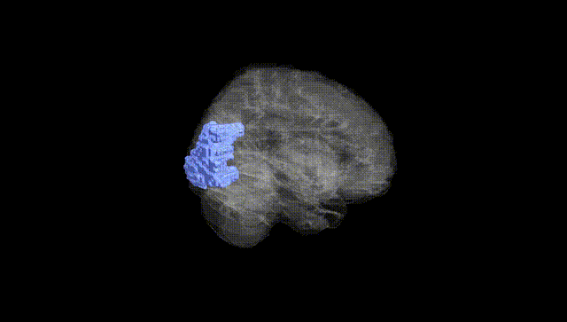
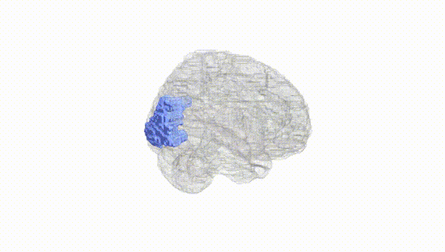
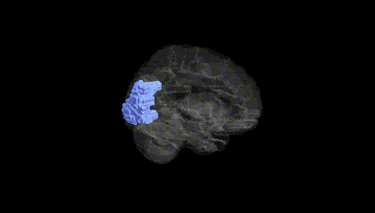
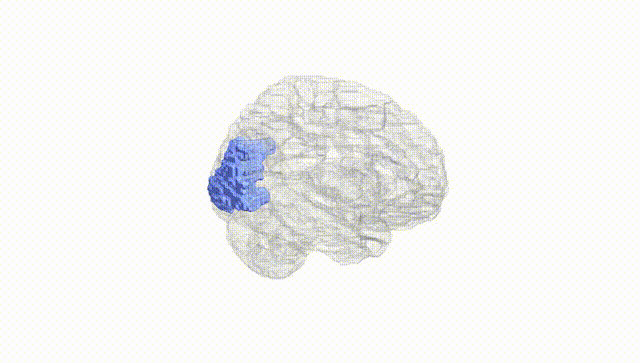
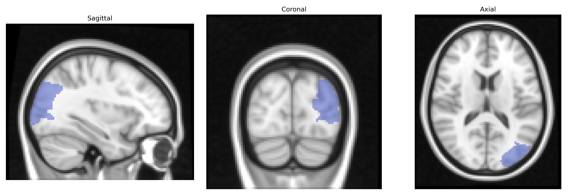
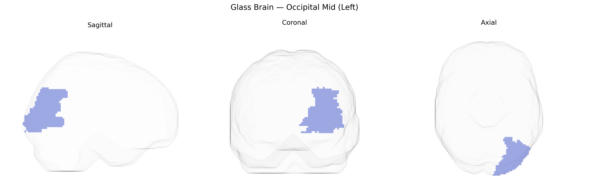

# Occipital Mid (Left)
 
## Overview
 
The left Occipital Mid (Left), corresponding to the middle occipital gyrus in the AAL atlas, is a cortical region located on the lateral surface of the occipital lobe, bounded superiorly by the superior occipital gyrus and inferiorly by the inferior occipital regions and temporo-occipital junction. It is primarily involved in intermediate-level visual processing, including analysis of motion, shape, and spatial relationships, and contributes to the integration of visual information necessary for object recognition and visually guided behavior. This region forms part of the dorsal and ventral visual streams through its connections with parietal and temporal cortices, respectively, and is supplied by branches of the posterior cerebral artery. There is no direct Wikipedia article for “Occipital Mid,” but it is closely related to the [Middle occipital gyrus](https://en.wikipedia.org/wiki/Middle_occipital_gyrus).
 
Genetic associations specific to the left middle occipital gyrus (Occipital Mid L in the AAL atlas) are relatively sparse, but several imaging-genetics and GWAS studies implicate this region in visual processing, higher-order cognition, and neuropsychiatric phenotypes. Heritability estimates from twin and family studies show that occipital cortical thickness and surface area, including middle occipital regions, are moderately to highly heritable, and large neuroimaging GWAS (e.g., ENIGMA, UK Biobank) have identified common variants near genes involved in neurodevelopment and synaptic function (such as HMGA2, MIR137, CRTC1, and variants in Wnt and axon guidance pathways) that influence occipital cortical morphology. Altered structure or activation of the middle occipital gyrus has been reported in schizophrenia, major depressive disorder, autism spectrum disorder, and dyslexia, often in concert with genetic risk scores or specific risk loci, suggesting that polygenic architectures affecting visual and associative cortices contribute to these conditions. In visual system disorders, including migraine with aura and some forms of visual hallucinations, imaging-genetic work has linked risk alleles in glutamatergic and vascular-related genes to occipital activation differences, though attribution to the middle occipital gyrus alone is typically indirect. Overall, the left Occipital Mid region appears as part of broader occipito-parietal and occipito-temporal networks whose structure and function are influenced by common neurodevelopmental and synaptic variants, with disease associations emerging through distributed cortico-cortical patterns rather than region-specific GWAS hits.
 
*Overview generated by GPT-4o (2026).*
 
---
 
**Region ID:** 5201  
**Hemisphere:** left  
**Atlas:** AAL 
 
---
 
## Occipital Mid (Left) – Black Background (Full Brain)
 

 
**Full Quality Version:** <a href="full_black.mp4" download>Download MP4</a>
 
---
 
## Occipital Mid (Left) – White Background (Full Brain)
 

 
**Full Quality Version:** <a href="full_white.mp4" download>Download MP4</a>
 
---

## Occipital Mid (Left) – Black Background (Hemisphere)
 

 
**Full Quality Version:** <a href="hemi_black.mp4" download>Download MP4</a>
 
---
 
## Occipital Mid (Left) – White Background (Hemisphere)
 

 
**Full Quality Version:** <a href="hemi_white.mp4" download>Download MP4</a>
 
---

## Triplanar View – T1 Background
 

 
---
 
## Triplanar View – Ghost Brain
 


