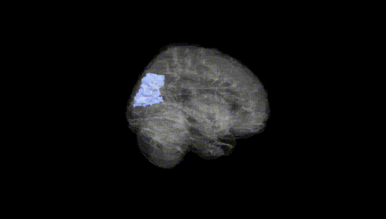
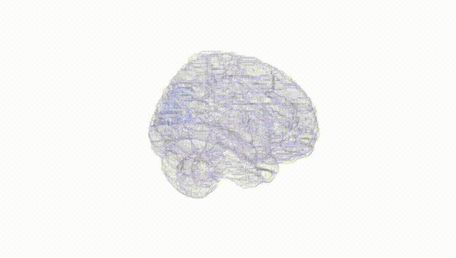
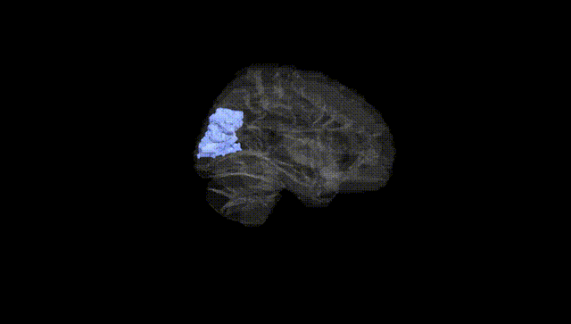
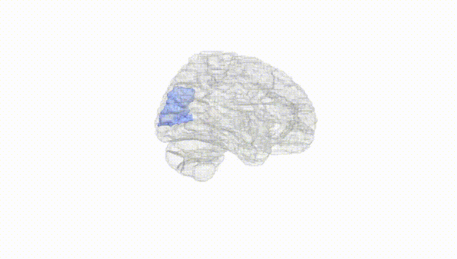
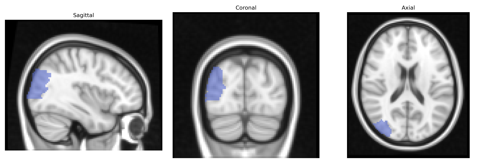
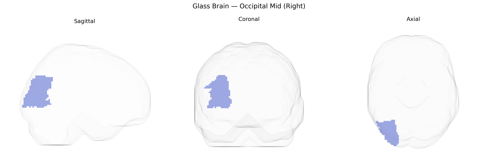

# Occipital Mid (Right)
 
## Overview
 
The right Occipital Mid (Right) region in the AAL atlas corresponds primarily to the middle occipital gyrus of the right cerebral hemisphere, a lateral occipital cortical area involved in visual processing, particularly intermediate-level analysis of shape, motion, and object features. Cytoarchitectonically, it lies within the occipital lobe between superior and inferior occipital regions and is interconnected with primary visual cortex (V1), dorsal and ventral visual streams, and parietal and temporal association areas. Functionally, this region contributes to visuospatial perception, object recognition, and integration of visual information necessary for guiding attention and visually oriented actions; it is frequently activated in tasks involving motion perception, complex visual scenes, and visuomotor coordination. There is no direct link for the AAL label itself; a closely related structure is the [Middle occipital gyrus](https://en.wikipedia.org/wiki/Middle_occipital_gyrus).
 
Genetic associations specifically targeting the right middle occipital gyrus (Occipital Mid Right) in the AAL atlas are limited, but several GWAS and imaging‑genetics studies implicate this region as part of broader occipital and visual cortical networks. Common variants in genes related to synaptic function and neurodevelopment—such as GRIN2B, NRG1, BDNF, and CNTNAP2—have been associated with occipital cortical thickness or surface area, which often show bilateral or regionally diffuse effects that include middle occipital areas. Large neuroimaging GWAS consortia (e.g., ENIGMA, UK Biobank) report heritable variation in occipital lobe structure and activation patterns linked to loci near genes involved in axon guidance (e.g., ROBO1), myelination (e.g., MAG), and visual pathway development, although these findings rarely isolate the right middle occipital gyrus as a unique target. Functionally, genetic influences on visual processing endophenotypes—such as reading ability, face recognition, and motion perception—frequently implicate occipito‑temporal circuits that encompass the middle occipital cortex, with risk variants for dyslexia, autism spectrum disorder, and schizophrenia showing altered activation or connectivity in this region. Additionally, polygenic risk scores for major psychiatric disorders and neurodevelopmental conditions have been associated with structural and functional variation across the occipital lobe, including middle occipital areas, highlighting this region as a genetically modulated node in visual and higher‑order cognitive networks rather than a locus with highly specific, well‑replicated gene–region associations.
 
*Overview generated by GPT-4o (2026).*
 
---
 
**Region ID:** 5202  
**Hemisphere:** right  
**Atlas:** AAL 
 
---
 
## Occipital Mid (Right) – Black Background (Full Brain)
 

 
**Full Quality Version:** <a href="full_black.mp4" download>Download MP4</a>
 
---
 
## Occipital Mid (Right) – White Background (Full Brain)
 

 
**Full Quality Version:** <a href="full_white.mp4" download>Download MP4</a>
 
---

## Occipital Mid (Right) – Black Background (Hemisphere)
 

 
**Full Quality Version:** <a href="hemi_black.mp4" download>Download MP4</a>
 
---
 
## Occipital Mid (Right) – White Background (Hemisphere)
 

 
**Full Quality Version:** <a href="hemi_white.mp4" download>Download MP4</a>
 
---

## Triplanar View – T1 Background
 

 
---
 
## Triplanar View – Ghost Brain
 


