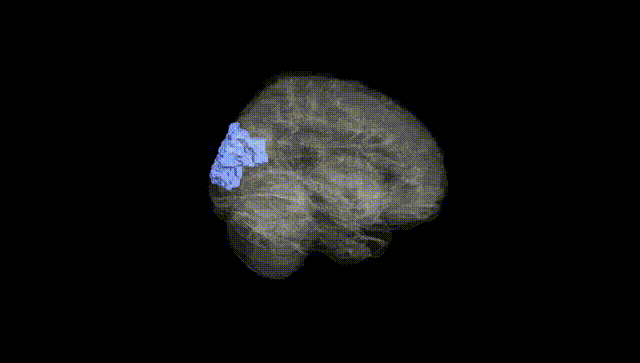
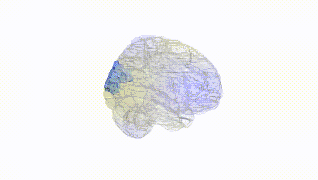
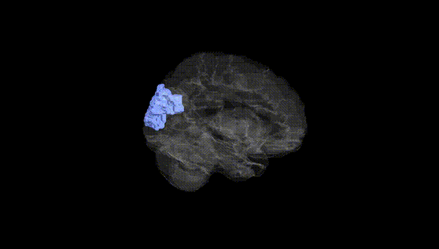
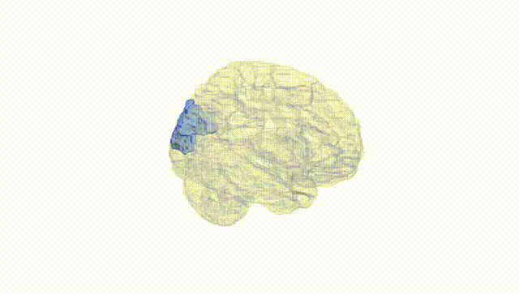
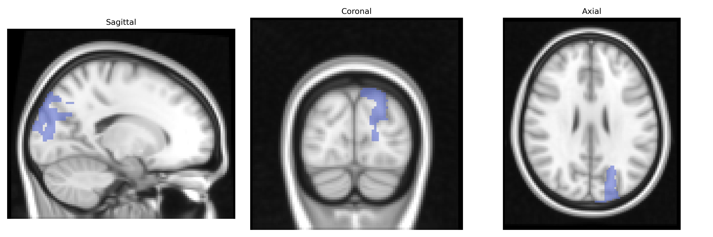
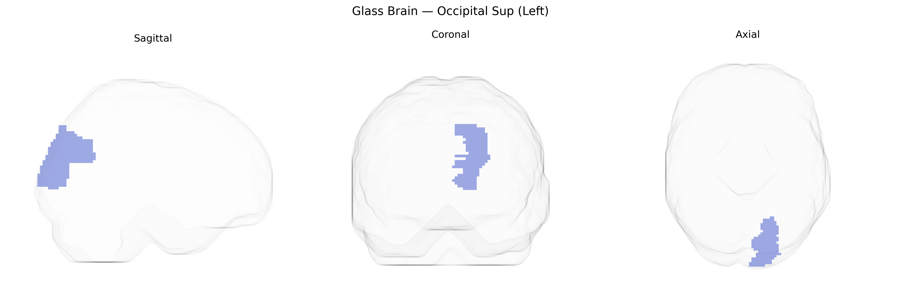

# Occipital Sup (Left)
 
## Overview
 
The left Occipital_Sup region in the AAL atlas corresponds primarily to the **left superior occipital gyrus**, a dorsal portion of the occipital lobe located superior to the calcarine fissure and posterior to the parietal lobe. It is composed mainly of visual association cortex (Brodmann areas 19 and parts of 18) and participates in higher-order visual processing, including integration of motion, spatial orientation, and visuomotor coordination. This region receives processed input from primary visual areas and contributes to dorsal “where/how” pathway functions, such as localizing objects in space and guiding eye and limb movements based on visual information. Structurally, it connects with parietal and frontal regions via long-range association fibers, supporting visuospatial attention and visually guided behavior. There is no direct Wikipedia article for “superior occipital gyrus”; a related structure and broader anatomical context is the [Occipital lobe](https://en.wikipedia.org/wiki/Occipital_lobe).
 
The left superior occipital gyrus (Occipital Sup (Left) in the AAL atlas) has been implicated in several large-scale imaging genetics and GWAS studies that link common variants to occipital structure and function, though typically as part of broader occipital or visual cortex measures rather than in isolation. Variants near genes involved in neurodevelopment and synaptic function (for example, in or near MAPT, MEF2C, EPHB, and other axon-guidance or plasticity-related loci) have been associated with occipital cortical thickness, surface area, and volume, and with functional activation in visual processing tasks. Occipital regions including the superior occipital gyrus show altered morphology or connectivity in genetically influenced conditions such as schizophrenia, autism spectrum disorder, major depressive disorder, and Alzheimer’s disease, where polygenic risk scores correlate with differences in occipital measures in some cohorts. GWAS of visual perception and visual acuity, reading and dyslexia, and general cognitive ability have reported associations that map onto occipital networks, including dorsal visual stream areas overlapping the superior occipital gyrus, although the implicated loci typically act on distributed networks rather than this region alone. Overall, genetic influences on the left superior occipital gyrus appear to be polygenic and shared with broader visual and cognitive systems, with no single locus uniquely tied to this specific AAL-defined region.
 
*Overview generated by GPT-4o (2026).*
 
---
 
**Region ID:** 5101  
**Hemisphere:** left  
**Atlas:** AAL 
 
---
 
## Occipital Sup (Left) – Black Background (Full Brain)
 

 
**Full Quality Version:** <a href="full_black.mp4" download>Download MP4</a>
 
---
 
## Occipital Sup (Left) – White Background (Full Brain)
 

 
**Full Quality Version:** <a href="full_white.mp4" download>Download MP4</a>
 
---

## Occipital Sup (Left) – Black Background (Hemisphere)
 

 
**Full Quality Version:** <a href="hemi_black.mp4" download>Download MP4</a>
 
---
 
## Occipital Sup (Left) – White Background (Hemisphere)
 

 
**Full Quality Version:** <a href="hemi_white.mp4" download>Download MP4</a>
 
---

## Triplanar View – T1 Background
 

 
---
 
## Triplanar View – Ghost Brain
 


