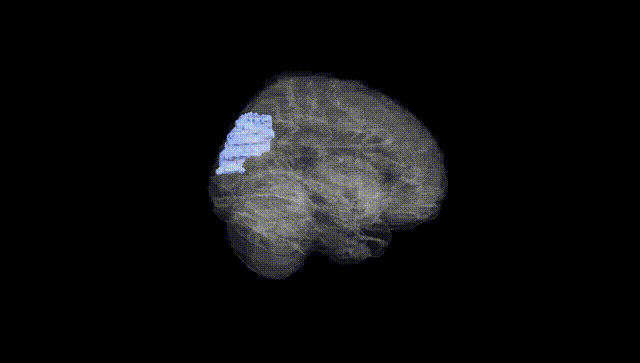
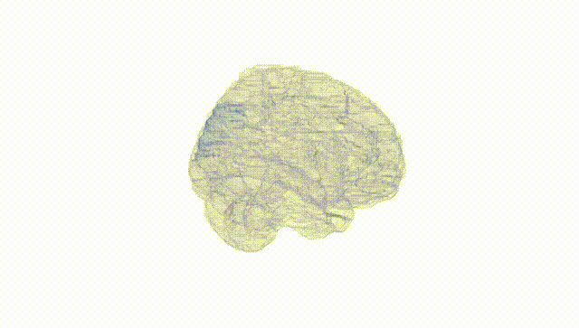
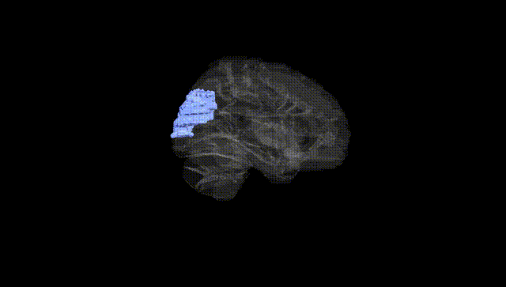
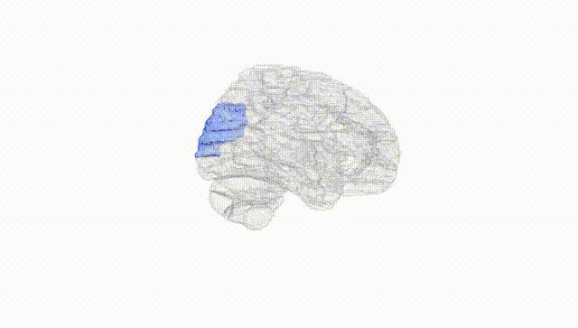
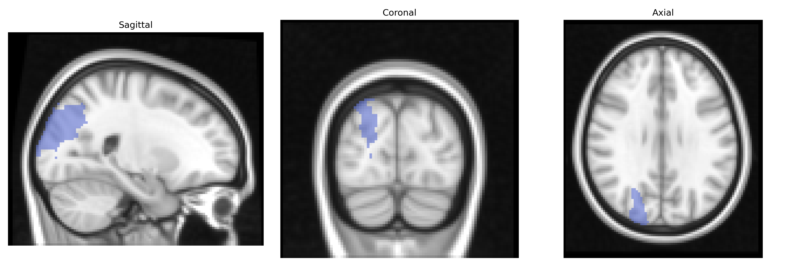
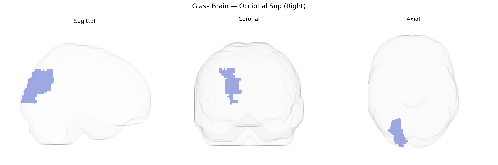

# Occipital Sup (Right)
 
## Overview
 
The right superior occipital gyrus (Right Occipital Sup in the AAL atlas) is a cortical region located in the dorsal portion of the occipital lobe, lateral and superior to primary visual cortex and bordering parietal regions such as the superior parietal lobule. It is primarily involved in higher-order visual processing, including integration of visual information related to spatial orientation, motion, and visuospatial attention, and participates in dorsal “where” pathway networks that support visually guided behavior and visuomotor coordination. Anatomically, it receives input from earlier visual areas (e.g., V1–V3) and projects to parietal association cortices, contributing to the transformation of retinotopic visual signals into spatial representations used for perception and action. There is no direct link for this exact AAL label; a related structure is the [Occipital lobe](https://en.wikipedia.org/wiki/Occipital_lobe).
 
The right superior occipital gyrus (Occipital Sup Right in the AAL atlas), a core component of the dorsal visual stream, has been implicated in several genetic and imaging‐genetic associations, though findings are generally indirect and regionally broad rather than specific to this exact parcel. Large‑scale brain MRI GWAS (e.g., ENIGMA and UK Biobank) show that cortical thickness and surface area in occipital regions, including superior occipital cortex, are heritable and influenced by common variants in genes involved in neurodevelopment, axon guidance, and synaptic function (such as variants near EPHB, MAPT, and microtubule- or cell-adhesion–related loci), with some hemispheric asymmetry effects reported but not consistently restricted to the right side. Occipital structural and functional measures overlapping the AAL Occipital Sup region have been genetically linked to neurodevelopmental and neuropsychiatric disorders, including schizophrenia, autism spectrum disorder, and major depression, often in the context of altered visual processing networks; for example, polygenic risk for schizophrenia and autism shows associations with occipital cortical thickness and connectivity patterns. GWAS of visual traits—such as visual acuity, contrast sensitivity, and susceptibility to visual illusions—as well as migraine and photosensitivity have identified loci influencing occipital cortex excitability and visual network responsivity, although these signals rarely map uniquely to the right superior occipital gyrus. Overall, current evidence supports that this region’s structure and function are moderately heritable, influenced by distributed polygenic effects tied to neurodevelopmental and synaptic pathways, and that genetic risk for several psychiatric, neurodevelopmental, and visual phenotypes is partly mediated through occipital (including superior occipital) morphology and connectivity, but precise gene–region associations specific to the right AAL Occipital Sup label remain sparse and mostly inferred from broader occipital or visual network findings.
 
*Overview generated by GPT-4o (2026).*
 
---
 
**Region ID:** 5102  
**Hemisphere:** right  
**Atlas:** AAL 
 
---
 
## Occipital Sup (Right) – Black Background (Full Brain)
 

 
**Full Quality Version:** <a href="full_black.mp4" download>Download MP4</a>
 
---
 
## Occipital Sup (Right) – White Background (Full Brain)
 

 
**Full Quality Version:** <a href="full_white.mp4" download>Download MP4</a>
 
---

## Occipital Sup (Right) – Black Background (Hemisphere)
 

 
**Full Quality Version:** <a href="hemi_black.mp4" download>Download MP4</a>
 
---
 
## Occipital Sup (Right) – White Background (Hemisphere)
 

 
**Full Quality Version:** <a href="hemi_white.mp4" download>Download MP4</a>
 
---

## Triplanar View – T1 Background
 

 
---
 
## Triplanar View – Ghost Brain
 


