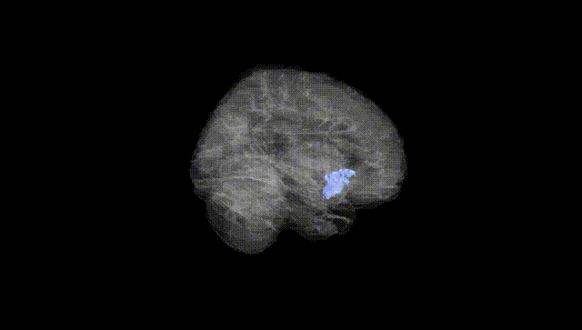
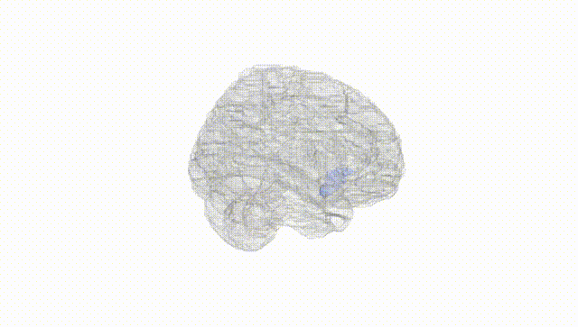
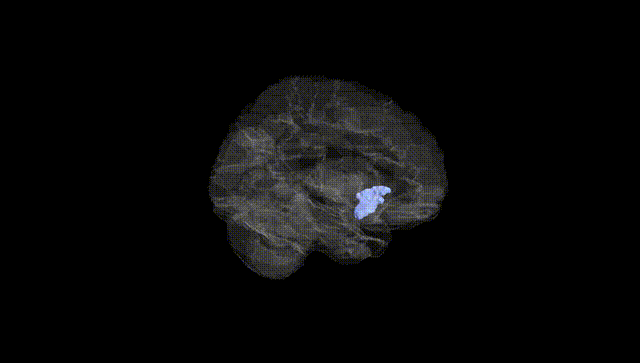
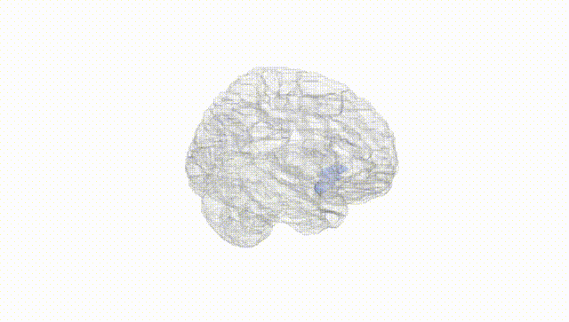
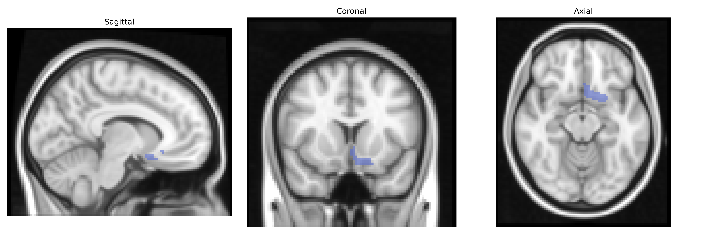
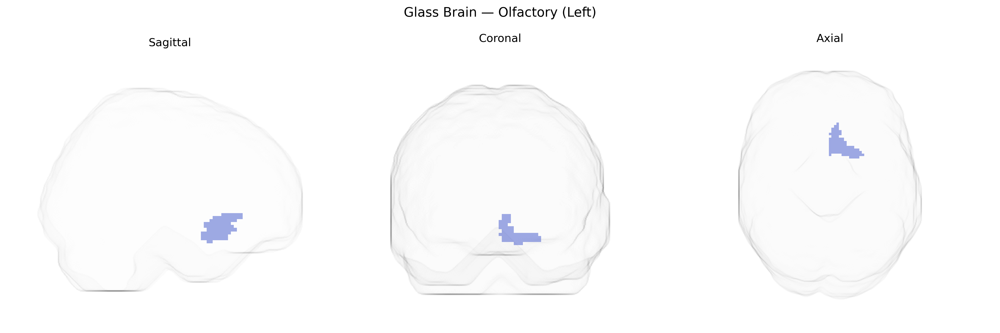

# Olfactory (Left)
 
## Overview
 
The left olfactory region in the AAL atlas corresponds primarily to the left olfactory bulb and adjacent olfactory cortex, including parts of the piriform cortex, which together constitute the initial central relay for smell processing. It receives input from olfactory receptor neurons via the olfactory nerve and transmits this information through mitral and tufted cells to higher-order olfactory areas such as the piriform cortex, amygdala, and entorhinal cortex, thereby contributing to odor detection, discrimination, and the strong associative links between odors, memory, and emotion. This region lies on the ventral surface of the frontal lobe, along the olfactory sulcus and gyrus rectus, and is supplied by small branches of the anterior cerebral and anterior communicating arteries. There is no direct Wikipedia article for the “olfactory (left)” AAL label; a closely related structure is the [Olfactory bulb](https://en.wikipedia.org/wiki/Olfactory_bulb).
 
The left olfactory region, as defined in the AAL atlas, has been implicated in several genetic and GWAS findings primarily through its role in olfactory processing and its involvement in neuropsychiatric and neurodegenerative conditions. Variants in olfactory receptor (OR) gene clusters, particularly on chromosomes 11 and 17, influence olfactory sensitivity and discrimination and have been associated with structural and functional differences in olfactory cortices, including left-sided regions, in imaging–genetics studies. GWAS of Parkinson’s disease and Alzheimer’s disease have repeatedly linked loci such as APOE (ε4), MAPT, GBA, and SNCA to early olfactory dysfunction, with imaging evidence showing atrophy or altered activity in primary olfactory areas, including the left olfactory cortex, in carriers of risk alleles. Schizophrenia and major depression GWAS hits in genes related to synaptic function (e.g., GRIN2A, CACNA1C) and neurodevelopment have been associated with altered olfactory bulb and olfactory cortical volumes, often lateralized to the left hemisphere. Additionally, genetic risk for smoking behavior (e.g., CHRNA5–CHRNA3–CHRNB4 cluster) and obesity-related loci (e.g., FTO) has been linked to variation in olfactory performance and, in some imaging cohorts, to differences in olfactory cortex volume and activation, suggesting that the left olfactory region integrates genetic influences on both sensory processing and broader disease risk.
 
*Overview generated by GPT-4o (2026).*
 
---
 
**Region ID:** 2501  
**Hemisphere:** left  
**Atlas:** AAL 
 
---
 
## Olfactory (Left) – Black Background (Full Brain)
 

 
**Full Quality Version:** <a href="full_black.mp4" download>Download MP4</a>
 
---
 
## Olfactory (Left) – White Background (Full Brain)
 

 
**Full Quality Version:** <a href="full_white.mp4" download>Download MP4</a>
 
---

## Olfactory (Left) – Black Background (Hemisphere)
 

 
**Full Quality Version:** <a href="hemi_black.mp4" download>Download MP4</a>
 
---
 
## Olfactory (Left) – White Background (Hemisphere)
 

 
**Full Quality Version:** <a href="hemi_white.mp4" download>Download MP4</a>
 
---

## Triplanar View – T1 Background
 

 
---
 
## Triplanar View – Ghost Brain
 


