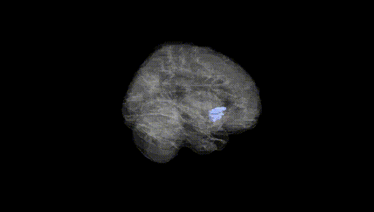
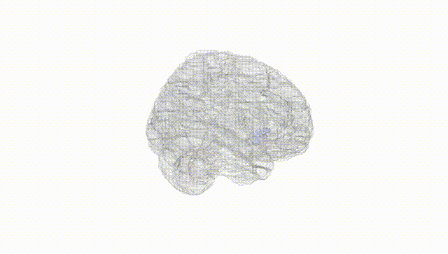
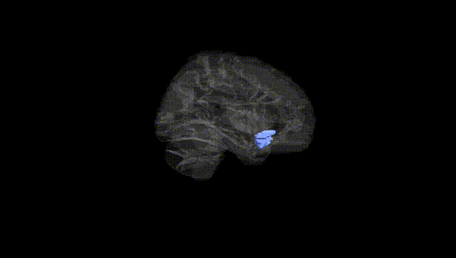
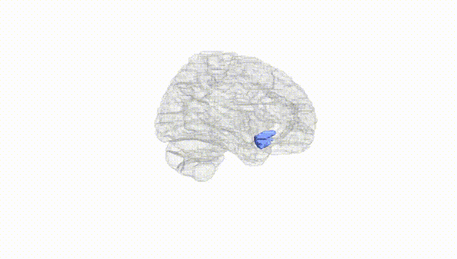
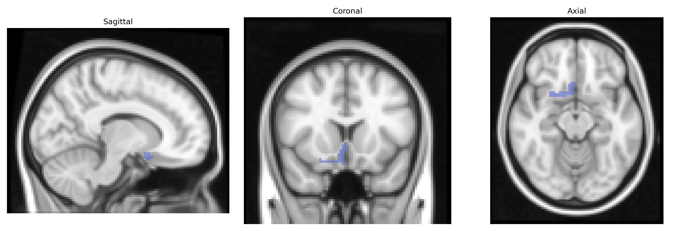
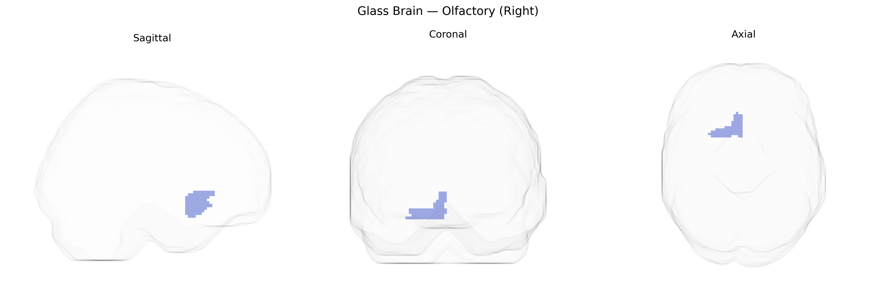

# Olfactory (Right)
 
## Overview
 
The right olfactory region in the AAL atlas corresponds to the cortical areas involved in processing olfactory (smell) information in the right hemisphere, primarily located in the ventromedial frontal lobe and closely associated with the piriform cortex, amygdala, and orbitofrontal cortex. This region receives direct input from the olfactory bulb and participates in odor detection, discrimination, and the affective and associative components of olfactory perception. Functionally, it forms part of the primary and secondary olfactory cortices and interconnects with limbic structures mediating emotional and memory-related aspects of smell. There is no direct Wikipedia article for “Right Olfactory” as defined in the AAL atlas; a closely related structure is the [Piriform cortex](https://en.wikipedia.org/wiki/Piriform_cortex).
 
The right olfactory cortex (as defined in the AAL atlas, typically including piriform and adjacent olfactory areas) has limited region-specific genetic association data, but several lines of evidence link its structure and function to genetic variants and disorders. Genome-wide association studies of brain imaging phenotypes (e.g., ENIGMA and UK Biobank–based analyses) have identified loci influencing olfactory bulb and olfactory cortical volumes—often near genes involved in axon guidance, synaptic organization, and neurodevelopment (such as those in semaphorin, netrin, and cell-adhesion pathways)—although many reports aggregate bilateral measures rather than isolating the right side. GWAS of olfactory performance have highlighted genes involved in odorant receptor signaling and ciliary function, including clusters of olfactory receptor genes (e.g., OR families on chromosomes 11 and 17), which shape activity patterns in primary olfactory regions. In neuropsychiatric and neurodegenerative disorders, genetics and olfactory-region anatomy intersect: risk variants for Parkinson’s disease (e.g., in SNCA, LRRK2, GBA) and Alzheimer’s disease (e.g., APOE ε4) are associated with early olfactory dysfunction and atrophy or hypometabolism in primary olfactory cortices, including the right side, although imaging–genetics work usually treats olfactory regions as part of broader limbic or temporal networks. Schizophrenia and major depression GWAS loci, particularly those affecting synaptic and immune pathways (e.g., MHC region, complement genes), have been linked to altered olfactory identification and volume changes in primary olfactory areas, again typically without strict lateralization. Overall, while no large GWAS has focused exclusively on the AAL-defined right olfactory region, convergent evidence from imaging–genetics, olfactory-function GWAS, and disease-risk loci supports a genetically influenced vulnerability of primary olfactory cortex that contributes to olfactory deficits in neurodegenerative and psychiatric conditions.
 
*Overview generated by GPT-4o (2026).*
 
---
 
**Region ID:** 2502  
**Hemisphere:** right  
**Atlas:** AAL 
 
---
 
## Olfactory (Right) – Black Background (Full Brain)
 

 
**Full Quality Version:** <a href="full_black.mp4" download>Download MP4</a>
 
---
 
## Olfactory (Right) – White Background (Full Brain)
 

 
**Full Quality Version:** <a href="full_white.mp4" download>Download MP4</a>
 
---

## Olfactory (Right) – Black Background (Hemisphere)
 

 
**Full Quality Version:** <a href="hemi_black.mp4" download>Download MP4</a>
 
---
 
## Olfactory (Right) – White Background (Hemisphere)
 

 
**Full Quality Version:** <a href="hemi_white.mp4" download>Download MP4</a>
 
---

## Triplanar View – T1 Background
 

 
---
 
## Triplanar View – Ghost Brain
 


