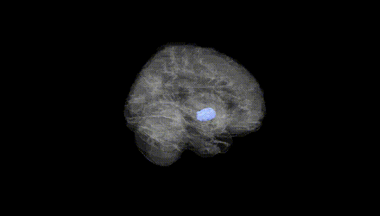
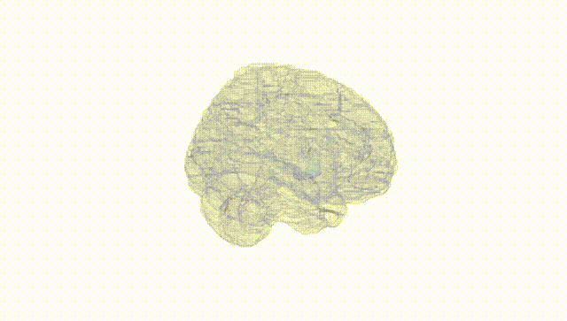
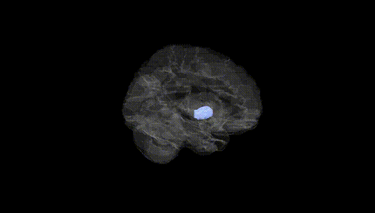
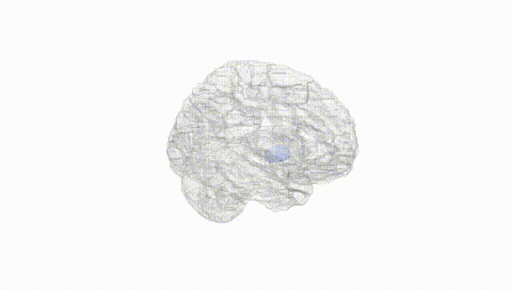
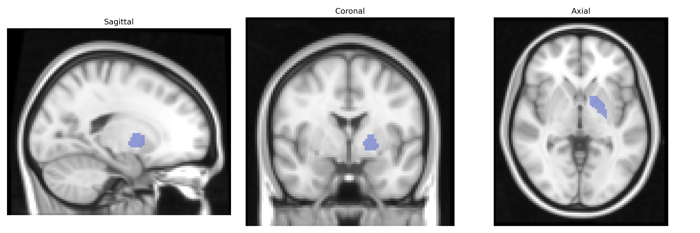
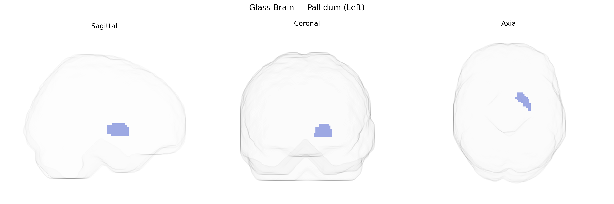

# Pallidum (Left)
 
## Overview
 
The left pallidum, corresponding largely to the left globus pallidus within the basal ganglia, is a subcortical gray matter structure situated medial to the putamen and lateral to the internal capsule, and is divided into external (GPe) and internal (GPi) segments. It receives major inhibitory input from the striatum and excitatory input from the subthalamic nucleus, and sends inhibitory output primarily to the thalamus and brainstem nuclei, thereby playing a key role in the indirect and direct pathways that regulate movement initiation, muscle tone, and motor learning. Functionally, the left pallidum contributes to the modulation of voluntary motor control, procedural learning, and certain aspects of cognitive and limbic processing; pathological alterations in this region are implicated in movement disorders such as Parkinson’s disease and dystonia. A related article is [Globus pallidus](https://en.wikipedia.org/wiki/Globus_pallidus).
 
The left pallidum, a basal ganglia structure in the AAL atlas, has been implicated in several genetic associations primarily through neuroimaging GWAS of subcortical volumes and disorder-related imaging genetics. Large-scale GWAS (e.g., ENIGMA and UK Biobank) have identified multiple loci influencing pallidum volume, including variants in or near genes related to synaptic function and neurodevelopment such as DRD2, DCC, and others involved in dopaminergic signaling and axonal guidance, although effect sizes are small and highly polygenic. Pallidal volume and function show heritability and have been linked to genetic risk for movement disorders, especially Parkinson’s disease and dystonia, with variants in genes like LRRK2, GBA, and TOR1A indirectly affecting pallidal circuitry through broader basal ganglia pathophysiology. Imaging genetics studies have also connected pallidal structure and activity with polygenic risk scores for schizophrenia, bipolar disorder, major depressive disorder, and obsessive–compulsive disorder, consistent with the pallidum’s role in motor, reward, and cognitive control circuits. Additionally, GWAS of behavioral and cognitive traits—such as impulsivity, risk-taking, and educational attainment—have reported associations between trait-related genetic variants and morphometry or functional activation in pallidal and adjacent basal ganglia regions, suggesting that the left pallidum contributes to the genetically influenced variability in motivation, habit learning, and executive control.
 
*Overview generated by GPT-4o (2026).*
 
---
 
**Region ID:** 7021  
**Hemisphere:** left  
**Atlas:** AAL 
 
---
 
## Pallidum (Left) – Black Background (Full Brain)
 

 
**Full Quality Version:** <a href="full_black.mp4" download>Download MP4</a>
 
---
 
## Pallidum (Left) – White Background (Full Brain)
 

 
**Full Quality Version:** <a href="full_white.mp4" download>Download MP4</a>
 
---

## Pallidum (Left) – Black Background (Hemisphere)
 

 
**Full Quality Version:** <a href="hemi_black.mp4" download>Download MP4</a>
 
---
 
## Pallidum (Left) – White Background (Hemisphere)
 

 
**Full Quality Version:** <a href="hemi_white.mp4" download>Download MP4</a>
 
---

## Triplanar View – T1 Background
 

 
---
 
## Triplanar View – Ghost Brain
 


