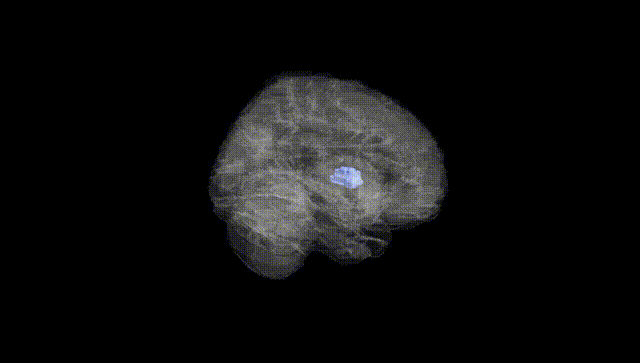
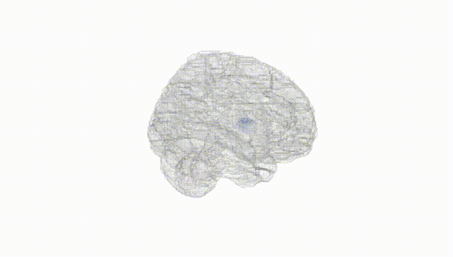
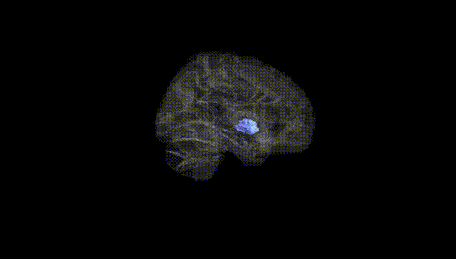
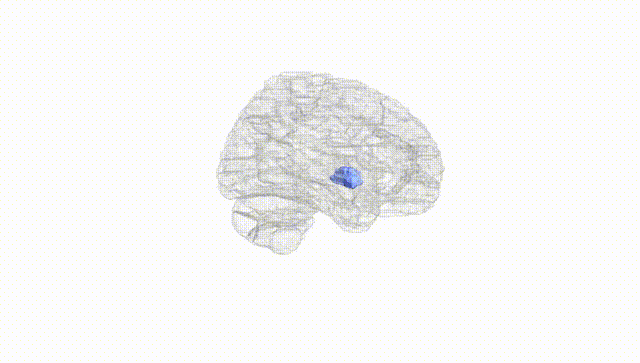
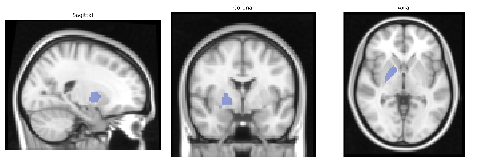
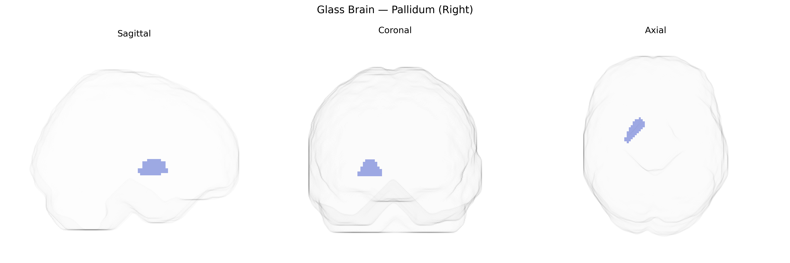

# Pallidum (Right)
 
## Overview
 
The right pallidum, part of the globus pallidus within the basal ganglia, is a subcortical gray matter structure involved primarily in the regulation of voluntary movement, muscle tone, and motor learning. It forms a critical node in cortico–basal ganglia–thalamocortical loops, integrating excitatory input from the striatum and modulatory input from the substantia nigra to generate inhibitory output to the thalamus and brainstem motor centers. Functionally, the pallidum contributes to the selection and scaling of motor programs, suppression of unwanted movements, and maintenance of postural control. Pathophysiologically, alterations in pallidal activity are closely associated with movement disorders such as Parkinson’s disease, dystonia, and Huntington’s disease, in which abnormal firing patterns and neurotransmitter imbalances disrupt normal motor circuitry. There is no direct Wikipedia article for “right pallidum”; a closely related structure is the [Globus pallidus](https://en.wikipedia.org/wiki/Globus_pallidus).
 
The right pallidum, part of the basal ganglia and typically defined in imaging genetics by the AAL atlas, has been implicated in several large-scale GWAS of subcortical brain volumes, most prominently the ENIGMA consortium and UK Biobank analyses. These studies consistently report heritability of pallidal volume and identify common variants near genes involved in neurodevelopment, synaptic function, and neuropsychiatric risk (for example in or near KTN1, DRD2-related pathways, and loci associated with general brain size and intracranial volume), although specific genome-wide significant hits for the right versus left pallidum are often not distinguished. Pallidal volume and morphology show genetic correlations with Parkinson’s disease, dystonia, schizophrenia, bipolar disorder, major depression, and obsessive-compulsive disorder, reflecting the pallidum’s central role in motor and reward circuitry; several GWAS of these disorders highlight basal ganglia–related pathways, dopaminergic signaling, and glutamatergic regulation that likely influence pallidal structure and function. In addition, GWAS of cognitive traits, intelligence, and educational attainment, as well as personality dimensions such as neuroticism and impulsivity, report genetic overlap with subcortical volumes including the pallidum, suggesting that polygenic architectures contributing to these traits partially act through variation in basal ganglia circuits encompassing the right pallidum.
 
*Overview generated by GPT-4o (2026).*
 
---
 
**Region ID:** 7022  
**Hemisphere:** right  
**Atlas:** AAL 
 
---
 
## Pallidum (Right) – Black Background (Full Brain)
 

 
**Full Quality Version:** <a href="full_black.mp4" download>Download MP4</a>
 
---
 
## Pallidum (Right) – White Background (Full Brain)
 

 
**Full Quality Version:** <a href="full_white.mp4" download>Download MP4</a>
 
---

## Pallidum (Right) – Black Background (Hemisphere)
 

 
**Full Quality Version:** <a href="hemi_black.mp4" download>Download MP4</a>
 
---
 
## Pallidum (Right) – White Background (Hemisphere)
 

 
**Full Quality Version:** <a href="hemi_white.mp4" download>Download MP4</a>
 
---

## Triplanar View – T1 Background
 

 
---
 
## Triplanar View – Ghost Brain
 


