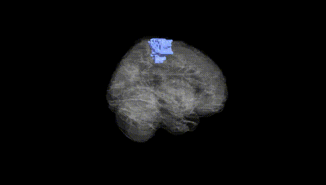
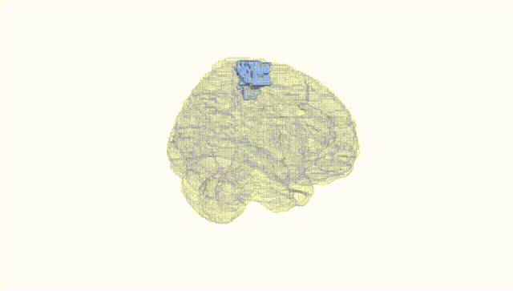
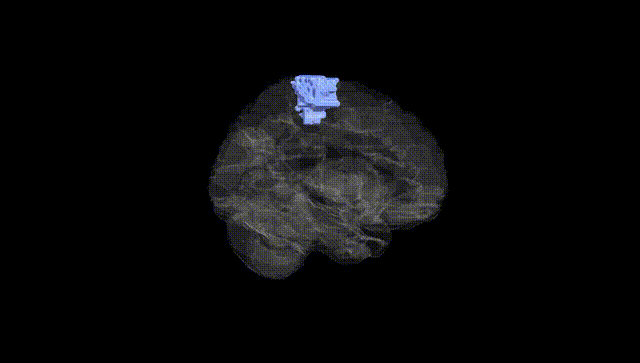
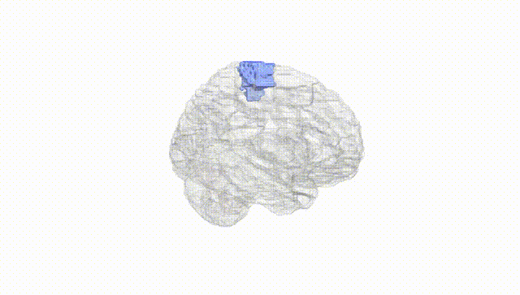
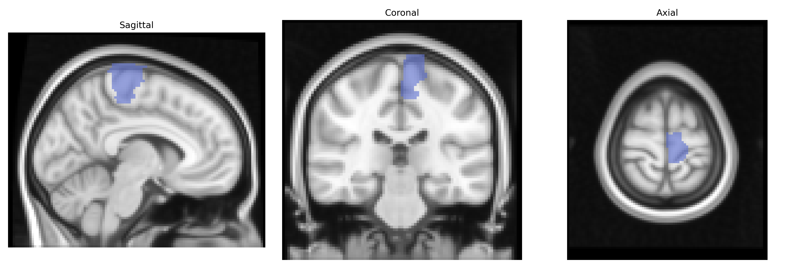
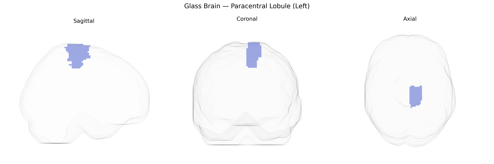

# Paracentral Lobule (Left)
 
## Overview
 
The left paracentral lobule is a medial cortical region of the superior frontal lobe that bridges the precentral and postcentral gyri around the central sulcus, forming part of the medial extension of the primary motor and primary somatosensory cortices. Functionally, it contains somatotopic representations of the contralateral lower limb and perineal region, contributing critically to voluntary motor control, sensory processing, and aspects of sphincter and pelvic floor regulation. Vascular supply is primarily via branches of the anterior cerebral artery, and it participates in motor and sensorimotor networks implicated in gait, posture, and lower-limb coordination. There is no direct Wikipedia article for the paracentral lobule as an isolated region in the AAL atlas; a closely related and encompassing structure is the [Medial surface of cerebral cortex](https://en.wikipedia.org/wiki/Cerebral_cortex#Medial_surface).
 
The left paracentral lobule (AAL: Paracentral_Lobule_L), encompassing medial primary motor and somatosensory cortex for lower limbs, has been implicated in several genetic and GWAS-based associations, although rarely as a primary focus. Structural MRI GWAS from ENIGMA and UK Biobank have identified common variants in genes related to neurodevelopment, myelination, and synaptic function (for example in or near DRD2, MAPT, and microtubule- or axon-guidance–related loci) that influence cortical thickness or surface area in medial sensorimotor regions including the paracentral lobule. Polygenic risk scores for schizophrenia, bipolar disorder, and major depressive disorder have been associated with altered morphology or activation in this region, and some schizophrenia and autism spectrum disorder imaging–genetics studies report aberrant paracentral lobule structure linked to risk variants in synaptic and glutamatergic genes. In neurodegenerative disease, genetic risk for amyotrophic lateral sclerosis (e.g., C9orf72 and other ALS loci) and primary lateral sclerosis has been associated with atrophy or microstructural change in medial motor regions encompassing the paracentral lobule, while Alzheimer’s disease risk variants (such as APOE ε4) show more modest and nonspecific effects on this area compared with temporoparietal cortex. GWAS of motor function, gait, and physical activity traits, as well as Restless Legs Syndrome, highlight paracentral lobule activity and structure in imaging endophenotype studies, although the genetic associations generally implicate broader motor and somatosensory networks rather than this AAL-defined region in isolation.
 
*Overview generated by GPT-4o (2026).*
 
---
 
**Region ID:** 6401  
**Hemisphere:** left  
**Atlas:** AAL 
 
---
 
## Paracentral Lobule (Left) – Black Background (Full Brain)
 

 
**Full Quality Version:** <a href="full_black.mp4" download>Download MP4</a>
 
---
 
## Paracentral Lobule (Left) – White Background (Full Brain)
 

 
**Full Quality Version:** <a href="full_white.mp4" download>Download MP4</a>
 
---

## Paracentral Lobule (Left) – Black Background (Hemisphere)
 

 
**Full Quality Version:** <a href="hemi_black.mp4" download>Download MP4</a>
 
---
 
## Paracentral Lobule (Left) – White Background (Hemisphere)
 

 
**Full Quality Version:** <a href="hemi_white.mp4" download>Download MP4</a>
 
---

## Triplanar View – T1 Background
 

 
---
 
## Triplanar View – Ghost Brain
 


