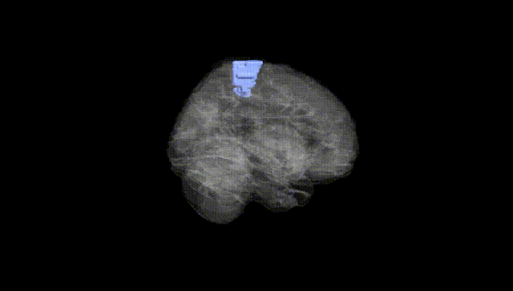
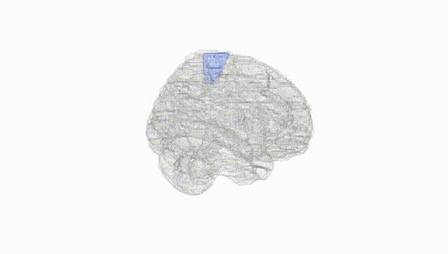
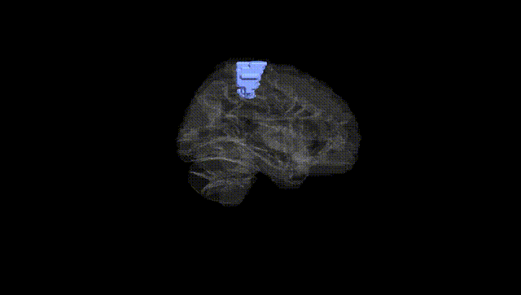
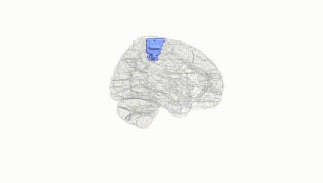
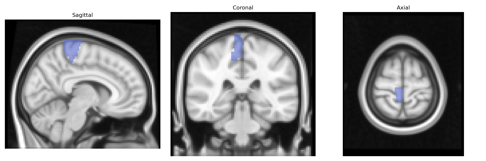
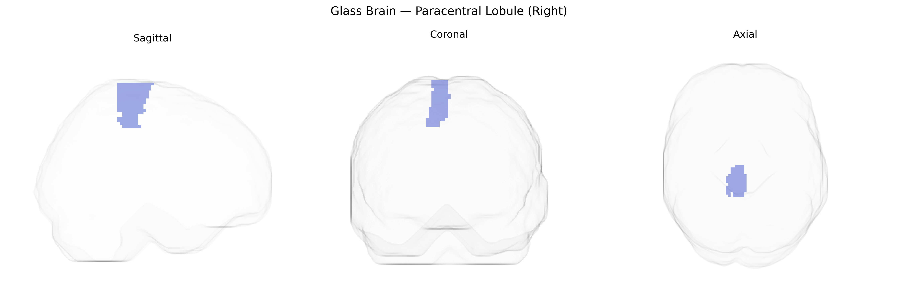

# Paracentral Lobule (Right)
 
## Overview
 
The right paracentral lobule is a medial cortical region of the frontal and parietal lobes, situated around the continuation of the central sulcus on the medial surface of the hemisphere and encompassing portions of the primary motor and primary somatosensory cortices representing mainly the contralateral lower limb and perineal areas. In the AAL atlas, it is defined as a distinct anatomical parcel bordering the precuneus posteriorly and the medial frontal gyrus/anterior cingulate cortex anteriorly and inferiorly. Functionally, the right paracentral lobule participates in voluntary motor control and somatosensory processing of the leg and foot, and contributes to sphincter control and gait-related networks, with additional roles in sensorimotor integration and postural control. Vascular supply is primarily via branches of the anterior cerebral artery, and lesions in this region can lead to contralateral leg weakness, sensory deficits, and disturbances of bladder or bowel control. [Paracentral lobule](https://en.wikipedia.org/wiki/Paracentral_lobule)
 
Genetic associations involving the right paracentral lobule (AAL-defined) primarily emerge from imaging-genetics and GWAS of cortical morphology, motor/somatosensory function, and neuropsychiatric traits, although region-specific findings are often reported at the broader “paracentral” or “medial sensorimotor cortex” level rather than strictly lateralized to the right. Large-scale brain MRI GWAS (e.g., ENIGMA, UK Biobank) have identified loci in genes related to neurodevelopment and synaptic function—such as MAPT, KCNK2, PAX6, and variants in cell-adhesion and axon-guidance pathways—that associate with cortical thickness, surface area, or gyrification in medial sensorimotor/paracentral regions. Variants influencing motor function (e.g., loci near CADM2, CNTN4, and other neurodevelopmental genes) show associations with structural and functional measures in paracentral territories, consistent with the region’s role in leg and trunk motor/sensory processing. Polygenic risk for disorders including multiple sclerosis, amyotrophic lateral sclerosis, and Parkinson’s disease has been linked to altered structure or activation in paracentral lobule regions, reflecting involvement in motor circuitry, and imaging-genetics work in schizophrenia, bipolar disorder, and major depression has reported paracentral cortical alterations partially mediated by common risk variants affecting cortical development and myelination. In addition, GWAS of pain sensitivity, gait and balance, and physical activity have implicated loci in neurodevelopmental and ion-channel genes whose imaging correlates include paracentral lobule morphology or connectivity, though current evidence remains more suggestive than region-specific and does not yet provide a definitive, well-replicated set of genes uniquely tied to the right paracentral lobule alone.
 
*Overview generated by GPT-4o (2026).*
 
---
 
**Region ID:** 6402  
**Hemisphere:** right  
**Atlas:** AAL 
 
---
 
## Paracentral Lobule (Right) – Black Background (Full Brain)
 

 
**Full Quality Version:** <a href="full_black.mp4" download>Download MP4</a>
 
---
 
## Paracentral Lobule (Right) – White Background (Full Brain)
 

 
**Full Quality Version:** <a href="full_white.mp4" download>Download MP4</a>
 
---

## Paracentral Lobule (Right) – Black Background (Hemisphere)
 

 
**Full Quality Version:** <a href="hemi_black.mp4" download>Download MP4</a>
 
---
 
## Paracentral Lobule (Right) – White Background (Hemisphere)
 

 
**Full Quality Version:** <a href="hemi_white.mp4" download>Download MP4</a>
 
---

## Triplanar View – T1 Background
 

 
---
 
## Triplanar View – Ghost Brain
 


