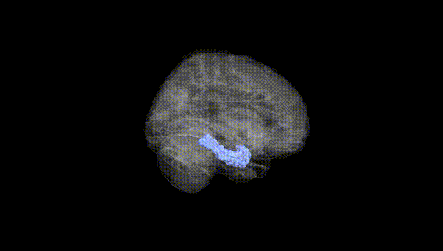
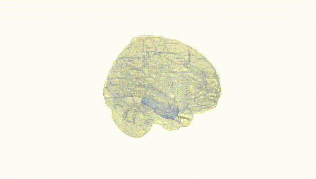
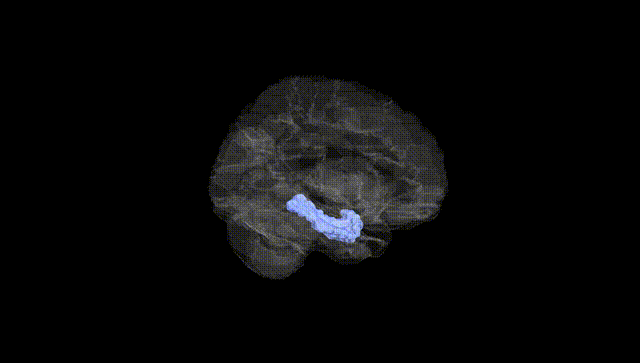
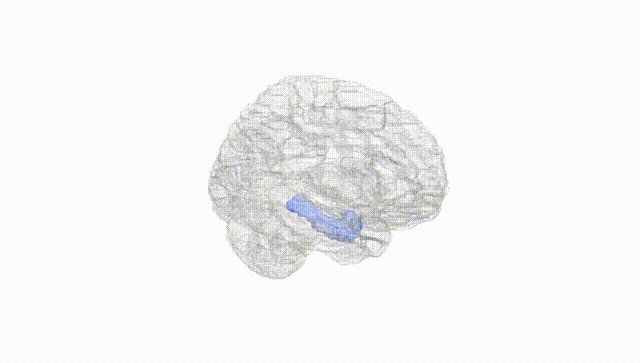
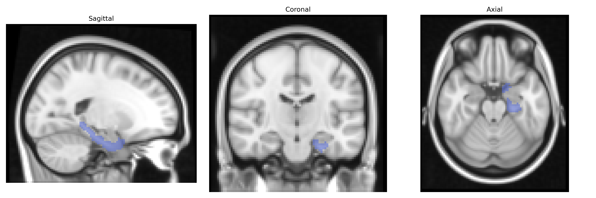
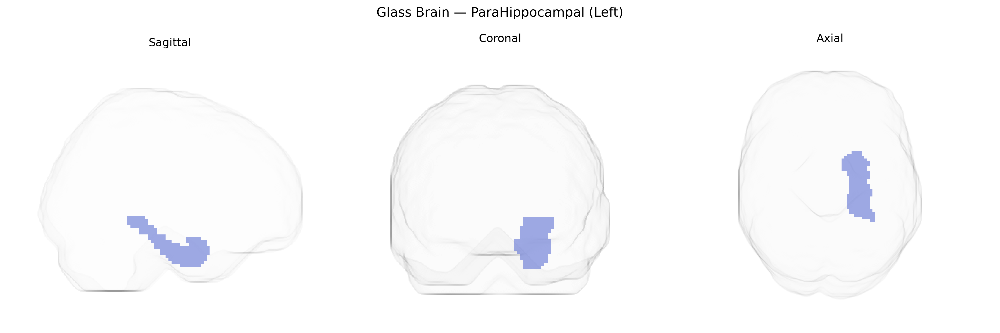

# ParaHippocampal (Left)
 
## Overview
 
The left parahippocampal gyrus, as defined in the AAL atlas, is a medial temporal lobe structure that forms part of the limbic system and is closely associated with the hippocampal formation. It plays a critical role in episodic memory encoding and retrieval, contextual and spatial processing, and scene recognition, integrating multimodal sensory information with mnemonic and emotional components. Anatomically, it lies inferior to the hippocampus and is bordered by the fusiform gyrus laterally and the lingual gyrus posteriorly, with key subregions such as the parahippocampal cortex and entorhinal cortex providing major input to the hippocampus. Functionally, it participates in the formation of cognitive maps and environmental layouts, and its dysfunction has been implicated in memory disorders, temporal lobe epilepsy, and neurodegenerative conditions such as Alzheimer’s disease.  
[Parahippocampal gyrus](https://en.wikipedia.org/wiki/Parahippocampal_gyrus)
 
The left parahippocampal gyrus, as defined in the AAL atlas, has been implicated in genetic studies primarily through neuroimaging GWAS of regional volume, cortical thickness, and functional connectivity. Variants in genes involved in synaptic plasticity and neurodevelopment, including APOE, BIN1, CLU, and CR1, have shown associations with structural measures of medial temporal lobe regions encompassing the parahippocampal gyrus in the context of Alzheimer’s disease risk, where reduced volume and altered connectivity are common endophenotypes. Large-scale imaging genetics consortia such as ENIGMA and UK Biobank–based studies have identified multiple loci across the genome (e.g., near GMNC, WNT3, and MS4A gene clusters) associated with hippocampal and parahippocampal-related volumes, many of which overlap with risk loci for dementia, cognitive decline, and general cognitive performance. Additionally, polygenic risk scores for schizophrenia, major depressive disorder, and bipolar disorder have been linked to structural and functional alterations in the parahippocampal region, in line with its role in episodic memory, contextual processing, and emotional regulation. GWAS of memory performance, spatial navigation, and neuroticism have also reported overlapping genetic influences on parahippocampal and adjacent medial temporal structures, suggesting that variation in genes regulating synaptic function, myelination, and neuroinflammation contributes to individual differences in this region’s morphology and associated cognitive and affective traits.
 
*Overview generated by GPT-4o (2026).*
 
---
 
**Region ID:** 4111  
**Hemisphere:** left  
**Atlas:** AAL 
 
---
 
## ParaHippocampal (Left) – Black Background (Full Brain)
 

 
**Full Quality Version:** <a href="full_black.mp4" download>Download MP4</a>
 
---
 
## ParaHippocampal (Left) – White Background (Full Brain)
 

 
**Full Quality Version:** <a href="full_white.mp4" download>Download MP4</a>
 
---

## ParaHippocampal (Left) – Black Background (Hemisphere)
 

 
**Full Quality Version:** <a href="hemi_black.mp4" download>Download MP4</a>
 
---
 
## ParaHippocampal (Left) – White Background (Hemisphere)
 

 
**Full Quality Version:** <a href="hemi_white.mp4" download>Download MP4</a>
 
---

## Triplanar View – T1 Background
 

 
---
 
## Triplanar View – Ghost Brain
 


