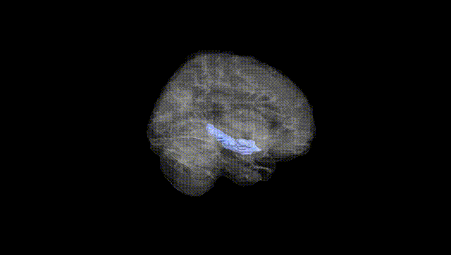
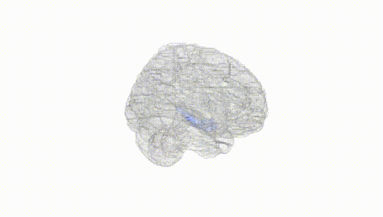
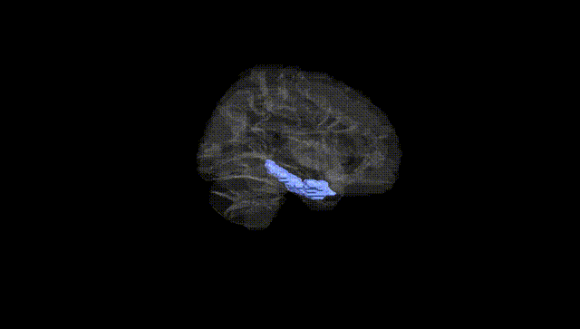
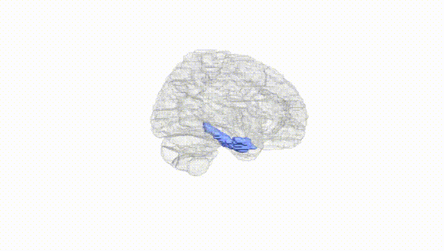
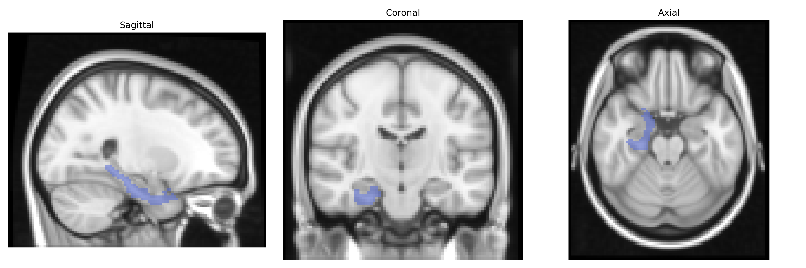
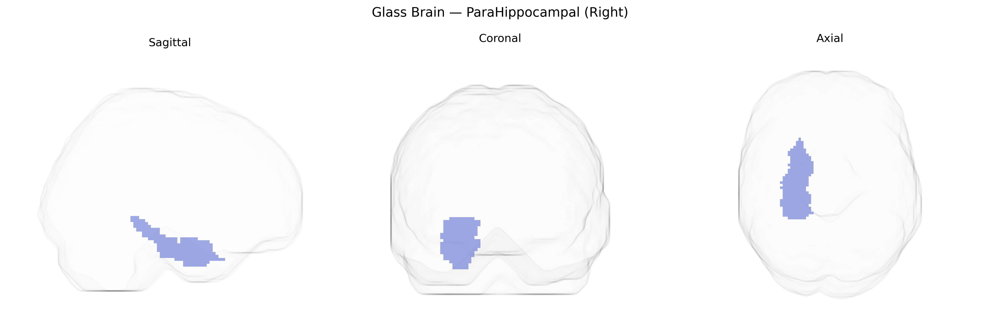

# ParaHippocampal (Right)
 
## Overview
 
The right parahippocampal gyrus, as defined in the AAL atlas, is a medial temporal lobe structure located adjacent to the hippocampus and entorhinal cortex, forming part of the limbic system and medial temporal memory network. It is composed predominantly of allocortical and periallocortical regions that receive highly processed multimodal sensory input from association cortices and relay contextual and spatial information to the hippocampal formation. Functionally, the right parahippocampal region is especially implicated in scene processing, spatial navigation, and episodic memory encoding and retrieval, contributing to contextual associations and environmental layout representations. It maintains dense reciprocal connections with the hippocampus, retrosplenial cortex, and prefrontal areas, supporting integration of spatial-contextual information with higher-order cognitive and emotional processes. [Parahippocampal gyrus](https://en.wikipedia.org/wiki/Parahippocampal_gyrus)
 
The right parahippocampal gyrus, as defined in the AAL atlas, has been implicated in multiple genetic and GWAS-based findings linking structural and functional variation in this region to diverse traits and disorders. Imaging genetics studies and large-scale consortia such as ENIGMA and UK Biobank have reported associations between right parahippocampal volume or cortical thickness and common polymorphisms in genes involved in neurodevelopment, synaptic plasticity, and neurodegeneration, including variants near BDNF, APOE (particularly ε4), and genes regulating glutamatergic and GABAergic signaling; these structural measures are in turn associated with memory performance and susceptibility to age-related cognitive decline. GWAS of brain structure have identified loci where allelic variation correlates specifically with parahippocampal morphology, suggesting partly distinct genetic architecture from adjacent medial temporal regions. Clinically, altered right parahippocampal structure and activity, influenced by genetic risk variants, have been linked to Alzheimer’s disease, temporal lobe epilepsy, schizophrenia, major depressive disorder, post-traumatic stress disorder, and anxiety traits, consistent with this region’s role in contextual memory and emotion processing. Additionally, polygenic risk scores for schizophrenia, bipolar disorder, and Alzheimer’s disease show associations with right parahippocampal measures, indicating that distributed genetic liability for these conditions manifests partly through this medial temporal locus.
 
*Overview generated by GPT-4o (2026).*
 
---
 
**Region ID:** 4112  
**Hemisphere:** right  
**Atlas:** AAL 
 
---
 
## ParaHippocampal (Right) – Black Background (Full Brain)
 

 
**Full Quality Version:** <a href="full_black.mp4" download>Download MP4</a>
 
---
 
## ParaHippocampal (Right) – White Background (Full Brain)
 

 
**Full Quality Version:** <a href="full_white.mp4" download>Download MP4</a>
 
---

## ParaHippocampal (Right) – Black Background (Hemisphere)
 

 
**Full Quality Version:** <a href="hemi_black.mp4" download>Download MP4</a>
 
---
 
## ParaHippocampal (Right) – White Background (Hemisphere)
 

 
**Full Quality Version:** <a href="hemi_white.mp4" download>Download MP4</a>
 
---

## Triplanar View – T1 Background
 

 
---
 
## Triplanar View – Ghost Brain
 


