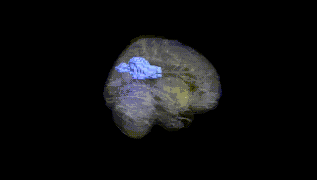
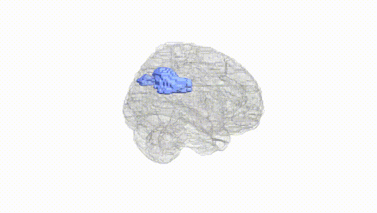
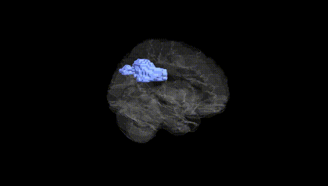
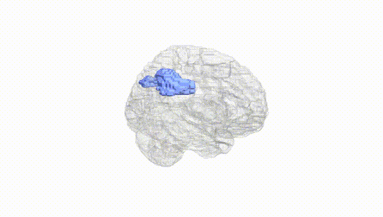
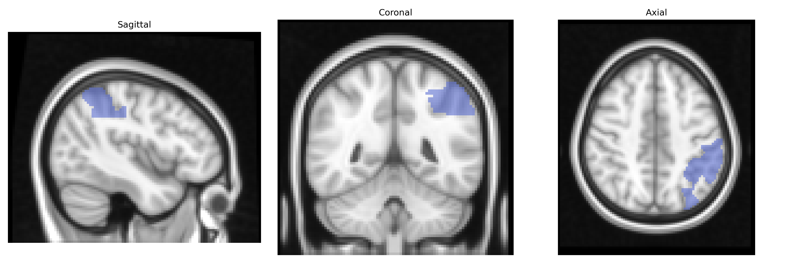
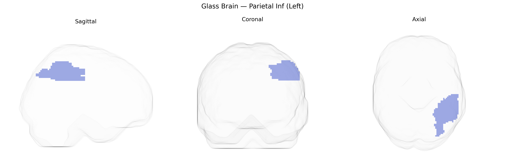

# Parietal Inf (Left)
 
## Overview
 
The left Inferior Parietal Lobule (Parietal Inf Left), as defined in the AAL atlas, is a heteromodal association region located in the posterior parietal cortex, comprising primarily the supramarginal and angular gyri. It plays a key role in multisensory integration, spatial attention, language-related processes (including semantic processing and aspects of reading and writing), numerical cognition, and aspects of social cognition such as theory of mind. Functionally, it serves as a convergence zone for visual, auditory, and somatosensory inputs, supporting higher-order representations that guide goal-directed behavior and tool use. The region shows strong connectivity with frontal, temporal, and occipital association cortices, and is frequently implicated in neuroimaging studies of attention, language, and default mode network activity. Related article: [Inferior parietal lobule](https://en.wikipedia.org/wiki/Inferior_parietal_lobule).
 
The left inferior parietal lobule, corresponding to the “Parietal Inf (Left)” region in the AAL atlas, has been implicated in genetic studies primarily through its roles in language, numerical cognition, attention, and social processing. GWAS and imaging-genetics work from large consortia (e.g., ENIGMA, UK Biobank) have identified associations between common variants in genes involved in neurodevelopment and synaptic function (such as FOXP2, CNTNAP2, DCDC2, KIAA0319, and other loci near neuronal adhesion and axon guidance genes) and structural or functional variation in inferior parietal regions, especially in relation to reading disability (developmental dyslexia), language lateralization, and speech and phonological processing. Variants linked with general cognitive ability and educational attainment (e.g., near genes like MAPT, APOE, and multiple polygenic loci) show correlations with cortical thickness and surface area in parietal areas, including inferior parietal cortex, and with performance on working memory, arithmetic, and visuospatial tasks. Neuropsychiatric GWAS for schizophrenia, autism spectrum disorder, and attention-deficit/hyperactivity disorder highlight polygenic risk scores that predict altered activation or morphology in fronto-parietal networks containing the inferior parietal lobule, aligning with deficits in attentional control, social cognition, and language pragmatics. In addition, genetic risk for Alzheimer’s disease and other dementias (e.g., APOE ε4 and loci near BIN1, CLU, PICALM) has been associated with atrophy and hypometabolism in parietal regions, including the inferior parietal lobule, reflecting its role in episodic memory retrieval and default-mode network function. Overall, current evidence supports a highly polygenic architecture in which numerous small-effect variants jointly shape structure and function of the left inferior parietal cortex, influencing susceptibility to language-related disorders, cognitive performance, and major neuropsychiatric and neurodegenerative conditions.
 
*Overview generated by GPT-4o (2026).*
 
---
 
**Region ID:** 6201  
**Hemisphere:** left  
**Atlas:** AAL 
 
---
 
## Parietal Inf (Left) – Black Background (Full Brain)
 

 
**Full Quality Version:** <a href="full_black.mp4" download>Download MP4</a>
 
---
 
## Parietal Inf (Left) – White Background (Full Brain)
 

 
**Full Quality Version:** <a href="full_white.mp4" download>Download MP4</a>
 
---

## Parietal Inf (Left) – Black Background (Hemisphere)
 

 
**Full Quality Version:** <a href="hemi_black.mp4" download>Download MP4</a>
 
---
 
## Parietal Inf (Left) – White Background (Hemisphere)
 

 
**Full Quality Version:** <a href="hemi_white.mp4" download>Download MP4</a>
 
---

## Triplanar View – T1 Background
 

 
---
 
## Triplanar View – Ghost Brain
 


