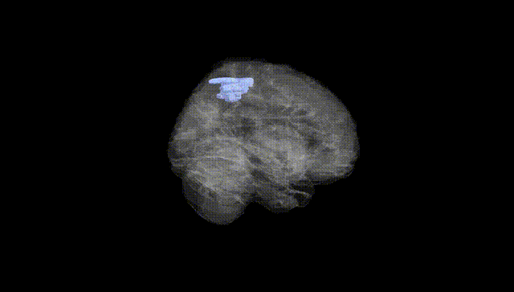
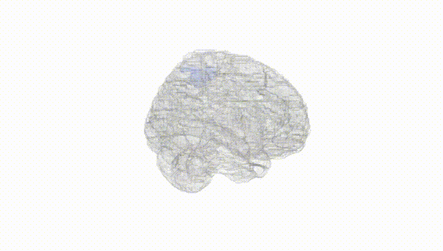
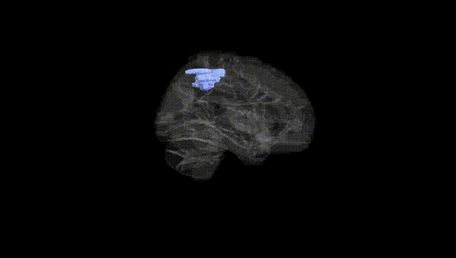
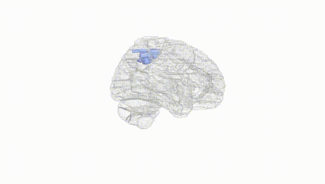
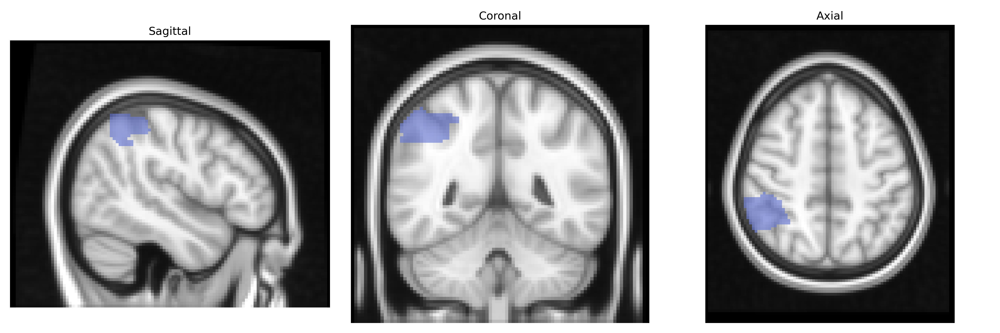
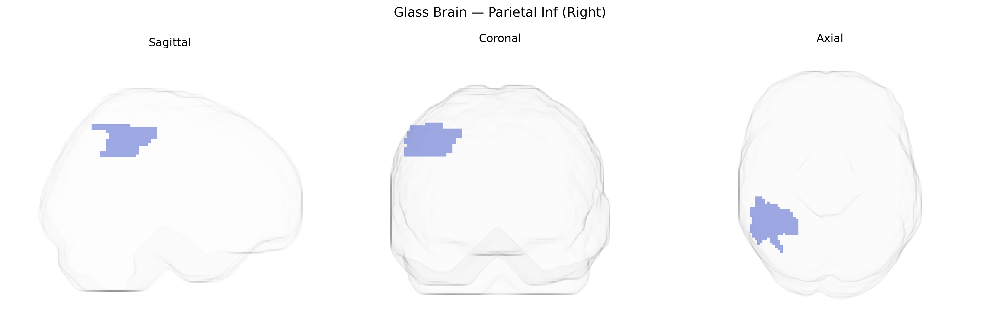

# Parietal Inf (Right)
 
## Overview
 
The right inferior parietal lobule (Parietal Inf Right in the AAL atlas) is a higher-order association region located in the posterior parietal cortex, bordering the superior temporal and occipital lobes, and encompassing structures such as the supramarginal and angular gyri. It integrates multimodal sensory inputs from visual, somatosensory, and auditory systems to support spatial attention, body schema, visuomotor coordination, and aspects of language and numerical processing. Functionally, this region plays a key role in right-lateralized attentional networks, particularly in directing attention to the contralateral (left) hemispace, and is critically implicated in hemispatial neglect when damaged. It also contributes to processes such as theory of mind, action understanding, and the integration of sensory information for goal-directed behavior. There is no direct link for “Right Parietal Inf” as an AAL label; a related structure entry is: [Inferior parietal lobule](https://en.wikipedia.org/wiki/Inferior_parietal_lobule).
 
The right inferior parietal lobule (IPL; “Parietal Inf R” in the AAL atlas) has been implicated in several imaging genetics and GWAS studies, although associations are generally modest and distributed rather than region-specific. Variants in genes involved in neuronal development and synaptic function—such as CNTNAP2, DISC1, BDNF, and APOE—have been associated with structural or functional differences in right IPL volume, cortical thickness, or activation, often in the context of language, attention, or social cognition tasks. Large-scale brain imaging GWAS (e.g., ENIGMA and UK Biobank) have identified polygenic influences on parietal lobe morphology, with loci near genes such as HMGA2, IGF1, and others contributing to global and regional cortical surface area and thickness that include the right inferior parietal region, although these signals are not exclusive to this parcel. Clinically, genetic risk for neurodevelopmental and psychiatric disorders—including autism spectrum disorder, schizophrenia, and attention-deficit/hyperactivity disorder—has been linked to atypical right IPL structure or connectivity, while APOE ε4 and other Alzheimer’s disease risk variants show associations with cortical thinning and hypometabolism in parietal regions encompassing the right IPL. Additionally, polygenic scores for cognitive ability and educational attainment correlate with right IPL morphology and activation patterns, reflecting this region’s role in higher-order cognition, but the current evidence supports a highly polygenic, network-level architecture rather than strong, region-specific single-gene effects.
 
*Overview generated by GPT-4o (2026).*
 
---
 
**Region ID:** 6202  
**Hemisphere:** right  
**Atlas:** AAL 
 
---
 
## Parietal Inf (Right) – Black Background (Full Brain)
 

 
**Full Quality Version:** <a href="full_black.mp4" download>Download MP4</a>
 
---
 
## Parietal Inf (Right) – White Background (Full Brain)
 

 
**Full Quality Version:** <a href="full_white.mp4" download>Download MP4</a>
 
---

## Parietal Inf (Right) – Black Background (Hemisphere)
 

 
**Full Quality Version:** <a href="hemi_black.mp4" download>Download MP4</a>
 
---
 
## Parietal Inf (Right) – White Background (Hemisphere)
 

 
**Full Quality Version:** <a href="hemi_white.mp4" download>Download MP4</a>
 
---

## Triplanar View – T1 Background
 

 
---
 
## Triplanar View – Ghost Brain
 


