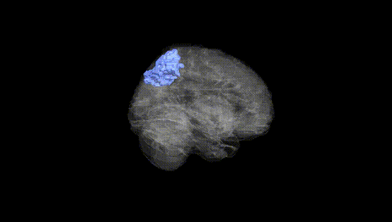
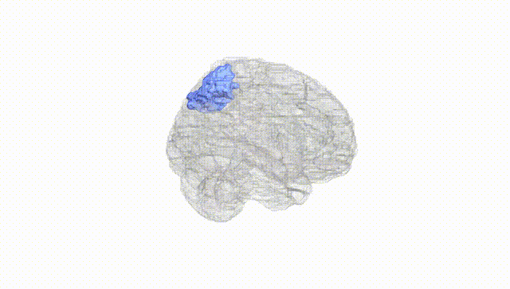
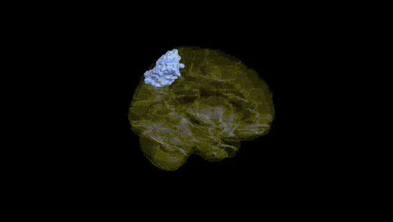
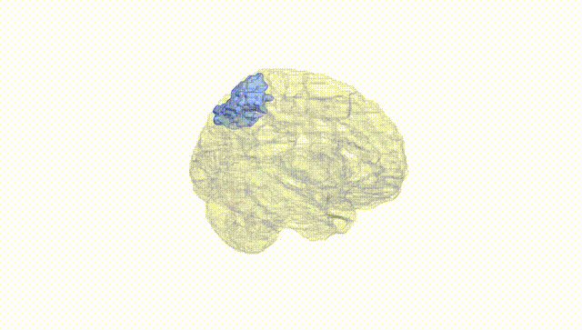
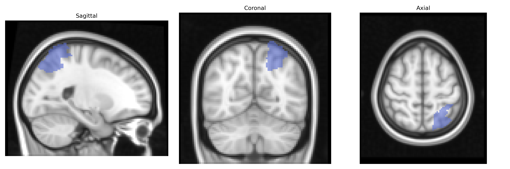
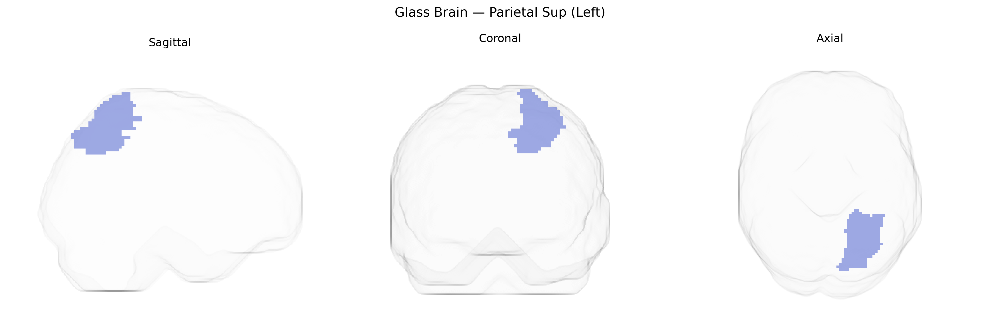

# Parietal Sup (Left)
 
## Overview
 
The left Parietal Sup (Left) region in the AAL atlas corresponds to the left superior parietal lobule, a dorsal parietal cortical area located posterior to the postcentral gyrus and superior to the intraparietal sulcus. It is primarily involved in multimodal sensory integration, visuospatial processing, attention allocation, and the coordination of sensorimotor transformations for reaching and grasping. This region receives convergent input from visual, somatosensory, and premotor areas and contributes to internal representations of body position in space, spatial awareness, and aspects of mental imagery and working memory related to spatial information. The superior parietal lobule is also implicated in higher-order perceptual functions and can be affected in disorders of spatial neglect and apraxia when damaged. [Superior parietal lobule](https://en.wikipedia.org/wiki/Superior_parietal_lobule)
 
The left superior parietal lobule (Parietal Sup L in the AAL atlas) has been repeatedly implicated in imaging-genetics and GWAS studies of brain structure, function, and connectivity, although associations are typically reported at the level of superior parietal or parietal cortex more broadly rather than this exact atlas parcel. Large-scale MRI GWAS consortia such as ENIGMA and UK Biobank have identified common variants in genes involved in neurodevelopment, synaptic function, and axon guidance (for example, microtubule- and cell-adhesion–related genes) that influence cortical thickness, surface area, or volume of superior parietal regions. Polygenic risk scores for neurodevelopmental and psychiatric disorders, including schizophrenia, autism spectrum disorder, attention-deficit/hyperactivity disorder, and major depression, show associations with structural or functional alterations in superior parietal areas, consistent with the region’s role in attention, visuospatial integration, and working memory. Genetic variation influencing parietal cortex has also been linked to individual differences in cognitive abilities (such as general intelligence, visuospatial skills, and mathematical performance) and in some studies to neurodegenerative conditions, particularly Alzheimer’s disease and posterior cortical atrophy, where risk loci affecting amyloid, tau, and synaptic pathways track with atrophy or hypometabolism in parietal regions. However, the field rarely assigns findings to a single AAL-defined parcel, so current evidence is best interpreted as implicating the superior parietal cortex, including but not limited to the Parietal Sup (Left) region, in these genetically influenced traits and disorders.
 
*Overview generated by GPT-4o (2026).*
 
---
 
**Region ID:** 6101  
**Hemisphere:** left  
**Atlas:** AAL 
 
---
 
## Parietal Sup (Left) – Black Background (Full Brain)
 

 
**Full Quality Version:** <a href="full_black.mp4" download>Download MP4</a>
 
---
 
## Parietal Sup (Left) – White Background (Full Brain)
 

 
**Full Quality Version:** <a href="full_white.mp4" download>Download MP4</a>
 
---

## Parietal Sup (Left) – Black Background (Hemisphere)
 

 
**Full Quality Version:** <a href="hemi_black.mp4" download>Download MP4</a>
 
---
 
## Parietal Sup (Left) – White Background (Hemisphere)
 

 
**Full Quality Version:** <a href="hemi_white.mp4" download>Download MP4</a>
 
---

## Triplanar View – T1 Background
 

 
---
 
## Triplanar View – Ghost Brain
 


