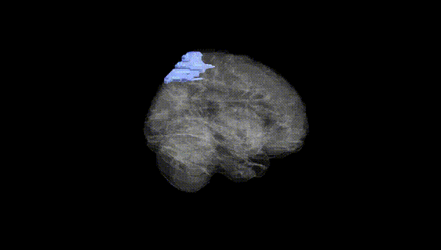
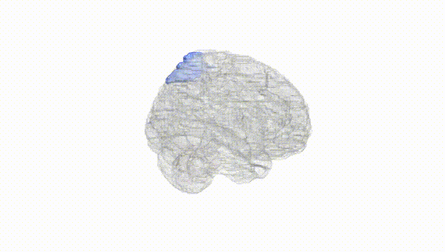
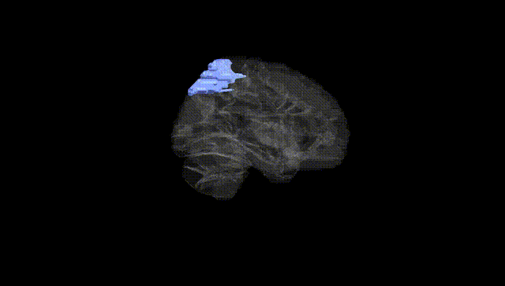
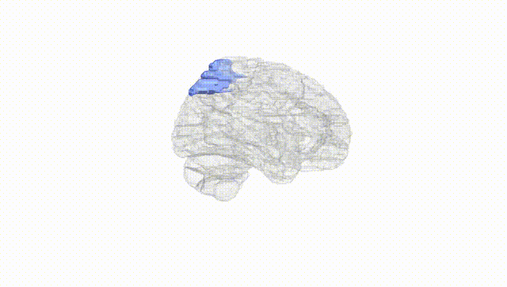
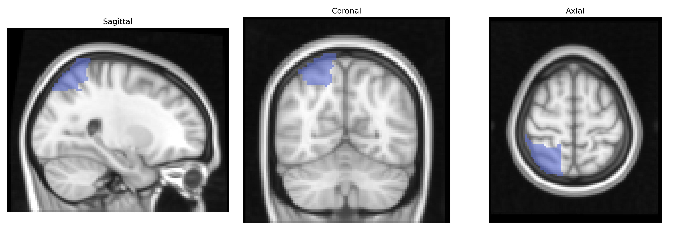
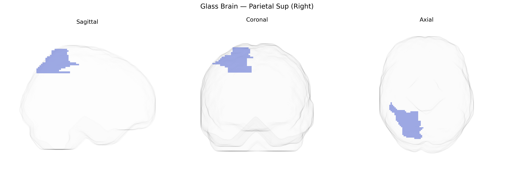

# Parietal Sup (Right)
 
## Overview
 
The right Parietal Sup (Right) region in the AAL atlas corresponds to the right superior parietal lobule, a dorsal parietal cortical area located posterior to the postcentral gyrus and superior to the intraparietal sulcus. It is primarily involved in multisensory integration, visuospatial processing, and the coordination of attention and sensorimotor transformations, particularly for guiding reaching and grasping movements and for spatial orientation of the body and objects in extrapersonal space. This region receives convergent input from visual, somatosensory, and auditory areas and is interconnected with premotor and frontal eye fields, supporting functions such as spatial attention, visuomotor coordination, and aspects of mental imagery and working memory related to spatial relationships. Lesions in the right superior parietal lobule can contribute to deficits in spatial perception and attention, including components of hemispatial neglect and impaired coordination of visually guided actions. [Superior parietal lobule](https://en.wikipedia.org/wiki/Superior_parietal_lobule)
 
The right superior parietal lobule (Parietal Sup Right in the AAL atlas) has been implicated in several genetic and imaging-genetics findings, although specific locus-level associations for this exact parcel are less common than for broader parietal or cortical measures. Twin and family studies consistently show high heritability for superior parietal cortical thickness, surface area, and volume, with SNP‑based estimates often in the 20–40% range. Large GWAS of cortical morphology (e.g., ENIGMA, UK Biobank) have identified multiple loci in or near genes such as HMGA2, microtubule and cytoskeletal genes, and neurodevelopmental regulators that influence parietal cortical measures, including superior parietal regions. Variants associated with general cognitive ability, educational attainment, and visuospatial skills often show corresponding structural or functional effects in superior parietal cortex, consistent with this region’s role in attention and spatial processing. Genetic risk for neurodevelopmental and psychiatric conditions—particularly ADHD, schizophrenia, and autism spectrum disorder—has been linked to altered superior parietal structure or connectivity, with polygenic risk scores for these disorders correlating with reduced parietal thickness or atypical activation patterns in imaging-genetics analyses. Additionally, Alzheimer’s disease and other dementias show genetically influenced atrophy patterns that include the superior parietal lobule, and parietal cortical measures sometimes serve as intermediate phenotypes in GWAS of neurodegeneration, though specific right-lateralized effects are less frequently isolated.
 
*Overview generated by GPT-4o (2026).*
 
---
 
**Region ID:** 6102  
**Hemisphere:** right  
**Atlas:** AAL 
 
---
 
## Parietal Sup (Right) – Black Background (Full Brain)
 

 
**Full Quality Version:** <a href="full_black.mp4" download>Download MP4</a>
 
---
 
## Parietal Sup (Right) – White Background (Full Brain)
 

 
**Full Quality Version:** <a href="full_white.mp4" download>Download MP4</a>
 
---

## Parietal Sup (Right) – Black Background (Hemisphere)
 

 
**Full Quality Version:** <a href="hemi_black.mp4" download>Download MP4</a>
 
---
 
## Parietal Sup (Right) – White Background (Hemisphere)
 

 
**Full Quality Version:** <a href="hemi_white.mp4" download>Download MP4</a>
 
---

## Triplanar View – T1 Background
 

 
---
 
## Triplanar View – Ghost Brain
 


