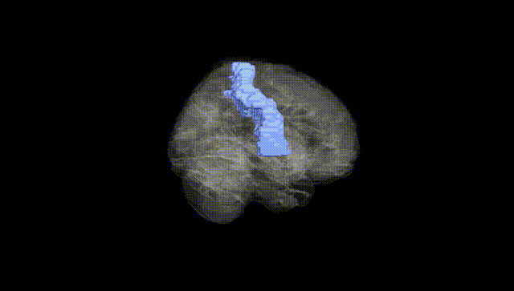
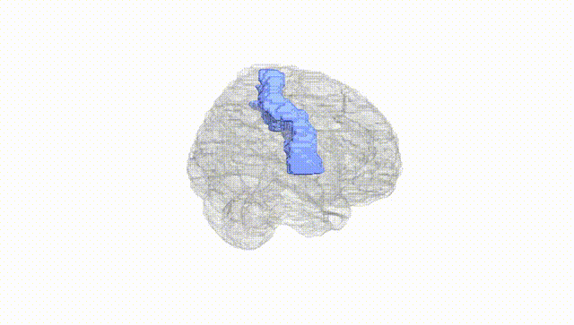
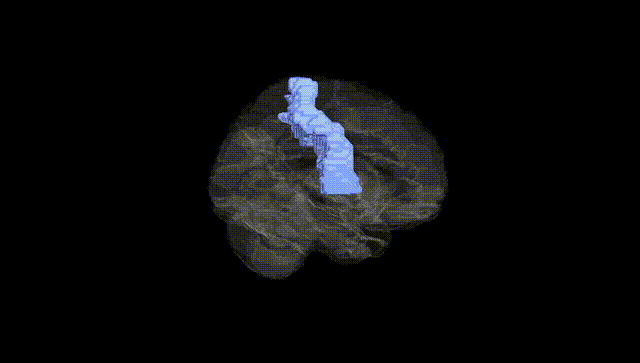
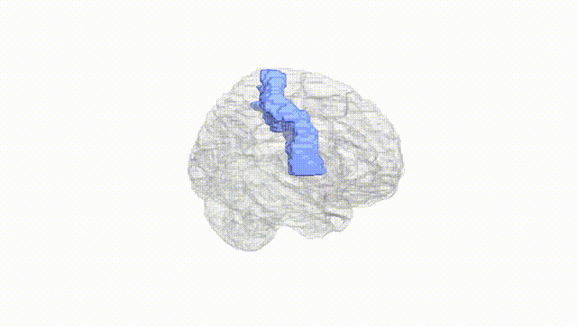
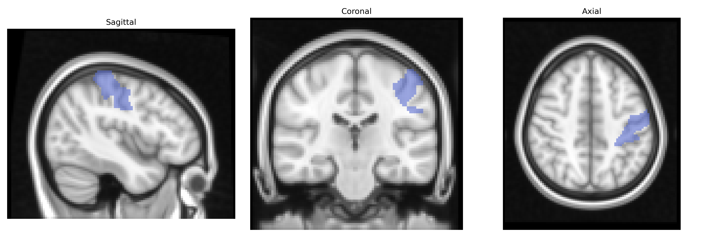
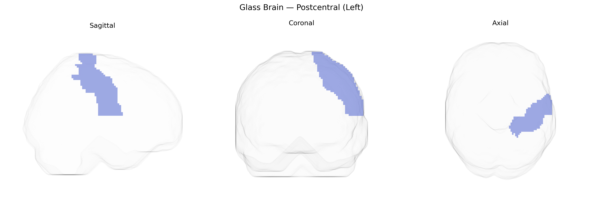

# Postcentral (Left)
 
## Overview
 
The left Postcentral region, as defined in the AAL atlas, corresponds primarily to the left postcentral gyrus, which houses the primary somatosensory cortex (Brodmann areas 3, 1, and 2) and is organized somatotopically to represent contralateral body parts. This cortex receives densely organized afferent input from the ventral posterior nuclei of the thalamus, integrating tactile, proprioceptive, and nociceptive information to enable conscious perception of touch, vibration, joint position, and body surface localization. Neurons in this region exhibit columnar organization and modality-specific tuning, supporting fine-grained discrimination of stimuli such as texture and shape, and contributing to sensorimotor integration with adjacent parietal and frontal regions for object manipulation and coordinated movement.  

[Postcentral gyrus](https://en.wikipedia.org/wiki/Postcentral_gyrus)
 
The left postcentral gyrus (primary somatosensory cortex) in the AAL atlas has been implicated in several genetic and GWAS-based findings, largely through imaging-genetics studies and disorder-focused analyses rather than single, region-exclusive loci. Structural and functional variation in postcentral regions has shown heritability in twin and SNP-based analyses, with polygenic influences overlapping those for brain size, cortical thickness, and surface area; large ENIGMA and UK Biobank imaging GWAS have reported common variants (e.g., within pathways related to neuronal development, synaptic function, and axon guidance) associated with somatosensory cortex measures, though not typically limited to the left hemisphere. Genetic risk for neurodevelopmental and psychiatric conditions such as autism spectrum disorder, schizophrenia, and ADHD has been associated with altered postcentral morphology or activation, with polygenic risk scores for these disorders correlating with somatosensory cortical thickness or activity patterns. In pain-related GWAS and imaging-genetics studies, somatosensory regions including the postcentral gyrus are frequently highlighted as intermediate phenotypes, with variants near genes involved in nociception, inflammatory signaling, and central pain processing linked indirectly to functional alterations in this area. In motor and sensorimotor phenotypes (e.g., hand preference, fine motor skills, motor learning), multi-locus polygenic influences show associations with sensorimotor network structure and connectivity that include the postcentral gyrus. Overall, the left postcentral region participates in polygenic architectures shared across brain-wide networks, with genetic effects most clearly observed through large-scale imaging GWAS and polygenic risk analyses for neurodevelopmental, psychiatric, and pain-related traits rather than single-gene or highly specific locus–region mappings.
 
*Overview generated by GPT-4o (2026).*
 
---
 
**Region ID:** 6001  
**Hemisphere:** left  
**Atlas:** AAL 
 
---
 
## Postcentral (Left) – Black Background (Full Brain)
 

 
**Full Quality Version:** <a href="full_black.mp4" download>Download MP4</a>
 
---
 
## Postcentral (Left) – White Background (Full Brain)
 

 
**Full Quality Version:** <a href="full_white.mp4" download>Download MP4</a>
 
---

## Postcentral (Left) – Black Background (Hemisphere)
 

 
**Full Quality Version:** <a href="hemi_black.mp4" download>Download MP4</a>
 
---
 
## Postcentral (Left) – White Background (Hemisphere)
 

 
**Full Quality Version:** <a href="hemi_white.mp4" download>Download MP4</a>
 
---

## Triplanar View – T1 Background
 

 
---
 
## Triplanar View – Ghost Brain
 


