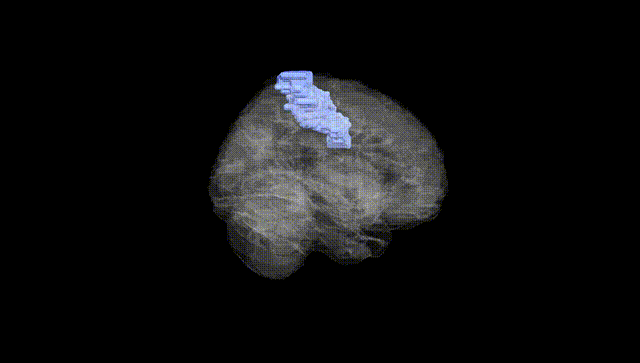
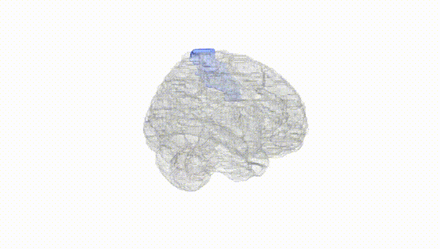
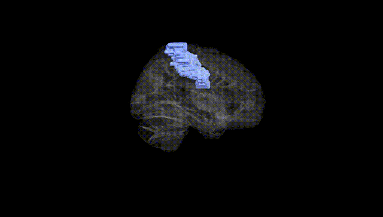
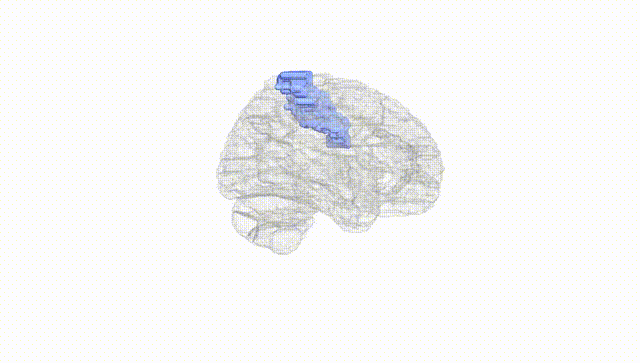
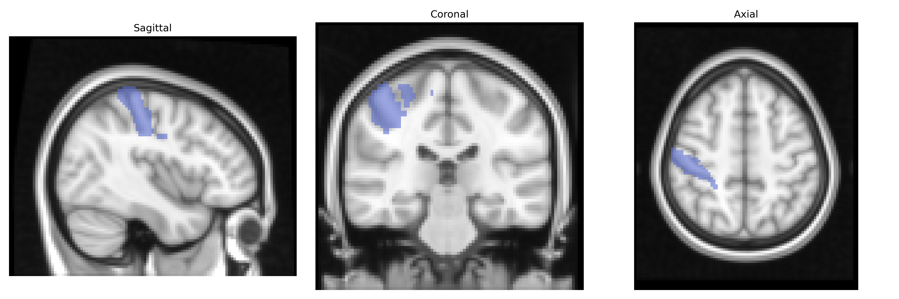
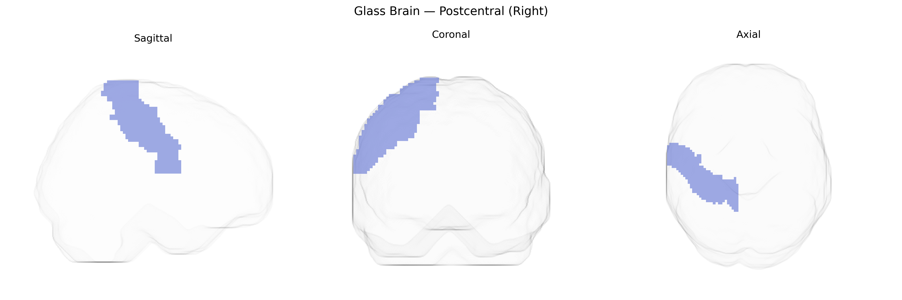

# Postcentral (Right)
 
## Overview
 
The right Postcentral gyrus, as defined in the AAL atlas, corresponds primarily to the right primary somatosensory cortex (Brodmann areas 3, 1, and 2), located in the parietal lobe immediately posterior to the central sulcus and superior to the lateral sulcus. This region receives densely organized somatotopic input from the ventral posterior nuclei of the thalamus and is crucial for processing tactile, proprioceptive, and nociceptive information from the contralateral (left) side of the body, including fine touch, vibration, joint position sense, and aspects of texture and shape discrimination. Its columnar and laminar architecture supports high-resolution spatial mapping of the body surface (sensory homunculus), forming the cortical basis for conscious perception of bodily sensations and contributing to sensorimotor integration and body schema. There is no direct Wikipedia article for the AAL “Postcentral (Right)” label; a related structure article is [Postcentral gyrus](https://en.wikipedia.org/wiki/Postcentral_gyrus).
 
The right postcentral gyrus, corresponding to primary somatosensory cortex in the AAL atlas, has been implicated in multiple genetic imaging and GWAS-based associations, though most studies examine bilateral or overall postcentral regions rather than right-lateralized effects. Large-scale imaging genetics consortia (e.g., ENIGMA, UK Biobank) have identified common variants in genes related to neurodevelopment, synaptic function, and cell adhesion (such as CNTNAP2, DLG2, and CDH13) that correlate with cortical thickness or surface area in postcentral areas, reflecting genetic influences on somatosensory cortical morphology. Polygenic risk for schizophrenia, bipolar disorder, and major depressive disorder has shown associations with structural alterations in the postcentral gyrus, suggesting that shared neurodevelopmental genetic architectures affect this sensory region as part of broader cortical networks. Autism spectrum disorder and ADHD GWAS and candidate gene studies have also reported postcentral involvement, with genetic risk linked to atypical sensorimotor integration and somatosensory processing differences. Moreover, variants in genes influencing pain perception (e.g., CACNA1H and SCN9A-related pathways) and touch sensitivity have been connected indirectly to right postcentral activation patterns in task-based fMRI, while GWAS of traits such as handedness, motor coordination, and body mass index have demonstrated modest but reproducible associations with postcentral cortical measures, indicating that the genetic architecture of sensorimotor function and bodily representation partly manifests through structural and functional variation in the right postcentral region.
 
*Overview generated by GPT-4o (2026).*
 
---
 
**Region ID:** 6002  
**Hemisphere:** right  
**Atlas:** AAL 
 
---
 
## Postcentral (Right) – Black Background (Full Brain)
 

 
**Full Quality Version:** <a href="full_black.mp4" download>Download MP4</a>
 
---
 
## Postcentral (Right) – White Background (Full Brain)
 

 
**Full Quality Version:** <a href="full_white.mp4" download>Download MP4</a>
 
---

## Postcentral (Right) – Black Background (Hemisphere)
 

 
**Full Quality Version:** <a href="hemi_black.mp4" download>Download MP4</a>
 
---
 
## Postcentral (Right) – White Background (Hemisphere)
 

 
**Full Quality Version:** <a href="hemi_white.mp4" download>Download MP4</a>
 
---

## Triplanar View – T1 Background
 

 
---
 
## Triplanar View – Ghost Brain
 


