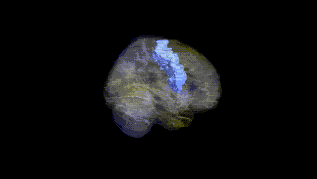
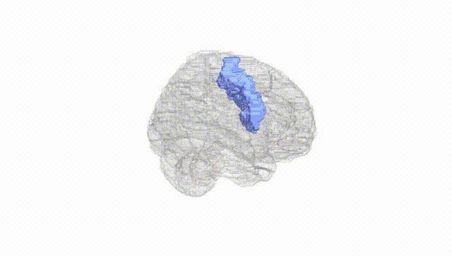
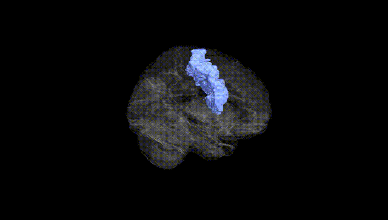
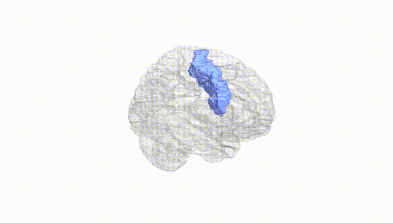
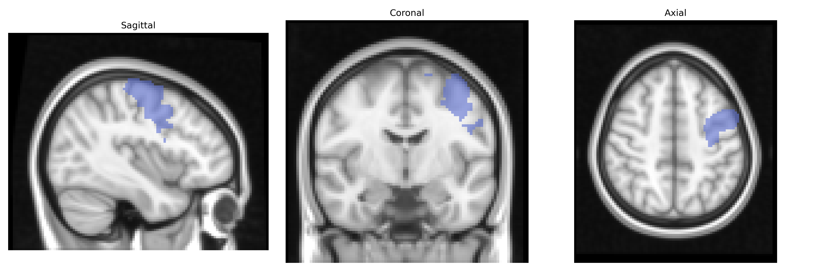
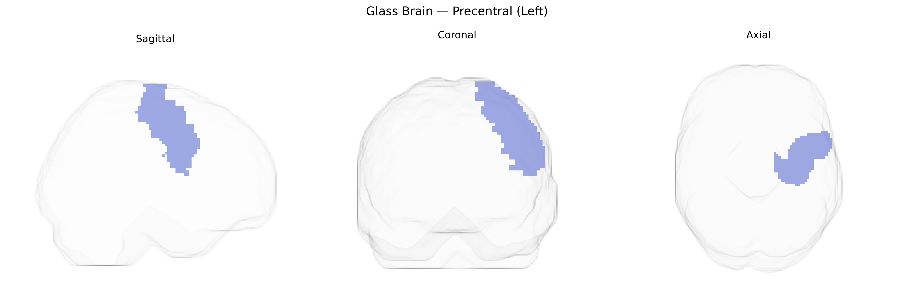

# Precentral (Left)
 
## Overview
 
The left Precentral region in the AAL atlas corresponds primarily to the left precentral gyrus, which contains the core of the primary motor cortex (M1, Brodmann area 4) and portions of adjacent premotor areas. This cortical strip, located anterior to the central sulcus in the frontal lobe, is organized somatotopically, with neuronal populations controlling voluntary movement of contralateral body parts, particularly fine motor control of the hand, face, and upper limb on the right side of the body. Its pyramidal neurons give rise to major descending motor pathways, including corticospinal and corticobulbar tracts, which synapse on spinal and brainstem motor neurons to drive execution of skilled, goal-directed movements. The left hemisphere precentral region is especially important in right-handed individuals for dominant-hand motor control and often interacts closely with neighboring premotor and supplementary motor areas for planning and sequencing of actions. [Precentral gyrus](https://en.wikipedia.org/wiki/Precentral_gyrus)
 
The left precentral gyrus (primary motor cortex) shows genetic associations primarily through imaging–genetics and GWAS of cortical structure and motor-related traits rather than via single, region-exclusive loci. Large neuroimaging GWAS (e.g., ENIGMA, UK Biobank) have identified common variants in genes involved in neurodevelopment, synaptic function, and axon guidance—such as MAPT, MECP2, BDNF, and microtubule- or cell-adhesion–related genes—associated with cortical thickness, surface area, or volume measures that include or overlap the left precentral region. Polygenic influences on motor cortex structure have been linked to disorders with motor or motor–cognitive components, including amyotrophic lateral sclerosis (with risk loci in C9orf72, SOD1, and other genes showing downstream effects on precentral motor neuron integrity), focal dystonias, and, more diffusely, Parkinson’s disease and multiple sclerosis, where genetic risk scores associate with motor cortex atrophy or microstructural change. In neurodevelopmental disorders, autism spectrum disorder and attention-deficit/hyperactivity disorder polygenic risk scores have been correlated with altered morphology or activation in precentral/motor regions, and certain schizophrenia- and bipolar disorder–associated loci show modest associations with motor cortex metrics in multivariate imaging GWAS. Additionally, genetic variants related to handedness (e.g., in genes such as PCSK6 and other lateralization-linked loci) and motor skill or coordination map onto asymmetric structural and functional properties of the precentral gyri, including the left AAL precentral region, although these effects are typically distributed and small in magnitude.
 
*Overview generated by GPT-4o (2026).*
 
---
 
**Region ID:** 2001  
**Hemisphere:** left  
**Atlas:** AAL 
 
---
 
## Precentral (Left) – Black Background (Full Brain)
 

 
**Full Quality Version:** <a href="full_black.mp4" download>Download MP4</a>
 
---
 
## Precentral (Left) – White Background (Full Brain)
 

 
**Full Quality Version:** <a href="full_white.mp4" download>Download MP4</a>
 
---

## Precentral (Left) – Black Background (Hemisphere)
 

 
**Full Quality Version:** <a href="hemi_black.mp4" download>Download MP4</a>
 
---
 
## Precentral (Left) – White Background (Hemisphere)
 

 
**Full Quality Version:** <a href="hemi_white.mp4" download>Download MP4</a>
 
---

## Triplanar View – T1 Background
 

 
---
 
## Triplanar View – Ghost Brain
 


