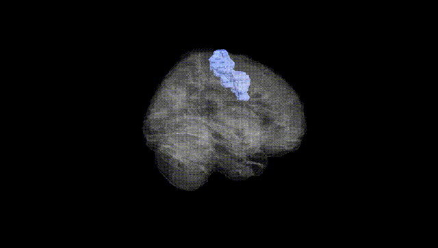
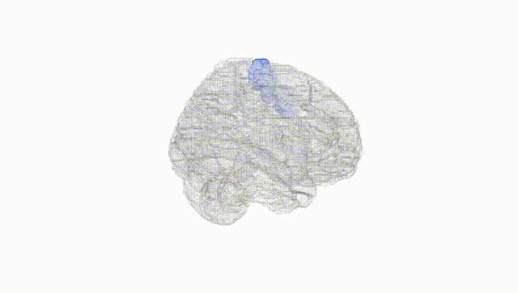
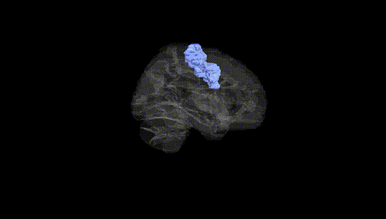
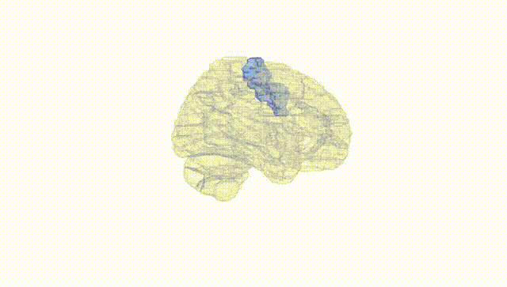
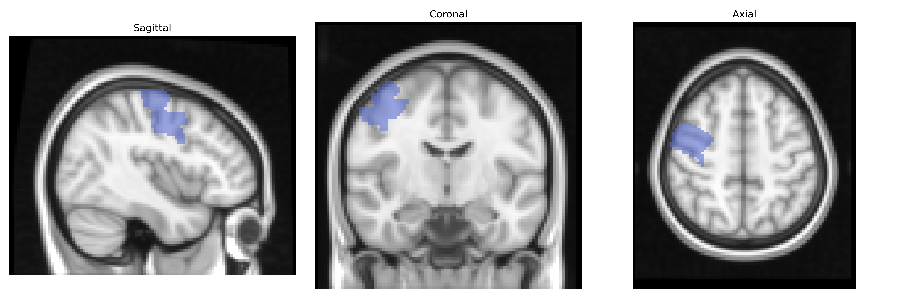
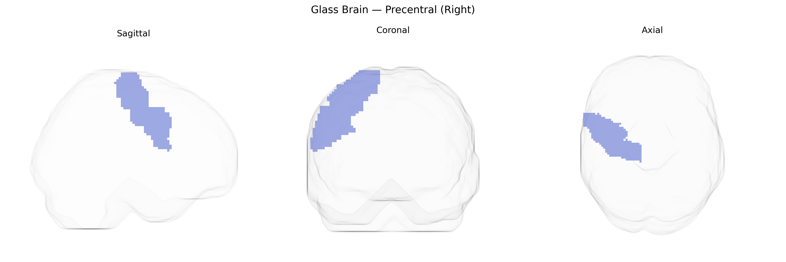

# Precentral (Right)
 
## Overview
 
The right Precentral region in the AAL atlas corresponds primarily to the right precentral gyrus, which contains the main portion of the primary motor cortex (M1) and adjacent premotor areas in the frontal lobe. This region is organized somatotopically, with neuronal populations controlling voluntary movements of contralateral body parts, especially fine motor control of the face, hand, and upper limb on the left side of the body. It integrates inputs from premotor and supplementary motor areas, basal ganglia, and cerebellum, and sends descending corticospinal and corticobulbar projections to brainstem and spinal motor circuits. Functionally, it is crucial for the planning, initiation, and execution of skilled, goal-directed movements and is involved in motor learning and adaptation. There is no direct Wikipedia article for the “Right Precentral” region, but it is part of the precentral gyrus: [Precentral gyrus](https://en.wikipedia.org/wiki/Precentral_gyrus).
 
The right precentral gyrus (primary motor cortex) in the AAL atlas has been implicated in several genetic association studies, largely through imaging genetics and GWAS of brain structure and function rather than locus-specific “right precentral” GWAS. Large-scale consortia such as ENIGMA and UK Biobank have identified common variants (notably near genes involved in neurodevelopment, synaptic function, and axon guidance, such as MAPT on 17q21.31, and loci near genes like HMGA2 and microtubule-related genes) associated with motor cortex thickness, surface area, and overall precentral morphology, with largely overlapping effects between hemispheres but occasionally hemisphere-specific signals. Polygenic risk for schizophrenia, ADHD, and major depressive disorder has been associated with altered motor cortex volume or activation, including right precentral regions, while autism spectrum disorder and developmental coordination disorder studies have linked variants in synaptic and neurodevelopmental genes (e.g., CNTNAP2, DCC and others) to atypical motor cortical structure or connectivity that often includes the precentral gyrus. Motor-related disorders such as amyotrophic lateral sclerosis (ALS) and hereditary spastic paraplegia show strong structural and functional involvement of the precentral cortex, and ALS GWAS loci (e.g., C9orf72, KIF5A, TBK1) have been connected to neurodegeneration patterns emphasizing corticospinal neurons originating in this region. Additionally, imaging–genetics work on motor learning, handedness, and fine motor skills has found associations between polygenic scores or specific variants (e.g., in PCSK6 and other lateralization-related genes) and asymmetries or activation patterns in the right precentral gyrus, though these effects are typically modest and distributed across broader motor and frontoparietal networks rather than confined strictly to the right precentral area.
 
*Overview generated by GPT-4o (2026).*
 
---
 
**Region ID:** 2002  
**Hemisphere:** right  
**Atlas:** AAL 
 
---
 
## Precentral (Right) – Black Background (Full Brain)
 

 
**Full Quality Version:** <a href="full_black.mp4" download>Download MP4</a>
 
---
 
## Precentral (Right) – White Background (Full Brain)
 

 
**Full Quality Version:** <a href="full_white.mp4" download>Download MP4</a>
 
---

## Precentral (Right) – Black Background (Hemisphere)
 

 
**Full Quality Version:** <a href="hemi_black.mp4" download>Download MP4</a>
 
---
 
## Precentral (Right) – White Background (Hemisphere)
 

 
**Full Quality Version:** <a href="hemi_white.mp4" download>Download MP4</a>
 
---

## Triplanar View – T1 Background
 

 
---
 
## Triplanar View – Ghost Brain
 


