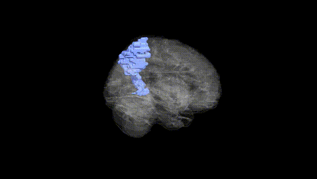
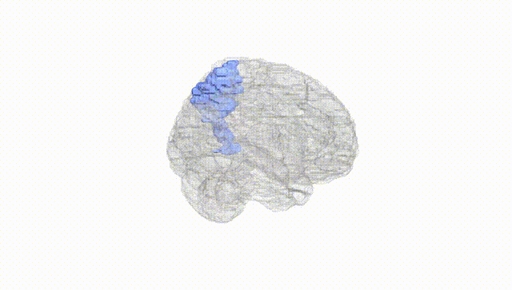
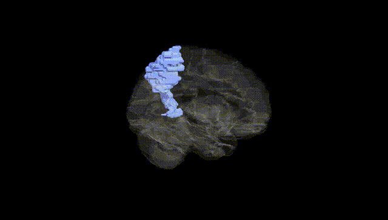
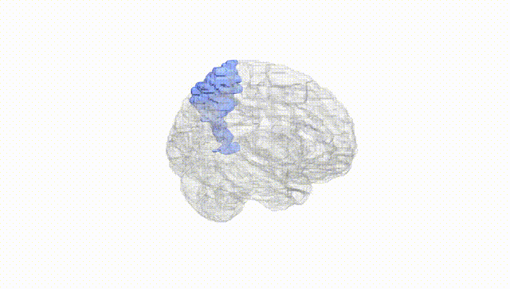
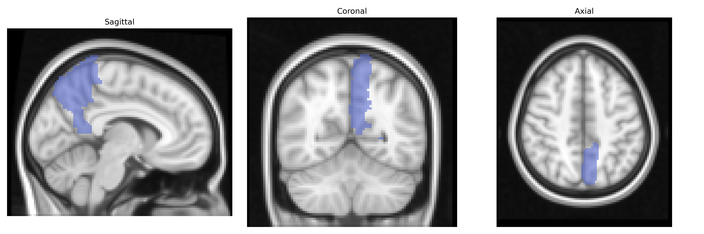
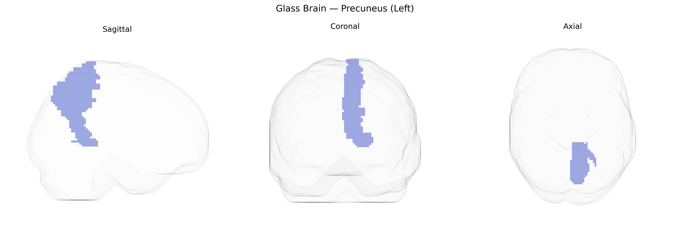

# Precuneus (Left)
 
## Overview
 
The left precuneus is a medial parietal lobe structure located on the medial surface of the hemisphere, bounded anteriorly by the marginal branch of the cingulate sulcus and posteriorly by the parieto‑occipital sulcus. It forms part of the superior parietal lobule and is heavily interconnected with posterior cingulate cortex, lateral parietal areas, medial prefrontal cortex, and subcortical structures, serving as a key hub of the default mode network. Functionally, the left precuneus is implicated in visuo-spatial imagery, self-referential and autobiographical memory processes, aspects of consciousness, and integration of sensory information for higher-order cognition. Neuroimaging studies link this region to episodic memory retrieval, mental imagery, perspective taking, and internally directed thought, while alterations in its activity or connectivity have been associated with disorders such as Alzheimer’s disease, depression, and disorders of consciousness. [Precuneus](https://en.wikipedia.org/wiki/Precuneus)
 
The left precuneus, as defined in the AAL atlas, has been repeatedly implicated in genetic studies linking brain structure and function to complex traits and disorders. GWAS of cortical thickness and surface area (e.g., ENIGMA and UK Biobank) have identified associations between precuneus morphology and variants near genes involved in synaptic function, neurodevelopment, and neuronal signaling, including loci in or near DAAM2, CENPO, and other polygenic contributors to general cortical architecture. Polygenic risk scores for schizophrenia, major depressive disorder, bipolar disorder, autism spectrum disorder, and Alzheimer’s disease have been associated with altered volume or connectivity of the precuneus, particularly within the default mode network, suggesting that genetic liability to these conditions partly operates through this hub region. GWAS of cognitive performance, intelligence, and educational attainment, as well as traits such as self-referential processing and rumination, have linked risk variants to structural and functional differences in precuneus regions, including the left hemisphere, consistent with its role in episodic memory, visuospatial imagery, and internal mentation. In addition, genetic influences on resting-state connectivity patterns and network centrality often highlight the precuneus as a key node whose connectivity strength and topology show heritability and association with neuropsychiatric and cognitive trait polygenic scores, though specific gene–region links remain largely polygenic and diffusely distributed across the genome.
 
*Overview generated by GPT-4o (2026).*
 
---
 
**Region ID:** 6301  
**Hemisphere:** left  
**Atlas:** AAL 
 
---
 
## Precuneus (Left) – Black Background (Full Brain)
 

 
**Full Quality Version:** <a href="full_black.mp4" download>Download MP4</a>
 
---
 
## Precuneus (Left) – White Background (Full Brain)
 

 
**Full Quality Version:** <a href="full_white.mp4" download>Download MP4</a>
 
---

## Precuneus (Left) – Black Background (Hemisphere)
 

 
**Full Quality Version:** <a href="hemi_black.mp4" download>Download MP4</a>
 
---
 
## Precuneus (Left) – White Background (Hemisphere)
 

 
**Full Quality Version:** <a href="hemi_white.mp4" download>Download MP4</a>
 
---

## Triplanar View – T1 Background
 

 
---
 
## Triplanar View – Ghost Brain
 


