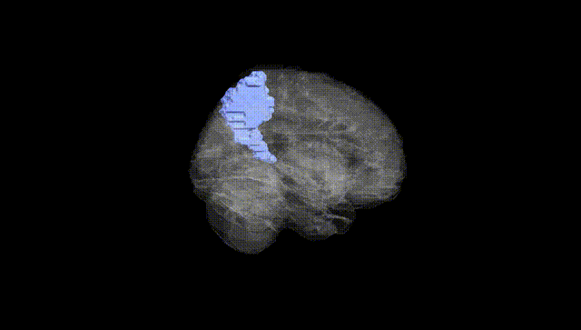
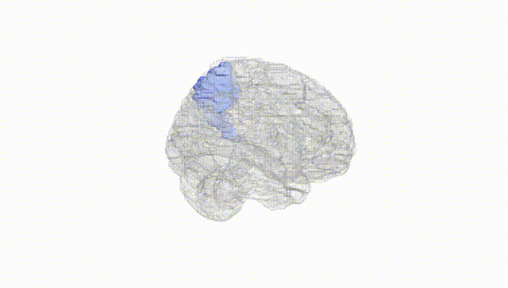
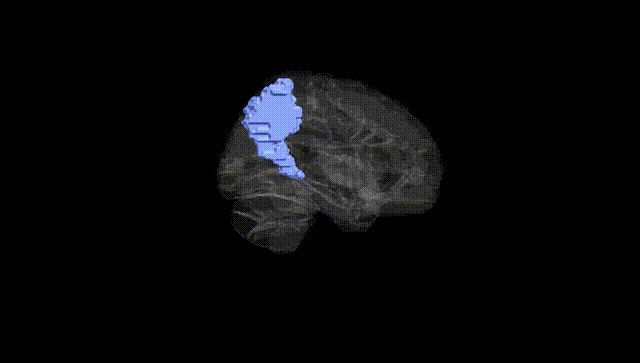
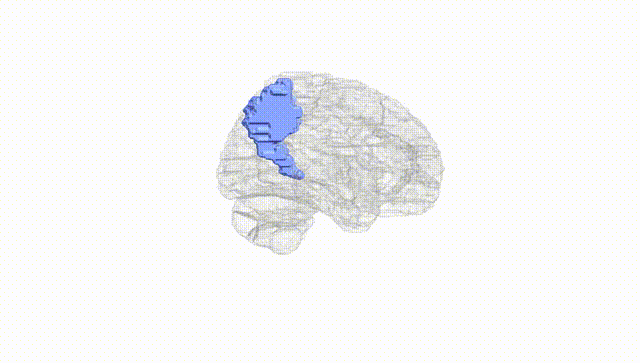
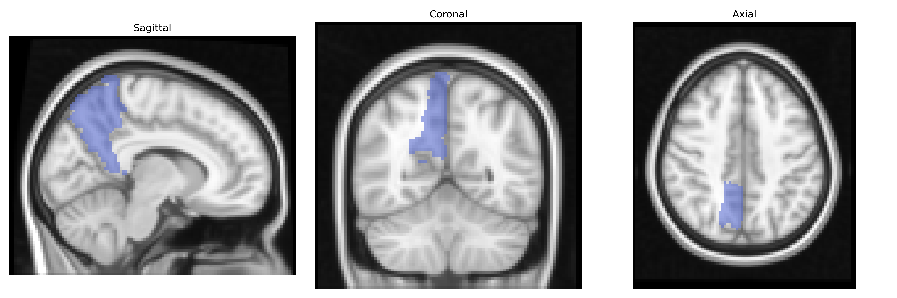
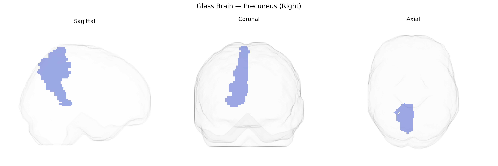

# Precuneus (Right)
 
## Overview
 
The right precuneus, as defined in the AAL atlas, is a medial parietal lobe region located on the medial surface of the hemisphere, bordered anteriorly by the marginal branch of the cingulate sulcus and posteriorly by the parieto‑occipital sulcus. It belongs to the superior parietal lobule and is composed mainly of association cortex involved in visuo-spatial processing, self-referential and autobiographical memory, aspects of consciousness, and integration of somatosensory and visual information. Functionally, the precuneus is a core hub of the default mode network, showing high metabolic activity at rest and widespread connectivity with frontal, parietal, and subcortical regions. Although many studies treat the precuneus as a single structure, the right precuneus may be functionally subdivided along anterior–posterior and dorsal–ventral axes, supporting distinct roles in motor imagery, spatial navigation, and episodic memory retrieval. [Precuneus](https://en.wikipedia.org/wiki/Precuneus)
 
The right precuneus, as defined in the AAL atlas, shows convergent genetic associations primarily through imaging genetics and GWAS of brain structure and function rather than direct locus-specific studies. Twin and family studies consistently indicate high heritability of precuneus volume and functional connectivity, with polygenic influences overlapping those for general cognitive ability, default mode network activity, and cortical thickness. Large-scale neuroimaging GWAS (e.g., ENIGMA and UK Biobank-based studies) have identified multiple loci associated with parietal and medial parietal cortical measures—often involving genes related to synaptic function, neurodevelopment, and myelination (such as variants near WNT, MAPT, and glutamatergic pathway genes)—though these findings typically report regional or network-level measures rather than a specific “right precuneus” locus. Genetically informed studies link precuneus structure and connectivity to traits including intelligence, memory performance, and self-referential processing, and have implicated shared genetic risk with neuropsychiatric disorders such as major depressive disorder, schizophrenia, and Alzheimer’s disease, in which risk loci (for example APOE and other AD-related genes) are associated with altered precuneus metabolism and atrophy. Additionally, polygenic risk scores for autism spectrum disorder, attention-deficit/hyperactivity disorder, and anxiety have been associated with functional changes in default mode network hubs that include the right precuneus, suggesting that this region is a key genetically influenced node in circuits underlying higher-order cognition and affective regulation.
 
*Overview generated by GPT-4o (2026).*
 
---
 
**Region ID:** 6302  
**Hemisphere:** right  
**Atlas:** AAL 
 
---
 
## Precuneus (Right) – Black Background (Full Brain)
 

 
**Full Quality Version:** <a href="full_black.mp4" download>Download MP4</a>
 
---
 
## Precuneus (Right) – White Background (Full Brain)
 

 
**Full Quality Version:** <a href="full_white.mp4" download>Download MP4</a>
 
---

## Precuneus (Right) – Black Background (Hemisphere)
 

 
**Full Quality Version:** <a href="hemi_black.mp4" download>Download MP4</a>
 
---
 
## Precuneus (Right) – White Background (Hemisphere)
 

 
**Full Quality Version:** <a href="hemi_white.mp4" download>Download MP4</a>
 
---

## Triplanar View – T1 Background
 

 
---
 
## Triplanar View – Ghost Brain
 


