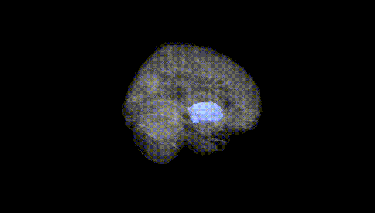
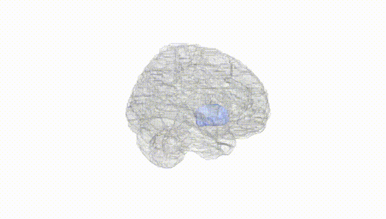
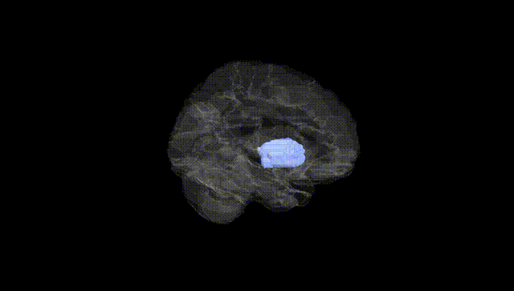
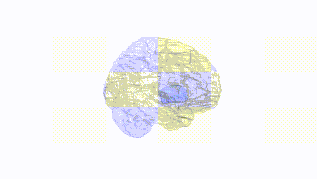
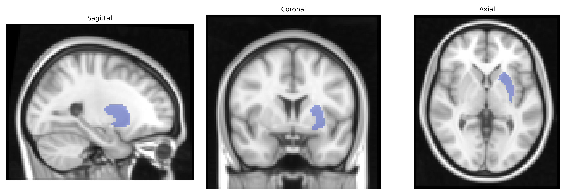
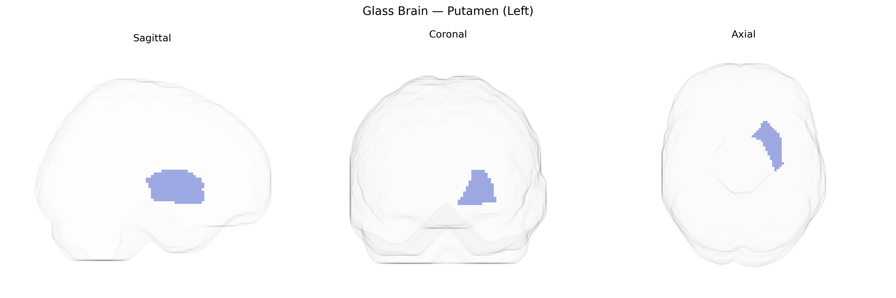

# Putamen (Left)
 
## Overview
 
The left putamen is a subcortical gray matter structure within the basal ganglia, located lateral to the globus pallidus and medial to the insular cortex, and is a principal component of the striatum alongside the caudate nucleus. It receives dense excitatory glutamatergic input from the cerebral cortex (particularly motor, premotor, and somatosensory areas) and thalamus, as well as modulatory dopaminergic projections from the substantia nigra pars compacta, and sends inhibitory GABAergic outputs primarily to the globus pallidus and substantia nigra. Functionally, the left putamen is critically involved in motor control, motor learning, habit formation, and aspects of procedural memory, integrating cortical signals to influence the initiation, scaling, and sequencing of movements and participating in cortico–basal ganglia–thalamo–cortical loops. Pathophysiologically, it is implicated in movement disorders such as Parkinson’s disease, dystonia, and Huntington’s disease, as well as in certain neuropsychiatric conditions. [Putamen](https://en.wikipedia.org/wiki/Putamen_(brain))
 
Genetic associations involving the left putamen, as defined in the AAL atlas, largely emerge from imaging–genetics and GWAS studies of subcortical brain volumes and related neuropsychiatric traits. Large-scale consortia such as ENIGMA and UK Biobank have identified multiple common variants that influence putamen volume bilaterally, including loci near or within genes involved in neurodevelopment, synaptic function, and axonal guidance (for example, variants in or near DCC, SLC39A8, PTCH1, and genes related to iron transport and myelination). These volumetric genetic signals often overlap with risk loci for disorders such as schizophrenia, bipolar disorder, major depressive disorder, and Parkinson’s disease, consistent with the putamen’s central role in corticostriatal circuits and dopaminergic signaling. Polygenic risk for schizophrenia and other psychiatric disorders has been associated with altered putamen structure, including asymmetries affecting the left putamen, while GWAS of Parkinson’s disease and related motor traits implicate genes affecting nigrostriatal pathways that converge functionally on the putamen. Additional associations link putamen volume and activity to genetic variation related to addiction, impulsivity, and cognitive performance, suggesting that the left putamen’s genetically influenced morphology and function contribute to interindividual differences in motor control, habit learning, and reward-related behaviors.
 
*Overview generated by GPT-4o (2026).*
 
---
 
**Region ID:** 7011  
**Hemisphere:** left  
**Atlas:** AAL 
 
---
 
## Putamen (Left) – Black Background (Full Brain)
 

 
**Full Quality Version:** <a href="full_black.mp4" download>Download MP4</a>
 
---
 
## Putamen (Left) – White Background (Full Brain)
 

 
**Full Quality Version:** <a href="full_white.mp4" download>Download MP4</a>
 
---

## Putamen (Left) – Black Background (Hemisphere)
 

 
**Full Quality Version:** <a href="hemi_black.mp4" download>Download MP4</a>
 
---
 
## Putamen (Left) – White Background (Hemisphere)
 

 
**Full Quality Version:** <a href="hemi_white.mp4" download>Download MP4</a>
 
---

## Triplanar View – T1 Background
 

 
---
 
## Triplanar View – Ghost Brain
 


