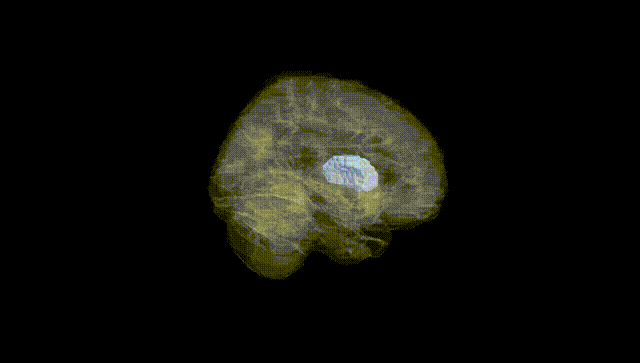
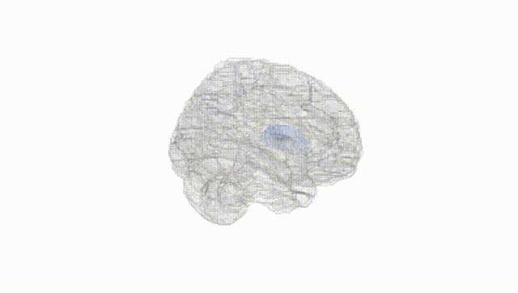
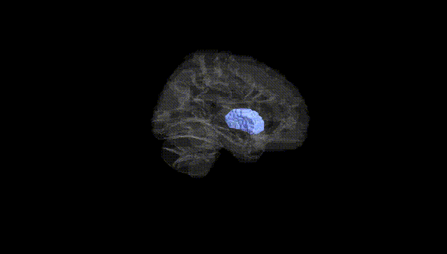
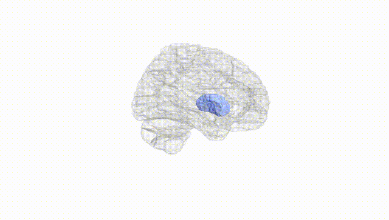
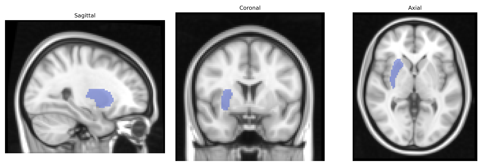
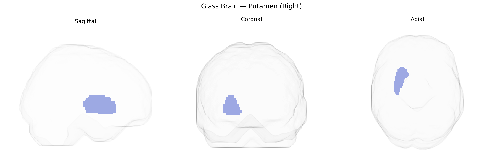

# Putamen (Right)
 
## Overview
 
The right putamen is a subcortical gray matter structure located in the lateral part of the basal ganglia within the telencephalon, forming the larger dorsal striatum together with the caudate nucleus. It receives dense glutamatergic input from widespread cortical areas, including motor, premotor, and somatosensory cortices, and dopaminergic projections from the substantia nigra pars compacta, integrating motor, cognitive, and limbic information for the modulation of voluntary movement and habit learning. Functionally, it participates in action selection, motor sequence execution, and procedural learning, and is critically involved in the indirect and direct pathways that regulate thalamocortical excitability. Structural or functional abnormalities of the putamen are associated with movement disorders such as Parkinson’s disease, Huntington’s disease, and dystonia, as well as with neuropsychiatric conditions including obsessive–compulsive disorder and attention-deficit/hyperactivity disorder. [Putamen](https://en.wikipedia.org/wiki/Putamen)
 
The right putamen, a key component of the dorsal striatum in the AAL atlas, has been repeatedly implicated in genetic studies of brain structure, motor control, and neuropsychiatric disease. Large-scale imaging GWAS (e.g., ENIGMA, UK Biobank) have identified common variants near genes involved in neuronal development, synaptic function, and dopamine signaling (including, among others, variants near DRD2, PPP1R1B/DARPP-32, and genes in glutamatergic and GABAergic pathways) that associate with putamen volume or shape, with many loci showing bilateral but sometimes hemisphere-specific effects. Polygenic risk scores for schizophrenia, bipolar disorder, and major depressive disorder have been linked to altered putamen morphology, and individual risk variants for schizophrenia and ADHD show associations with right putaminal volume or connectivity, consistent with the region’s role in frontostriatal circuits. GWAS of Parkinson’s disease, although centered on dopaminergic cell loss in the substantia nigra, implicate pathways (e.g., SNCA, LRRK2, MAPT loci) that modulate putaminal integrity and function, and right putamen volume and activity often differ in carriers of PD risk variants. Additionally, genetic influences on substance use, impulsivity, and habit formation—traits repeatedly associated with striatal circuitry—have been tied to variability in right putamen structure and activation, including loci identified in GWAS of alcohol and nicotine use and risk-taking behavior, highlighting a polygenic architecture in which many small-effect variants converge on this region’s dopaminergic and corticostriatal networks.
 
*Overview generated by GPT-4o (2026).*
 
---
 
**Region ID:** 7012  
**Hemisphere:** right  
**Atlas:** AAL 
 
---
 
## Putamen (Right) – Black Background (Full Brain)
 

 
**Full Quality Version:** <a href="full_black.mp4" download>Download MP4</a>
 
---
 
## Putamen (Right) – White Background (Full Brain)
 

 
**Full Quality Version:** <a href="full_white.mp4" download>Download MP4</a>
 
---

## Putamen (Right) – Black Background (Hemisphere)
 

 
**Full Quality Version:** <a href="hemi_black.mp4" download>Download MP4</a>
 
---
 
## Putamen (Right) – White Background (Hemisphere)
 

 
**Full Quality Version:** <a href="hemi_white.mp4" download>Download MP4</a>
 
---

## Triplanar View – T1 Background
 

 
---
 
## Triplanar View – Ghost Brain
 


