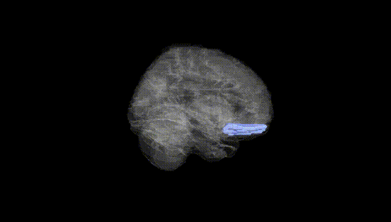
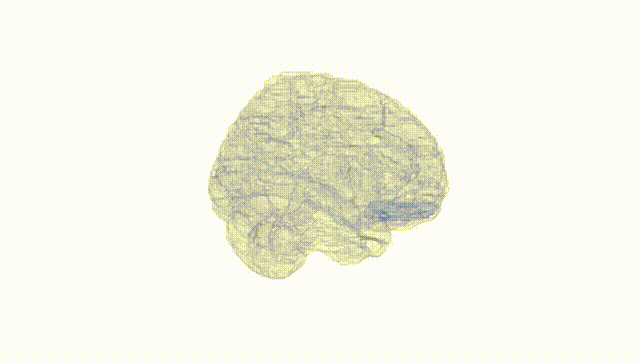
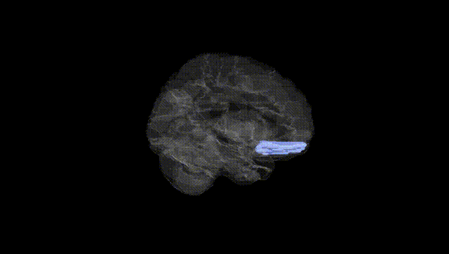
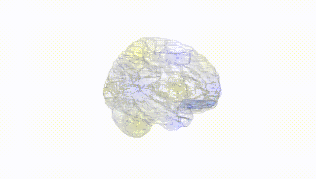
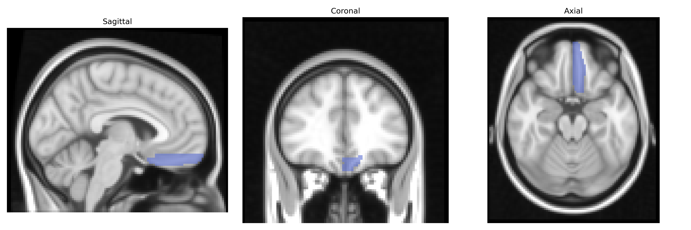
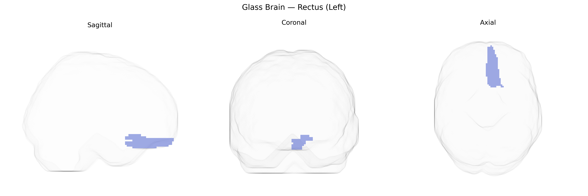

# Rectus (Left)
 
## Overview
 
The left Rectus (Left) region in the AAL atlas corresponds to the left gyrus rectus, a medial orbitofrontal cortical gyrus located on the inferior surface of the frontal lobe, adjacent to the olfactory sulcus and running anteroposteriorly along the ventromedial frontal cortex. Cytoarchitectonically, it is often considered part of the orbitofrontal cortex and is supplied mainly by branches of the anterior cerebral artery. Functionally, the gyrus rectus has been implicated in higher-order cognitive and affective processes, including aspects of decision-making, reward evaluation, emotional regulation, and olfactory-related processing, though its precise role remains incompletely defined and is frequently studied in the context of broader orbitofrontal networks. There is no direct Wikipedia article for the left rectus region; a closely related structure is the [Orbitofrontal cortex](https://en.wikipedia.org/wiki/Orbitofrontal_cortex).
 
The left rectus gyrus (medial orbitofrontal/ventromedial prefrontal region in the AAL atlas) is not a primary target in large-scale imaging genetics, but several GWAS and imaging–genetics studies implicate this area or closely overlapping medial orbitofrontal cortex. ENIGMA and UK Biobank–based cortical GWAS have identified common variants (e.g., near genes involved in neurodevelopment, synaptic signaling, and extracellular matrix such as HMGA2, IGF1, and PLEKHM1) associated with surface area or cortical thickness across frontal regions including medial orbitofrontal/rectus territories, though locus-level resolution to the left rectus specifically is limited. Polygenic scores for schizophrenia, major depressive disorder, and bipolar disorder show associations with structural or functional changes in medial orbitofrontal/rectus cortex, and genes repeatedly implicated in psychiatric risk (such as CACNA1C, GRIN2A, and SLC6A4) have been linked in candidate or intermediate-phenotype studies to altered activity or connectivity in ventromedial prefrontal/rectus areas, particularly in emotion and reward processing tasks. Alzheimer’s disease and frontotemporal dementia GWAS have not singled out the left rectus as a distinct locus, but APOE ε4 and other dementia risk variants are associated with broader orbitofrontal and medial prefrontal atrophy patterns that include rectus cortex. Overall, genetic associations involving the “left rectus” in AAL-based analyses typically emerge as part of larger medial orbitofrontal/ventromedial prefrontal circuits linked to psychiatric risk, personality traits (e.g., neuroticism and risk-taking), and global brain morphometry rather than as a uniquely isolated, well-replicated genetic target.
 
*Overview generated by GPT-4o (2026).*
 
---
 
**Region ID:** 2701  
**Hemisphere:** left  
**Atlas:** AAL 
 
---
 
## Rectus (Left) – Black Background (Full Brain)
 

 
**Full Quality Version:** <a href="full_black.mp4" download>Download MP4</a>
 
---
 
## Rectus (Left) – White Background (Full Brain)
 

 
**Full Quality Version:** <a href="full_white.mp4" download>Download MP4</a>
 
---

## Rectus (Left) – Black Background (Hemisphere)
 

 
**Full Quality Version:** <a href="hemi_black.mp4" download>Download MP4</a>
 
---
 
## Rectus (Left) – White Background (Hemisphere)
 

 
**Full Quality Version:** <a href="hemi_white.mp4" download>Download MP4</a>
 
---

## Triplanar View – T1 Background
 

 
---
 
## Triplanar View – Ghost Brain
 


