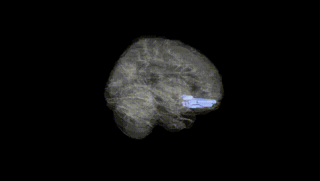
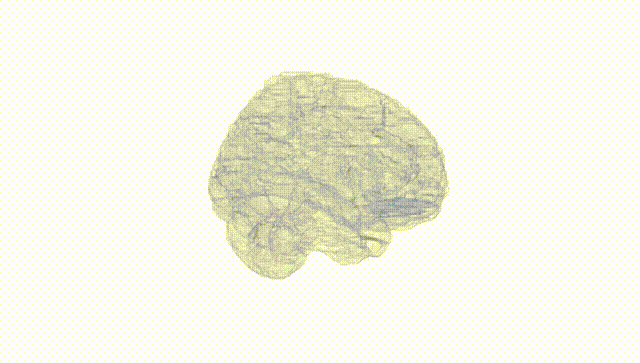
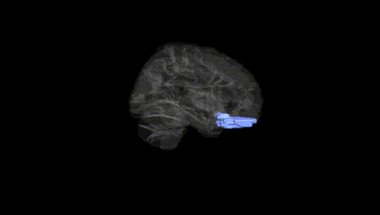
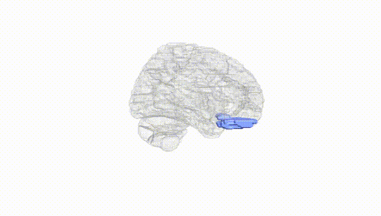
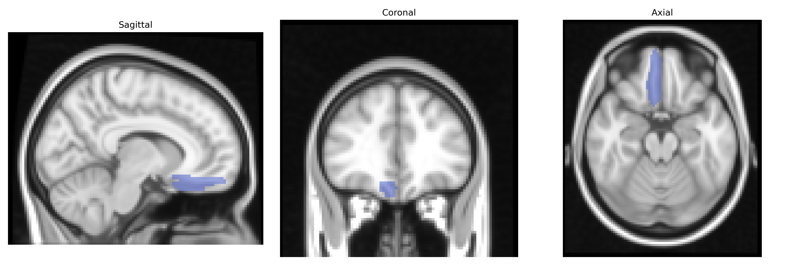
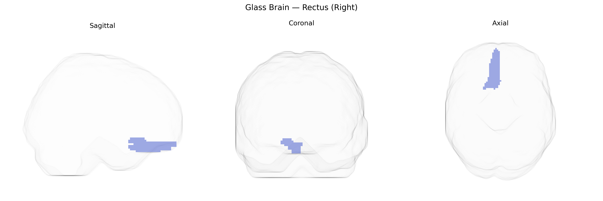

# Rectus (Right)
 
## Overview
 
The right Rectus (Right) region in the AAL atlas corresponds to the right gyrus rectus, a medial orbital gyrus located on the inferior surface of the frontal lobe, immediately adjacent to the olfactory sulcus and closely associated with the medial prefrontal and orbitofrontal cortices. It is supplied primarily by branches of the anterior cerebral artery and contains gray matter involved in higher-order cognitive and affective processes, including aspects of reward evaluation, emotional regulation, and decision-making, often in coordination with the limbic system. Functionally, this region participates in networks subserving social cognition and value-based judgment, though its precise roles are still being clarified through structural and functional neuroimaging. There is no direct Wikipedia article for “Right Rectus (Right)” as an AAL label; a related structure description can be found under [Gyrus rectus](https://en.wikipedia.org/wiki/Gyrus_rectus).
 
The right Rectus gyrus (medial orbitofrontal/ventromedial prefrontal region in the AAL atlas) has been implicated in several genetic imaging and GWAS-based studies, although typically not as a primary locus of association. Structural and functional measures involving this region (often grouped with orbitofrontal or ventromedial prefrontal cortex) have shown heritability in twin and family studies, and common variants in genes related to synaptic function and neurodevelopment—such as BDNF, COMT, and various glutamatergic and serotonergic genes—have been associated with orbitofrontal/medial prefrontal volume or activity, which includes the Rectus area. Large-scale neuroimaging GWAS consortia (e.g., ENIGMA, UK Biobank-based studies) have reported polygenic influences on cortical thickness and surface area in medial orbitofrontal regions, linking them to psychiatric and behavioral traits, including major depression, anxiety, obsessive–compulsive disorder, addiction-related phenotypes, and personality traits like neuroticism and impulsivity, though associations are generally distributed across prefrontal networks rather than specific to the right Rectus label. Additionally, GWAS of functional connectivity and resting-state networks involving the default mode and limbic circuits have implicated variants in multiple loci (often in or near genes like CACNA1C, GRM3, and others) that modulate activity in medial prefrontal regions overlapping the Rectus gyrus, with downstream associations to mood disorders, schizophrenia spectrum conditions, and cognitive control traits; however, no single robust, widely replicated genetic variant is known that uniquely or specifically targets the right Rectus (Right) region as defined in the AAL atlas.
 
*Overview generated by GPT-4o (2026).*
 
---
 
**Region ID:** 2702  
**Hemisphere:** right  
**Atlas:** AAL 
 
---
 
## Rectus (Right) – Black Background (Full Brain)
 

 
**Full Quality Version:** <a href="full_black.mp4" download>Download MP4</a>
 
---
 
## Rectus (Right) – White Background (Full Brain)
 

 
**Full Quality Version:** <a href="full_white.mp4" download>Download MP4</a>
 
---

## Rectus (Right) – Black Background (Hemisphere)
 

 
**Full Quality Version:** <a href="hemi_black.mp4" download>Download MP4</a>
 
---
 
## Rectus (Right) – White Background (Hemisphere)
 

 
**Full Quality Version:** <a href="hemi_white.mp4" download>Download MP4</a>
 
---

## Triplanar View – T1 Background
 

 
---
 
## Triplanar View – Ghost Brain
 


