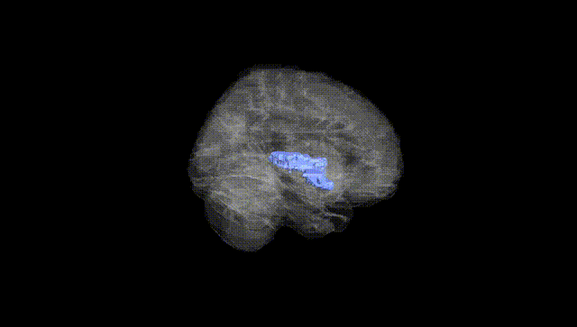
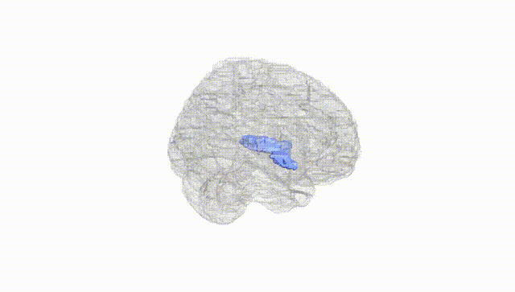
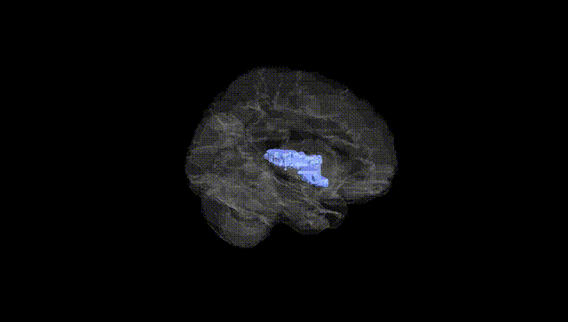
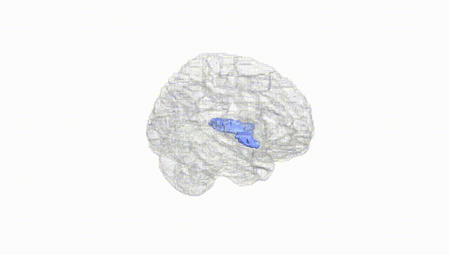
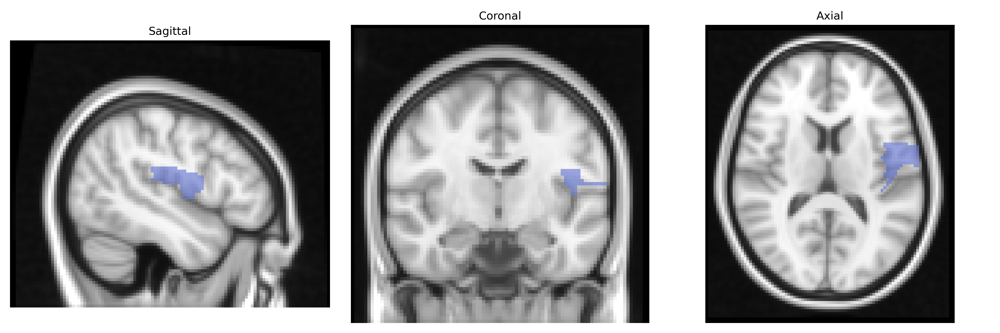
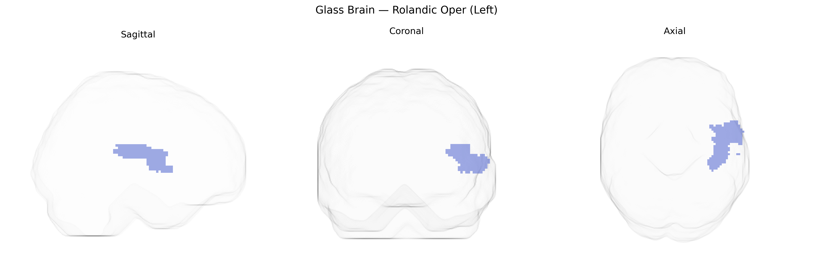

# Rolandic Oper (Left)
 
## Overview
 
The left Rolandic operculum is a cortical region overlying the insula along the lateral fissure, corresponding to the opercular portion of the precentral and postcentral gyri around the Rolandic (central) sulcus. In the AAL atlas, this area is associated primarily with sensorimotor integration for the face, tongue, and orofacial musculature, playing a role in articulation, chewing, swallowing, and somatosensory processing of the perioral region. It forms part of the broader peri-Sylvian network involved in speech production and oral motor control, and is structurally and functionally connected with adjacent primary motor, primary somatosensory, and insular cortices. There is no dedicated Wikipedia page for the “Rolandic operculum,” but it is part of the [Operculum (brain)](https://en.wikipedia.org/wiki/Operculum_(brain)).
 
The left Rolandic operculum, a peri-Sylvian region implicated in sensorimotor integration, speech articulation, and orofacial control, features in multiple imaging‑genetics and GWAS-based studies linking genetic variation to cortical structure and function in language and motor networks. Large-scale ENIGMA and UK Biobank analyses have reported associations between common variants (notably in loci near genes such as FOXP2, CNTNAP2, ROBO1, and other axon guidance, synaptic, and neurodevelopmental genes) and cortical thickness, surface area, or activation patterns in opercular and adjacent Rolandic regions, though findings are often distributed and not specific solely to the left Rolandic operculum as defined by the AAL atlas. Imaging GWAS on speech and language traits, stuttering, and reading ability implicate peri-Rolandic opercular areas along with inferior frontal and superior temporal regions, while motor-related GWAS (e.g., for orofacial motor control and general motor function) show polygenic influences on sensorimotor cortex structure that include Rolandic opercular territory. Neuropsychiatric GWAS (schizophrenia, autism spectrum disorder, ADHD, and major depression) frequently identify risk alleles that map, via imaging-genetics or functional annotation, to networks encompassing the left Rolandic operculum, particularly in the context of altered language, social communication, and sensorimotor integration; however, no single robust, widely replicated locus is currently recognized as uniquely or specifically associated with the left Rolandic operculum in isolation, and most evidence reflects its role as part of broader polygenic, distributed cortico-subcortical networks.
 
*Overview generated by GPT-4o (2026).*
 
---
 
**Region ID:** 2331  
**Hemisphere:** left  
**Atlas:** AAL 
 
---
 
## Rolandic Oper (Left) – Black Background (Full Brain)
 

 
**Full Quality Version:** <a href="full_black.mp4" download>Download MP4</a>
 
---
 
## Rolandic Oper (Left) – White Background (Full Brain)
 

 
**Full Quality Version:** <a href="full_white.mp4" download>Download MP4</a>
 
---

## Rolandic Oper (Left) – Black Background (Hemisphere)
 

 
**Full Quality Version:** <a href="hemi_black.mp4" download>Download MP4</a>
 
---
 
## Rolandic Oper (Left) – White Background (Hemisphere)
 

 
**Full Quality Version:** <a href="hemi_white.mp4" download>Download MP4</a>
 
---

## Triplanar View – T1 Background
 

 
---
 
## Triplanar View – Ghost Brain
 


