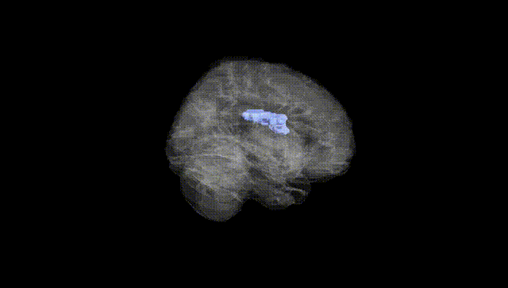
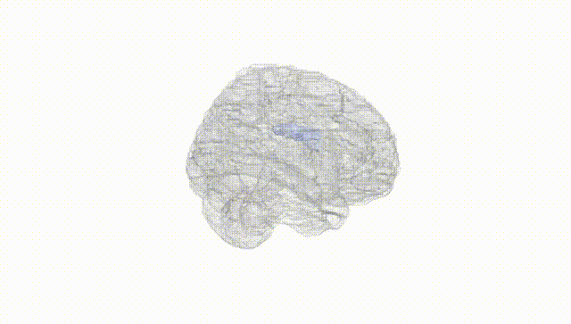
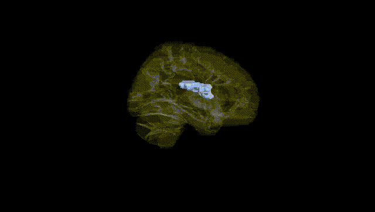
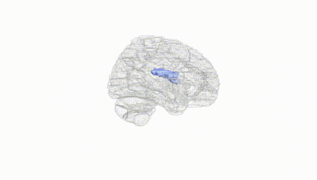
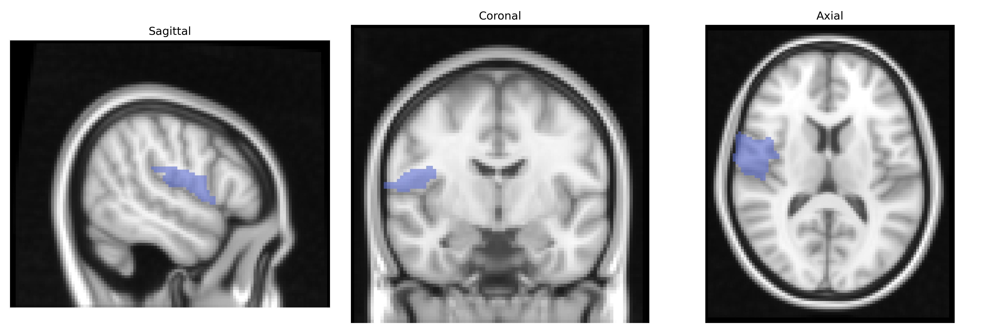
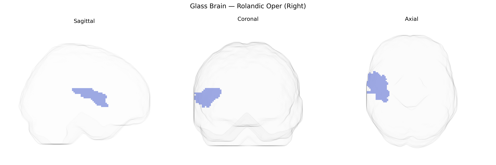

# Rolandic Oper (Right)
 
## Overview
 
The right Rolandic operculum is a cortical region overlying the posterior ascending ramus of the lateral sulcus, forming part of the opercular covering of the insula and adjacent to the primary somatosensory and motor cortices. It participates in sensorimotor integration of the orofacial and laryngeal musculature, contributing to swallowing, speech articulation, and somatic perception of the perioral and pharyngeal regions. Functionally, it is engaged in multimodal processing of tactile, proprioceptive, and possibly gustatory input, and is frequently co-activated with the insula, inferior frontal gyrus, and primary sensorimotor cortices in tasks involving articulation and oro-pharyngeal movements. There is no direct Wikipedia article for the Rolandic operculum; a closely related structure is the [Insular cortex](https://en.wikipedia.org/wiki/Insular_cortex).
 
The right Rolandic operculum (AAL “Rolandic Oper R”) has been implicated in several imaging‑genetics and GWAS studies, although findings are often reported at the level of adjacent sensorimotor, perisylvian, or opercular regions rather than this ROI alone; variants in genes involved in cortical development and synaptic function (for example, MIR137, DISC1, CNTNAP2, and FOXP2‑related pathways) have been associated with altered structure or activation in right peri‑Rolandic and opercular areas during speech production, orofacial motor control, and somatosensory processing. Large‑scale GWAS of cortical thickness and surface area (e.g., ENIGMA and UK Biobank–based analyses) report heritable variation in central and perisylvian regions overlapping the Rolandic operculum, with genome‑wide significant loci near genes regulating neurodevelopment (such as RSRC1, TBR1, and various Wnt‑signaling components), though these are typically summarized at lobar or gyral parcels rather than AAL’s exact boundary. Disorders linked through imaging‑genetics to right Rolandic/opercular regions include autism spectrum disorder and specific language/communication disorders (via altered opercular activation and connectivity in carriers of language‑related risk alleles), schizophrenia and psychosis risk (through associations of risk polygenic scores with structural differences in peri‑Rolandic regions), and focal epilepsy or benign Rolandic epilepsy (with susceptibility loci influencing the perisylvian sensorimotor cortex and adjacent operculum), but direct, consistently replicated, region‑specific GWAS hits confined strictly to the AAL right Rolandic operculum remain limited, and current evidence largely reflects broader sensorimotor and language networks that encompass this area.
 
*Overview generated by GPT-4o (2026).*
 
---
 
**Region ID:** 2332  
**Hemisphere:** right  
**Atlas:** AAL 
 
---
 
## Rolandic Oper (Right) – Black Background (Full Brain)
 

 
**Full Quality Version:** <a href="full_black.mp4" download>Download MP4</a>
 
---
 
## Rolandic Oper (Right) – White Background (Full Brain)
 

 
**Full Quality Version:** <a href="full_white.mp4" download>Download MP4</a>
 
---

## Rolandic Oper (Right) – Black Background (Hemisphere)
 

 
**Full Quality Version:** <a href="hemi_black.mp4" download>Download MP4</a>
 
---
 
## Rolandic Oper (Right) – White Background (Hemisphere)
 

 
**Full Quality Version:** <a href="hemi_white.mp4" download>Download MP4</a>
 
---

## Triplanar View – T1 Background
 

 
---
 
## Triplanar View – Ghost Brain
 


