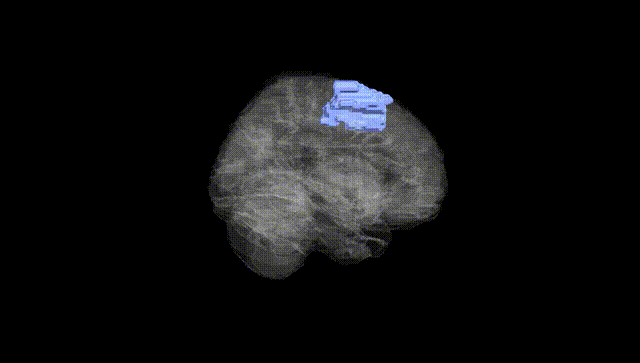
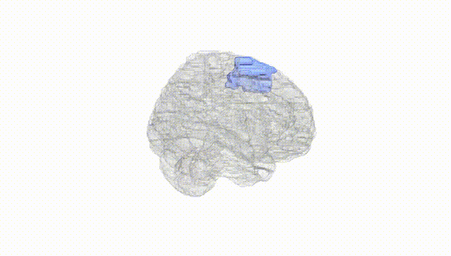
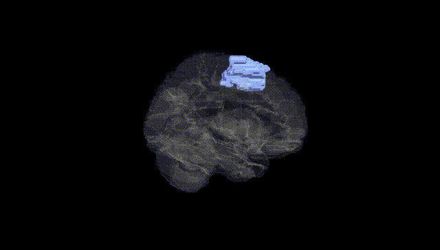
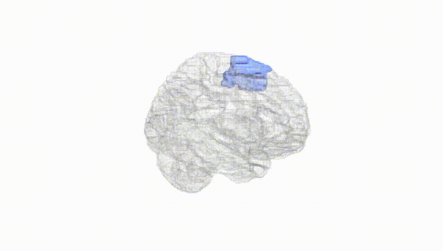
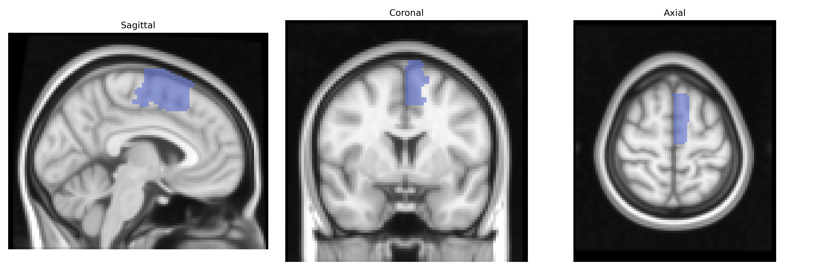
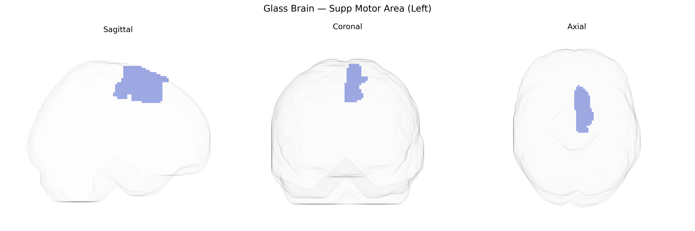

# Supp Motor Area (Left)
 
## Overview
 
The left Supplementary Motor Area (SMA), as defined in the AAL atlas, is a medial frontal cortical region located on the superior aspect of the hemisphere, anterior to the primary motor cortex and within the dorsal part of the medial premotor cortex. It is primarily involved in higher-order aspects of motor control, including planning, initiation, and sequencing of voluntary movements, particularly those that are internally generated or involve bimanual coordination. The SMA contributes to motor imagery, temporal organization of actions, and the transformation of intention into motor output, and it has dense connections with primary motor cortex, premotor areas, basal ganglia, and thalamus. Functionally, it is implicated in speech initiation, motor learning, and control of complex, learned motor patterns, and it is frequently activated in neuroimaging studies of motor preparation and execution. There is no direct Wikipedia entry specifically for “left Supplementary Motor Area,” but it is encompassed within the broader [Supplementary motor area](https://en.wikipedia.org/wiki/Supplementary_motor_area).
 
The left supplementary motor area (SMA), as defined in the AAL atlas, has been implicated in several genetic and genome-wide association studies (GWAS) that link its structure and function to neuropsychiatric and motor-related traits. Variants in genes involved in neurodevelopment, synaptic plasticity, and motor circuitry—such as those related to glutamatergic and GABAergic signaling (e.g., GRIN, GAD, and GABA receptor gene families) and basal ganglia–cortical loop function—have been associated with altered SMA volume, cortical thickness, or activation patterns in imaging-genetics work. The left SMA shows heritable variation in structural MRI measures, with SNP-based heritability estimates in large consortia (e.g., ENIGMA, UK Biobank) indicating polygenic influences overlapping with loci associated with general brain size, cortical morphology, and motor function. Functional and structural alterations of the left SMA have been repeatedly observed in genetically influenced disorders such as Parkinson’s disease, dystonia, Tourette syndrome, ADHD, and autism spectrum disorder, as well as in obsessive–compulsive disorder and schizophrenia, with several risk loci for these conditions (e.g., in DRD2, CACNA1C, and other synaptic/ion-channel genes) linked to SMA-related circuits. In addition, polygenic scores for educational attainment, cognitive performance, and motor traits have been associated with variation in SMA structure or connectivity in large population cohorts, suggesting that common genetic variation contributes to interindividual differences in this region relevant to both motor control and higher-order cognitive functions.
 
*Overview generated by GPT-4o (2026).*
 
---
 
**Region ID:** 2401  
**Hemisphere:** left  
**Atlas:** AAL 
 
---
 
## Supp Motor Area (Left) – Black Background (Full Brain)
 

 
**Full Quality Version:** <a href="full_black.mp4" download>Download MP4</a>
 
---
 
## Supp Motor Area (Left) – White Background (Full Brain)
 

 
**Full Quality Version:** <a href="full_white.mp4" download>Download MP4</a>
 
---

## Supp Motor Area (Left) – Black Background (Hemisphere)
 

 
**Full Quality Version:** <a href="hemi_black.mp4" download>Download MP4</a>
 
---
 
## Supp Motor Area (Left) – White Background (Hemisphere)
 

 
**Full Quality Version:** <a href="hemi_white.mp4" download>Download MP4</a>
 
---

## Triplanar View – T1 Background
 

 
---
 
## Triplanar View – Ghost Brain
 


