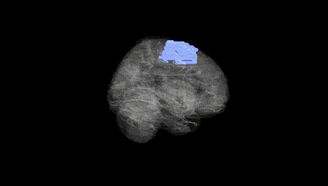
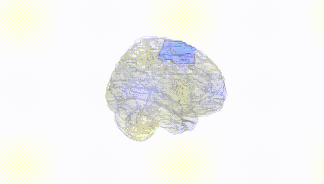
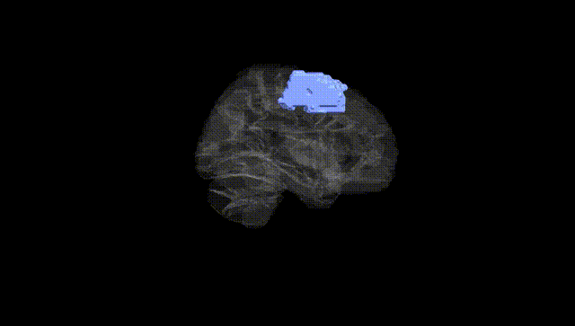
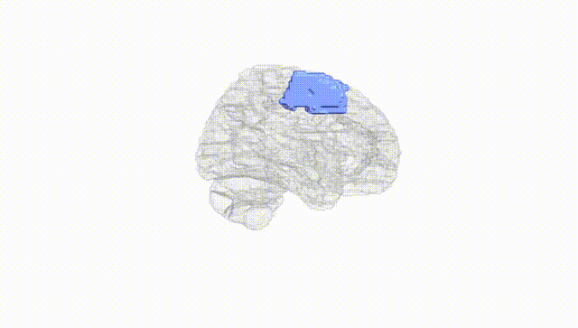
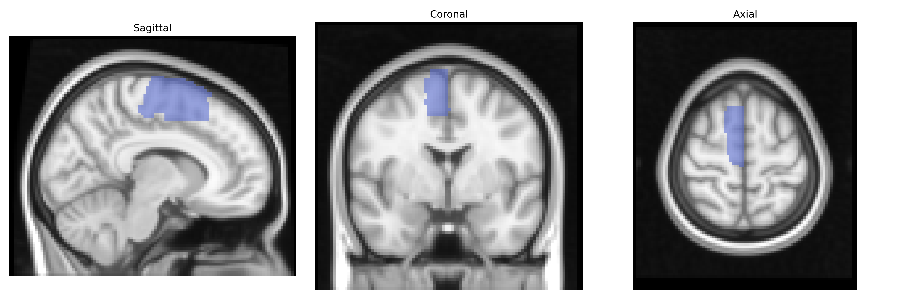
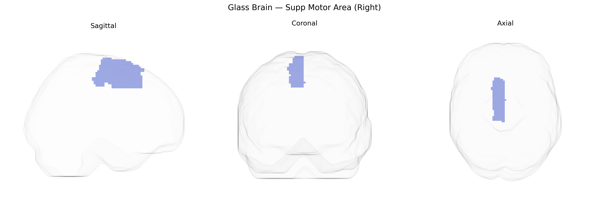

# Supp Motor Area (Right)
 
## Overview
 
The right supplementary motor area (Right Supp Motor Area) in the AAL atlas corresponds to the medial part of the superior frontal gyrus on the right hemisphere, located anterior to the primary motor cortex and extending along the medial wall of the frontal lobe. It is classically divided into pre-SMA (more anterior) and SMA proper (more posterior), with dense connections to primary motor cortex, premotor cortex, basal ganglia, and spinal cord pathways. Functionally, this region is implicated in the planning, initiation, and coordination of complex and internally generated movements, as well as in bimanual coordination, motor sequence learning, and aspects of motor imagery and preparation. It also participates in higher-order motor control processes such as response inhibition and temporal organization of actions. There is no direct Wikipedia article specifically for “right supplementary motor area”; a closely related structure is the [Supplementary motor area](https://en.wikipedia.org/wiki/Supplementary_motor_area).
 
The right supplementary motor area (SMA), as defined in the AAL atlas, has been implicated in several genetically influenced traits and disorders through imaging genetics and GWAS-based mapping, although few associations are strictly region-specific. Common variants in genes related to synaptic plasticity, neurodevelopment, and cortical morphometry (for example, BDNF, COMT, and polygenic scores for overall brain volume or cortical thickness) have been associated with structural or functional alterations encompassing medial frontal motor regions that include the SMA; large-scale ENIGMA and UK Biobank studies have linked global and regional motor/premotor cortex volumes and surface area to widespread polygenic effects rather than single loci of large effect. Functionally, risk variants for movement disorders (such as LRRK2, GBA, and other Parkinson’s disease–associated loci), dystonia, and Tourette syndrome have been associated with altered activity or connectivity in cortico–basal ganglia–thalamocortical loops that prominently involve the SMA, including the right hemisphere, while variants conferring risk for attention-deficit/hyperactivity disorder, obsessive–compulsive disorder, and autism spectrum disorder have been tied to atypical activation or connectivity in medial frontal control networks that include this region. In addition, polygenic risk for schizophrenia and major depression has been correlated with altered right medial frontal activation during tasks requiring motor planning or response inhibition, and GWAS of motor function, speech, and stuttering have implicated networks incorporating the SMA rather than isolated primary motor cortex. Overall, current evidence suggests that genetic influences on the right SMA are highly polygenic and typically detected at the level of broader medial frontal–motor networks, linking this region to movement disorders, neurodevelopmental conditions, and psychiatric traits via distributed, rather than region-specific, genetic effects.
 
*Overview generated by GPT-4o (2026).*
 
---
 
**Region ID:** 2402  
**Hemisphere:** right  
**Atlas:** AAL 
 
---
 
## Supp Motor Area (Right) – Black Background (Full Brain)
 

 
**Full Quality Version:** <a href="full_black.mp4" download>Download MP4</a>
 
---
 
## Supp Motor Area (Right) – White Background (Full Brain)
 

 
**Full Quality Version:** <a href="full_white.mp4" download>Download MP4</a>
 
---

## Supp Motor Area (Right) – Black Background (Hemisphere)
 

 
**Full Quality Version:** <a href="hemi_black.mp4" download>Download MP4</a>
 
---
 
## Supp Motor Area (Right) – White Background (Hemisphere)
 

 
**Full Quality Version:** <a href="hemi_white.mp4" download>Download MP4</a>
 
---

## Triplanar View – T1 Background
 

 
---
 
## Triplanar View – Ghost Brain
 


