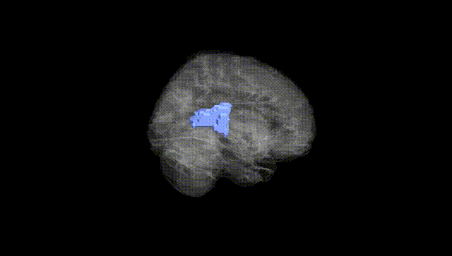
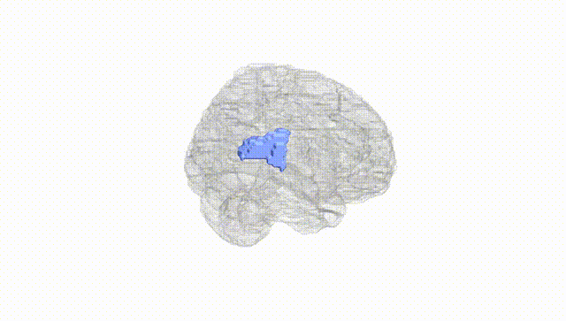
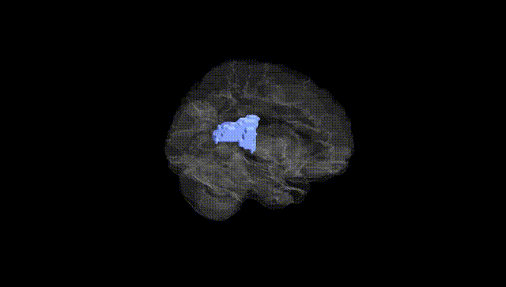
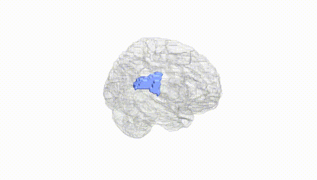
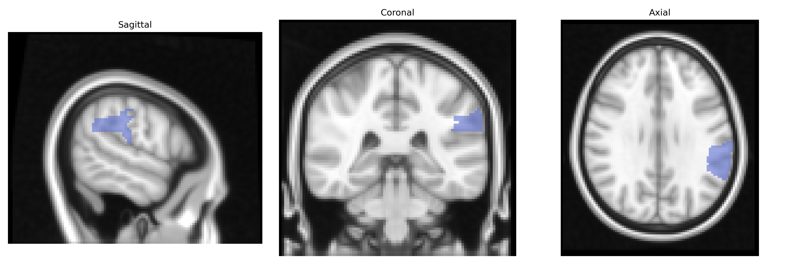
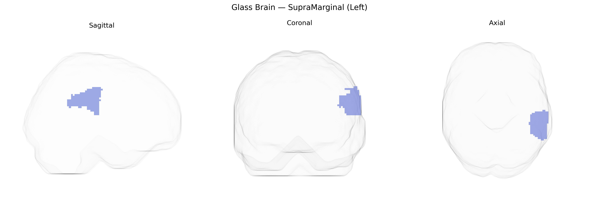

# SupraMarginal (Left)
 
## Overview
 
The left supramarginal gyrus is a cortical region of the inferior parietal lobule, curving around the posterior end of the lateral fissure and situated anterior to the angular gyrus. In the AAL atlas, it corresponds largely to the supramarginal gyrus of the dominant (usually left) hemisphere, implicated in phonological processing, verbal working memory, language comprehension, and aspects of reading and spelling, particularly grapheme–phoneme conversion. It also contributes to sensorimotor integration, the perception of limb position, and higher-order somatosensory processing, as well as social and empathetic functions through its involvement in perspective taking and emotion recognition. Cytoarchitectonically, it overlaps mostly with Brodmann area 40 and is interconnected with frontal language regions (such as Broca’s area), temporal auditory regions, and other parietal association cortices, forming part of dorsal language and attention networks. [Supramarginal gyrus](https://en.wikipedia.org/wiki/Supramarginal_gyrus)
 
The left supramarginal gyrus (AAL supramarginal left) has been implicated in multiple genetic and GWAS-based findings, particularly involving language, reading, and higher-order cognitive traits. Imaging-genetics studies show that common variants in genes such as FOXP2, DCDC2, KIAA0319, CNTNAP2, and ROBO1—classically associated with language and dyslexia—are linked to structural and functional differences in the left supramarginal gyrus, including altered cortical thickness and activation during phonological tasks. Large-scale ENIGMA and UK Biobank GWAS of cortical morphology have identified loci near genes involved in neurodevelopment and synaptic function (for example, variants in MIR924HG and other neurodevelopmental loci) associated with supramarginal gyrus surface area and thickness, though these effects are typically small and polygenic. Genetic correlations and case–control studies in dyslexia, developmental language disorder, and autism spectrum disorder suggest that polygenic risk for these conditions relates to altered left supramarginal structure and connectivity, consistent with its role in phonological processing and social–cognitive functions. Additional GWAS and candidate-gene work in schizophrenia, bipolar disorder, and major depression have reported disease-related changes in this region that co-occur with risk variants in glutamatergic and synaptic genes, as well as polygenic scores for these disorders, indicating that left supramarginal gyrus morphology and function form part of broader genetically influenced networks relevant to language, working memory, and psychopathology.
 
*Overview generated by GPT-4o (2026).*
 
---
 
**Region ID:** 6211  
**Hemisphere:** left  
**Atlas:** AAL 
 
---
 
## SupraMarginal (Left) – Black Background (Full Brain)
 

 
**Full Quality Version:** <a href="full_black.mp4" download>Download MP4</a>
 
---
 
## SupraMarginal (Left) – White Background (Full Brain)
 

 
**Full Quality Version:** <a href="full_white.mp4" download>Download MP4</a>
 
---

## SupraMarginal (Left) – Black Background (Hemisphere)
 

 
**Full Quality Version:** <a href="hemi_black.mp4" download>Download MP4</a>
 
---
 
## SupraMarginal (Left) – White Background (Hemisphere)
 

 
**Full Quality Version:** <a href="hemi_white.mp4" download>Download MP4</a>
 
---

## Triplanar View – T1 Background
 

 
---
 
## Triplanar View – Ghost Brain
 


