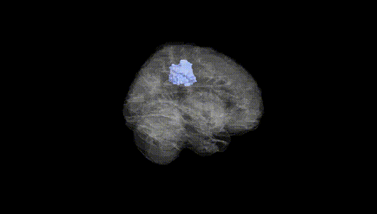
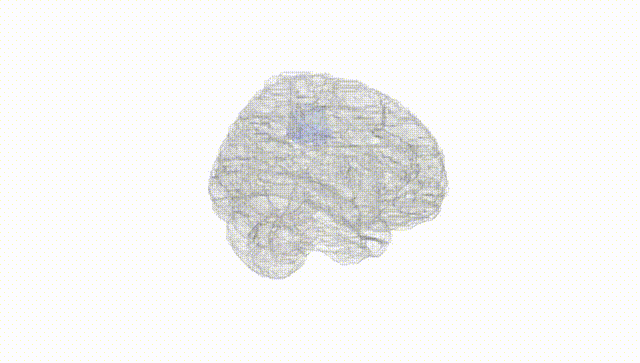
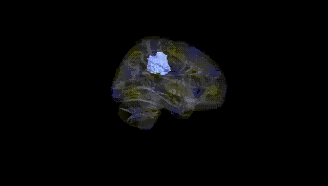
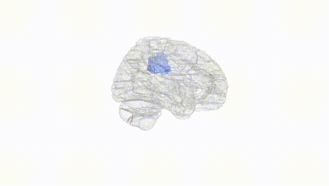
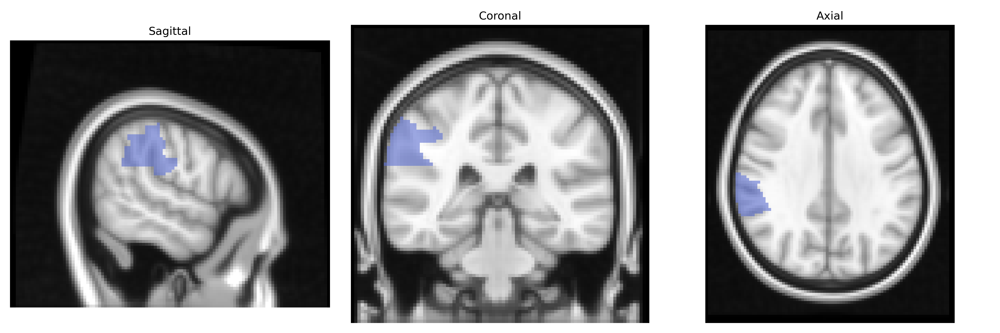
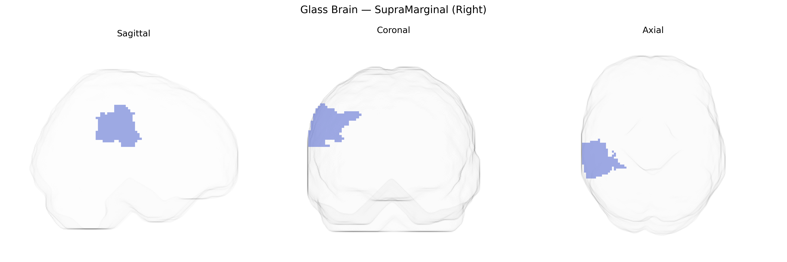

# SupraMarginal (Right)
 
## Overview
 
The right supramarginal gyrus, as defined in the AAL atlas, is a cortical region of the inferior parietal lobule located in the posterior part of the lateral convexity of the parietal lobe, wrapping around the posterior end of the Sylvian (lateral) fissure. It is cytoarchitectonically associated with Brodmann area 40 and participates in multimodal integration of auditory, somatosensory, and visual information. Functionally, this region is implicated in phonological processing, language comprehension (particularly prosody and aspects of speech perception), spatial attention, and aspects of social cognition such as empathy and perspective-taking, with right-hemispheric contributions often emphasized in attentional and emotional–prosodic functions. In the AAL atlas, the right supramarginal gyrus forms part of the broader inferior parietal functional network that links parietal, temporal, and frontal association cortices. There is no direct Wikipedia article specific to the “right supramarginal gyrus”; a related entry is [Supramarginal gyrus](https://en.wikipedia.org/wiki/Supramarginal_gyrus).
 
Genetic associations involving the right supramarginal gyrus (SMG; AAL Atlas) have emerged mainly from imaging‑genetics and GWAS of brain structure and cognition, though findings are still relatively sparse and heterogeneous. Variants near or within genes such as CNTNAP2, DCDC2, KIAA0319, FOXP2, and ROBO1, often implicated in language, reading, and neurodevelopmental phenotypes, have been linked to cortical thickness or volume differences in perisylvian regions that include the right SMG, particularly in the context of dyslexia, developmental language disorder, and speech‑language traits. Large-scale imaging GWAS (e.g., UK Biobank–based studies) have identified SNPs associated with surface area and thickness in inferior parietal and supramarginal regions, with loci including genes involved in neurodevelopment, axon guidance, and synaptic function (such as HMGA2 and others near neurodevelopmental pathways), though these are typically reported at the regional (inferior parietal/supramarginal) rather than fine-grained AAL level. The right SMG has also been implicated in GWAS-related endophenotypes for autism spectrum disorder, attention-deficit/hyperactivity disorder, and schizophrenia, where disorder‑associated variants show effects on right supramarginal morphology or connectivity, and in polygenic-score analyses linking genetic risk for these disorders to structural or functional alterations in this region. In addition, GWAS of cognitive traits (e.g., reading ability, phonological processing, verbal working memory, empathy, and social cognition) have reported associations between polygenic scores and right SMG activation or structure, suggesting that common genetic variation influencing language and social-cognitive abilities partly operates through this parietal region, although no single locus has yet emerged as a robust, specific, and consistently replicated determinant of right supramarginal anatomy or function.
 
*Overview generated by GPT-4o (2026).*
 
---
 
**Region ID:** 6212  
**Hemisphere:** right  
**Atlas:** AAL 
 
---
 
## SupraMarginal (Right) – Black Background (Full Brain)
 

 
**Full Quality Version:** <a href="full_black.mp4" download>Download MP4</a>
 
---
 
## SupraMarginal (Right) – White Background (Full Brain)
 

 
**Full Quality Version:** <a href="full_white.mp4" download>Download MP4</a>
 
---

## SupraMarginal (Right) – Black Background (Hemisphere)
 

 
**Full Quality Version:** <a href="hemi_black.mp4" download>Download MP4</a>
 
---
 
## SupraMarginal (Right) – White Background (Hemisphere)
 

 
**Full Quality Version:** <a href="hemi_white.mp4" download>Download MP4</a>
 
---

## Triplanar View – T1 Background
 

 
---
 
## Triplanar View – Ghost Brain
 


