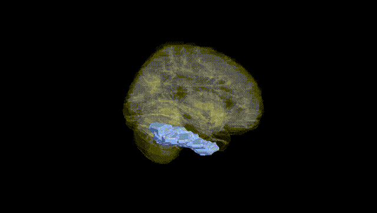
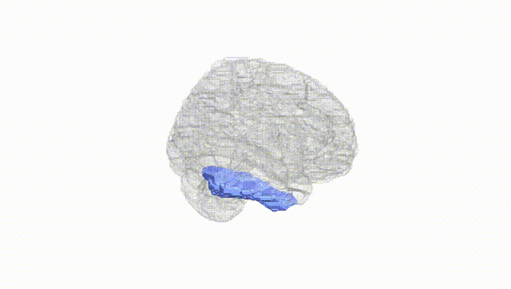
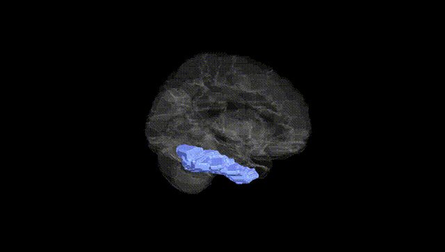
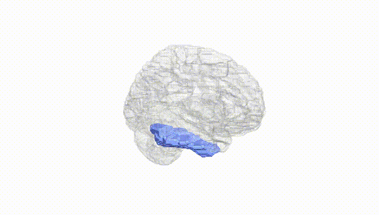
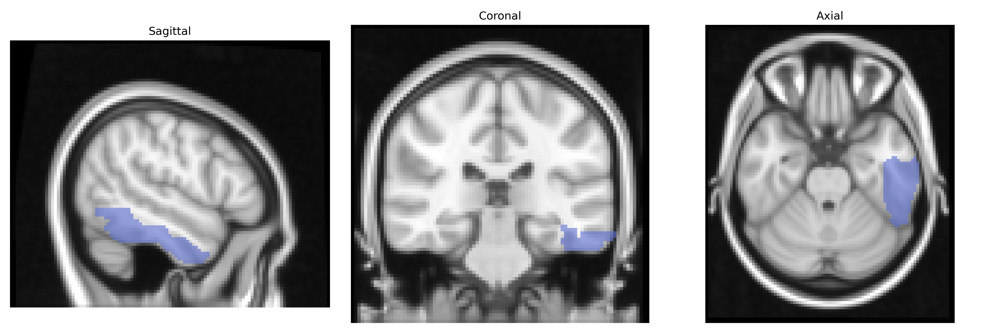
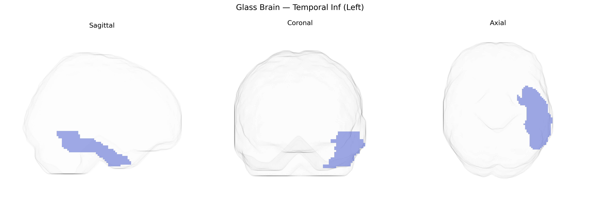

# Temporal Inf (Left)
 
## Overview
 
The left Inferior Temporal gyrus (Temporal_Inf_L) in the AAL atlas is a ventral temporal lobe region located lateral to the fusiform gyrus and inferior to the middle temporal gyrus, extending along the ventrolateral surface of the temporal lobe. Cytoarchitectonically, it includes portions of higher-order visual association cortex involved in complex object processing, including form recognition, semantic integration of visual information, and aspects of visual memory. Neurally, it receives robust input from primary and secondary visual cortices via the ventral (“what”) stream and projects to limbic and prefrontal regions implicated in semantic processing and memory. Functionally, the left hemisphere specialization of this region is particularly associated with visually mediated language and semantic functions, including naming and conceptual knowledge of objects. A related structure is described at [Inferior temporal gyrus](https://en.wikipedia.org/wiki/Inferior_temporal_gyrus).
 
The left inferior temporal gyrus (Left Temporal Inf in the AAL atlas), a core ventral visual and semantic processing region, has been implicated in multiple genetic imaging and GWAS studies, although often at the level of broader inferior temporal or ventral temporal cortex measures rather than this parcel alone. Large-scale imaging-genetics consortia such as ENIGMA and UK Biobank have reported SNP-based heritability for cortical thickness and surface area in inferior temporal regions, with significant associations to variants in genes involved in neurodevelopment, synaptic function, and axonal guidance (e.g., MAPT region, microtubule- and adhesion-related genes), and polygenic scores for educational attainment and intelligence showing correlations with structural metrics in temporal association cortices. Functionally, inferior temporal cortex involvement in object recognition, language semantics, and face processing underlies genetic links to disorders such as autism spectrum disorder, schizophrenia, and developmental language or reading disorders, where risk variants in synaptic and neurodevelopmental genes (e.g., NRXN, NRGN, CNTNAP2, FOXP2-related networks) have been associated with altered activation or morphology in inferior and lateral temporal regions. GWAS of focal epilepsy, particularly temporal lobe epilepsy, as well as studies of primary progressive aphasia and semantic variant frontotemporal dementia, have linked risk loci (including those near GRN, C9orf72, and MAPT) to neurodegeneration and cortical thinning in anterior and inferior temporal regions, predominantly on the left. In addition, Alzheimer’s disease and general cognitive decline GWAS hits, especially in APOE and genes involved in amyloid processing and tau pathology, contribute to variability in inferior temporal atrophy patterns, with this region often serving as an early site of neurodegenerative change in genetic risk carriers.
 
*Overview generated by GPT-4o (2026).*
 
---
 
**Region ID:** 8301  
**Hemisphere:** left  
**Atlas:** AAL 
 
---
 
## Temporal Inf (Left) – Black Background (Full Brain)
 

 
**Full Quality Version:** <a href="full_black.mp4" download>Download MP4</a>
 
---
 
## Temporal Inf (Left) – White Background (Full Brain)
 

 
**Full Quality Version:** <a href="full_white.mp4" download>Download MP4</a>
 
---

## Temporal Inf (Left) – Black Background (Hemisphere)
 

 
**Full Quality Version:** <a href="hemi_black.mp4" download>Download MP4</a>
 
---
 
## Temporal Inf (Left) – White Background (Hemisphere)
 

 
**Full Quality Version:** <a href="hemi_white.mp4" download>Download MP4</a>
 
---

## Triplanar View – T1 Background
 

 
---
 
## Triplanar View – Ghost Brain
 


