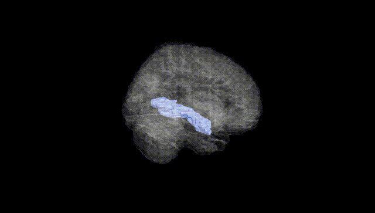
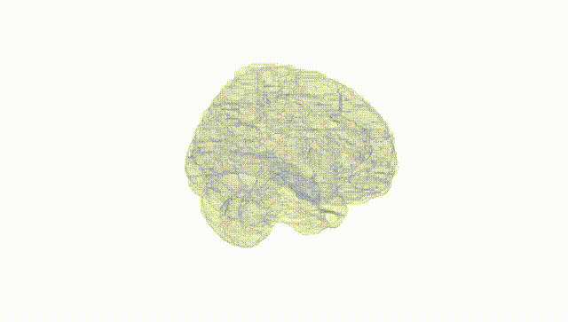
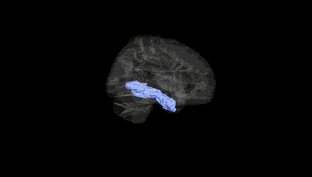
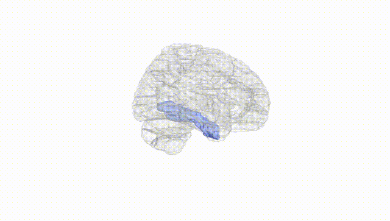
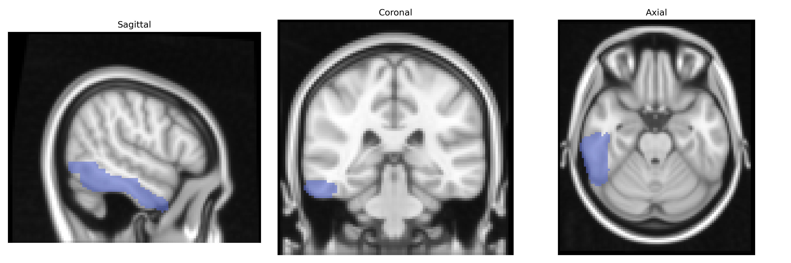
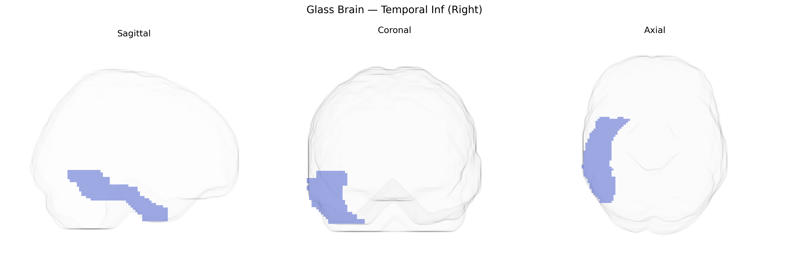

# Temporal Inf (Right)
 
## Overview
 
The Right Temporal Inf region in the AAL atlas corresponds to the right inferior temporal gyrus, a ventral temporal lobe structure located lateral to the fusiform gyrus and inferior to the middle temporal gyrus. It participates in high-level visual processing, including object recognition, visual form perception, and aspects of semantic processing, and is interconnected with occipital visual areas, fusiform regions, and anterior temporal structures. Functionally, this region contributes to the ventral “what” pathway, integrating complex visual features into coherent object representations, and has been implicated in disorders affecting visual recognition such as visual agnosia and certain forms of prosopagnosia. A closely related structure with a direct article is the [Inferior temporal gyrus](https://en.wikipedia.org/wiki/Inferior_temporal_gyrus).
 
The right inferior temporal (Temporal Inf R) region from the AAL atlas, involved in high-level visual processing and object recognition, has been implicated in several genetic and GWAS-based findings, although most studies reference broader “inferior temporal” or lateral temporal cortices rather than the AAL label explicitly. Imaging genetics work has linked common variants in genes such as APOE (especially ε4), CLU, CR1, and BIN1 to reduced cortical thickness or volume in inferior temporal regions in the context of Alzheimer’s disease risk, and polygenic risk scores for Alzheimer’s and other dementias also show associations with atrophy in this area. Large-scale brain MRI GWAS (e.g., ENIGMA and UK Biobank) have identified multiple loci associated with temporal lobe surface area and thickness, including regions overlapping the inferior temporal cortex, with signals near genes involved in neuronal development and synaptic function (such as HMGA2, MAPT region loci on 17q21, and several intergenic regulatory variants). Schizophrenia and autism spectrum disorder polygenic risk scores have been associated with structural and functional alterations in lateral and inferior temporal cortex, including right-sided effects in some cohorts, reflecting this region’s role in social cognition and language-related processing. Additional associations link inferior temporal morphology or activation patterns to genetic risk for major depressive disorder and bipolar disorder, and to individual differences in cognitive traits such as general intelligence, face recognition ability, and reading or language performance, although these relationships are typically polygenic and distributed, with no single variant uniquely defining right inferior temporal structure or function.
 
*Overview generated by GPT-4o (2026).*
 
---
 
**Region ID:** 8302  
**Hemisphere:** right  
**Atlas:** AAL 
 
---
 
## Temporal Inf (Right) – Black Background (Full Brain)
 

 
**Full Quality Version:** <a href="full_black.mp4" download>Download MP4</a>
 
---
 
## Temporal Inf (Right) – White Background (Full Brain)
 

 
**Full Quality Version:** <a href="full_white.mp4" download>Download MP4</a>
 
---

## Temporal Inf (Right) – Black Background (Hemisphere)
 

 
**Full Quality Version:** <a href="hemi_black.mp4" download>Download MP4</a>
 
---
 
## Temporal Inf (Right) – White Background (Hemisphere)
 

 
**Full Quality Version:** <a href="hemi_white.mp4" download>Download MP4</a>
 
---

## Triplanar View – T1 Background
 

 
---
 
## Triplanar View – Ghost Brain
 


