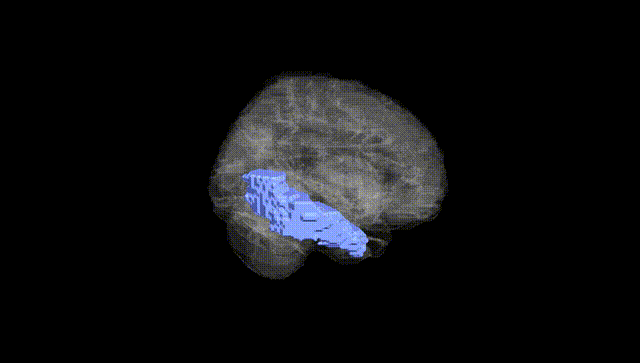
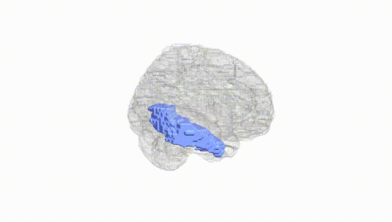
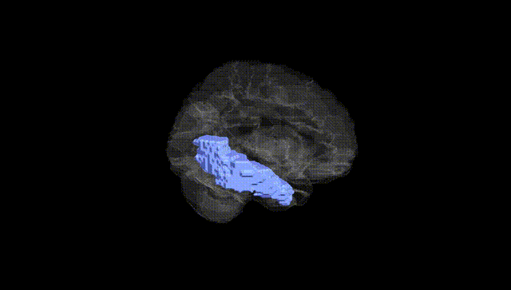
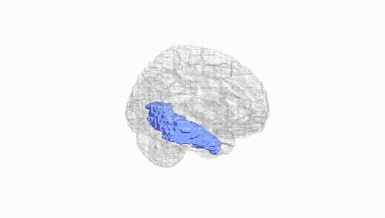
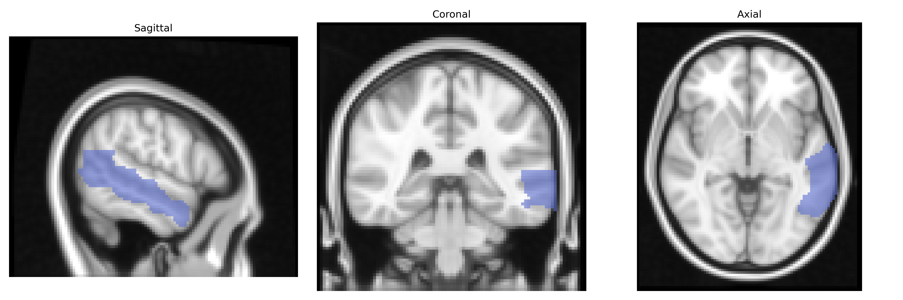
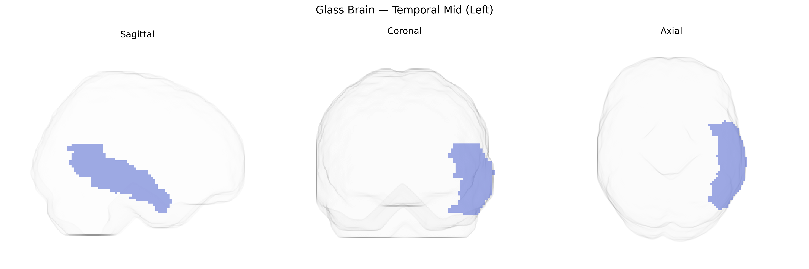

# Temporal Mid (Left)
 
## Overview
 
The left middle temporal gyrus (Temporal Mid Left in the AAL atlas) is a cortical region located on the lateral surface of the temporal lobe, between the superior and inferior temporal gyri, extending from the temporal pole anteriorly toward the angular gyrus posteriorly. It is composed of neocortical gray matter organized in six layers and is supplied primarily by branches of the middle cerebral artery. Functionally, this region is implicated in semantic processing, lexical access, and aspects of language comprehension, as well as in the perception of motion and complex visual stimuli, and it participates in distributed networks supporting social cognition and autobiographical memory. The left middle temporal gyrus maintains reciprocal connections with adjacent temporal regions, inferior parietal areas, and prefrontal cortices, facilitating integration of auditory, visual, and linguistic information. [Middle temporal gyrus](https://en.wikipedia.org/wiki/Middle_temporal_gyrus)
 
The left middle temporal gyrus (Temporal Mid Left) in the AAL atlas has been implicated in multiple genetic and neuropsychiatric contexts, particularly through imaging genetics and large-scale GWAS of brain structure and function. Variants in genes involved in synaptic function, axon guidance, and neurodevelopment—such as BDNF, GRIN2B, DISC1, and neuregulin/ErbB pathway genes—have been associated with gray matter volume, cortical thickness, or activation changes in the left middle temporal region, especially in tasks involving language and semantic processing. Large imaging GWAS (e.g., ENIGMA, UK Biobank) have identified polygenic influences on temporal lobe morphology, with common variants in loci near genes such as HMGA2, TESC, and others contributing to interindividual differences in temporal cortex volume, including middle temporal areas. Psychiatric and neurodevelopmental disorders—schizophrenia, autism spectrum disorder, major depression, and bipolar disorder—show heritable alterations in left temporal mid-gyric structure and connectivity, with risk loci (e.g., in CACNA1C, ZNF804A, and MHC region genes) associated with temporal lobe abnormalities and language-related deficits. In neurodegenerative conditions such as Alzheimer’s disease and primary progressive aphasia, genetic risk factors (notably APOE ε4 and MAPT haplotypes) are linked to atrophy patterns prominently involving the left temporal mid region, aligning with semantic memory and naming impairments; polygenic risk scores for Alzheimer’s and related dementias also correlate with structural and metabolic changes in left middle temporal cortex, underscoring a convergent genetic contribution to vulnerability of this region.
 
*Overview generated by GPT-4o (2026).*
 
---
 
**Region ID:** 8201  
**Hemisphere:** left  
**Atlas:** AAL 
 
---
 
## Temporal Mid (Left) – Black Background (Full Brain)
 

 
**Full Quality Version:** <a href="full_black.mp4" download>Download MP4</a>
 
---
 
## Temporal Mid (Left) – White Background (Full Brain)
 

 
**Full Quality Version:** <a href="full_white.mp4" download>Download MP4</a>
 
---

## Temporal Mid (Left) – Black Background (Hemisphere)
 

 
**Full Quality Version:** <a href="hemi_black.mp4" download>Download MP4</a>
 
---
 
## Temporal Mid (Left) – White Background (Hemisphere)
 

 
**Full Quality Version:** <a href="hemi_white.mp4" download>Download MP4</a>
 
---

## Triplanar View – T1 Background
 

 
---
 
## Triplanar View – Ghost Brain
 


