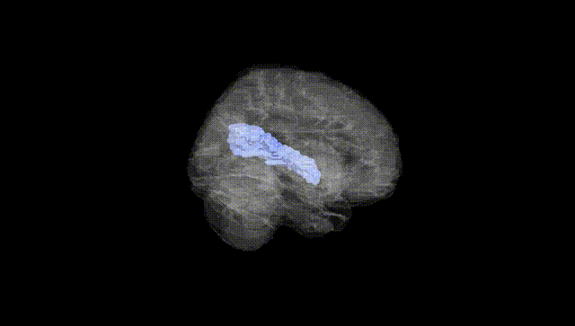
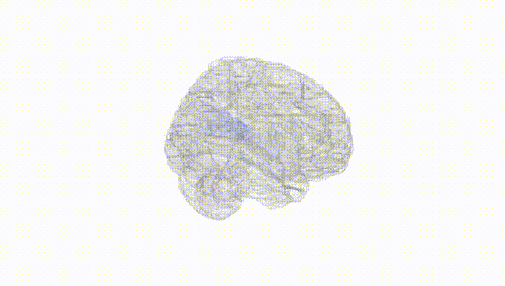
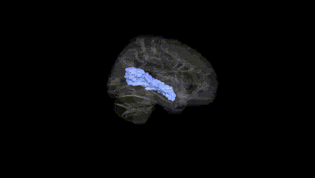
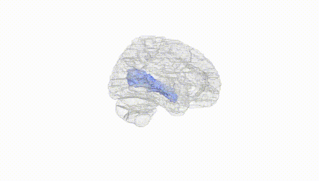
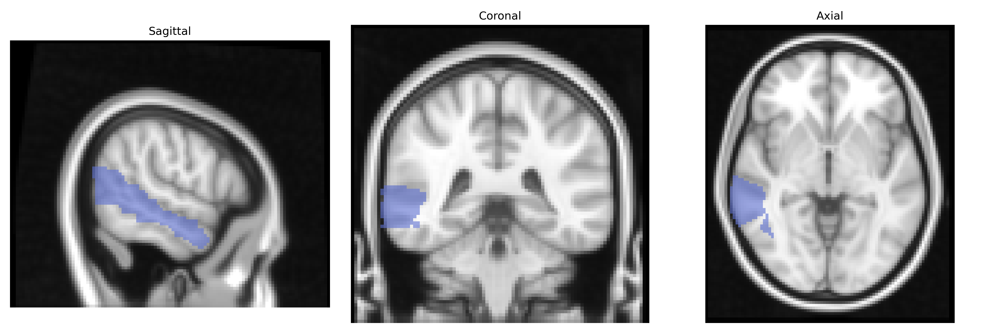
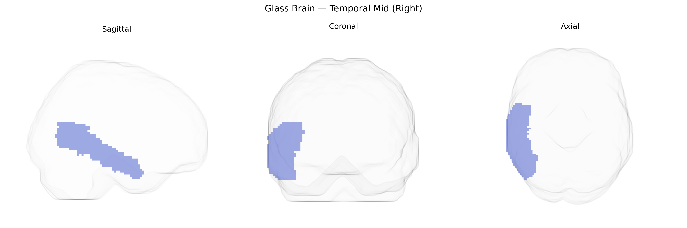

# Temporal Mid (Right)
 
## Overview
 
The right Temporal Mid (Right) region in the AAL atlas corresponds to the middle temporal gyrus of the right cerebral hemisphere, a portion of the lateral temporal lobe situated between the superior and inferior temporal gyri. This cortical area is implicated in multimodal association processes, including semantic language comprehension, lexical access, and the integration of auditory and visual information, as well as aspects of social cognition such as perception of biological motion and interpretation of others’ actions. It maintains extensive reciprocal connections with other temporal regions, the inferior parietal lobule, prefrontal cortex, and limbic structures, supporting higher-order cognitive functions and memory-related processing. A closely related structure is the middle temporal gyrus: [Middle temporal gyrus](https://en.wikipedia.org/wiki/Middle_temporal_gyrus).
 
The right middle temporal gyrus (right Temporal Mid in the AAL atlas) has been implicated in several genetic and imaging-genetics studies, particularly through GWAS of cortical thickness, surface area, and regional volume, which identify polygenic influences involving genes related to synaptic function, neurodevelopment, and axonal guidance (for example, loci near MIR124-1, WNT and MAPK pathway genes, and genes expressed in glutamatergic neurons). Large consortia such as ENIGMA and UK Biobank–based analyses have reported associations between right middle temporal morphology and variants linked to general cognitive ability, educational attainment, and language-related traits, as well as polygenic risk scores for schizophrenia, major depressive disorder, and autism spectrum disorder, where altered structure or connectivity of the middle temporal gyrus features as an intermediate phenotype. Additional GWAS and candidate gene studies in Alzheimer’s disease, frontotemporal dementia, and temporal lobe epilepsy have connected risk variants—such as APOE ε4 and genes involved in tau metabolism or synaptic integrity—to atrophy or functional disruption in temporal neocortical regions that include the right middle temporal gyrus, suggesting that this area often serves as a convergent neuroanatomical substrate for diverse genetic risks affecting language, semantic processing, and social cognition.
 
*Overview generated by GPT-4o (2026).*
 
---
 
**Region ID:** 8202  
**Hemisphere:** right  
**Atlas:** AAL 
 
---
 
## Temporal Mid (Right) – Black Background (Full Brain)
 

 
**Full Quality Version:** <a href="full_black.mp4" download>Download MP4</a>
 
---
 
## Temporal Mid (Right) – White Background (Full Brain)
 

 
**Full Quality Version:** <a href="full_white.mp4" download>Download MP4</a>
 
---

## Temporal Mid (Right) – Black Background (Hemisphere)
 

 
**Full Quality Version:** <a href="hemi_black.mp4" download>Download MP4</a>
 
---
 
## Temporal Mid (Right) – White Background (Hemisphere)
 

 
**Full Quality Version:** <a href="hemi_white.mp4" download>Download MP4</a>
 
---

## Triplanar View – T1 Background
 

 
---
 
## Triplanar View – Ghost Brain
 


